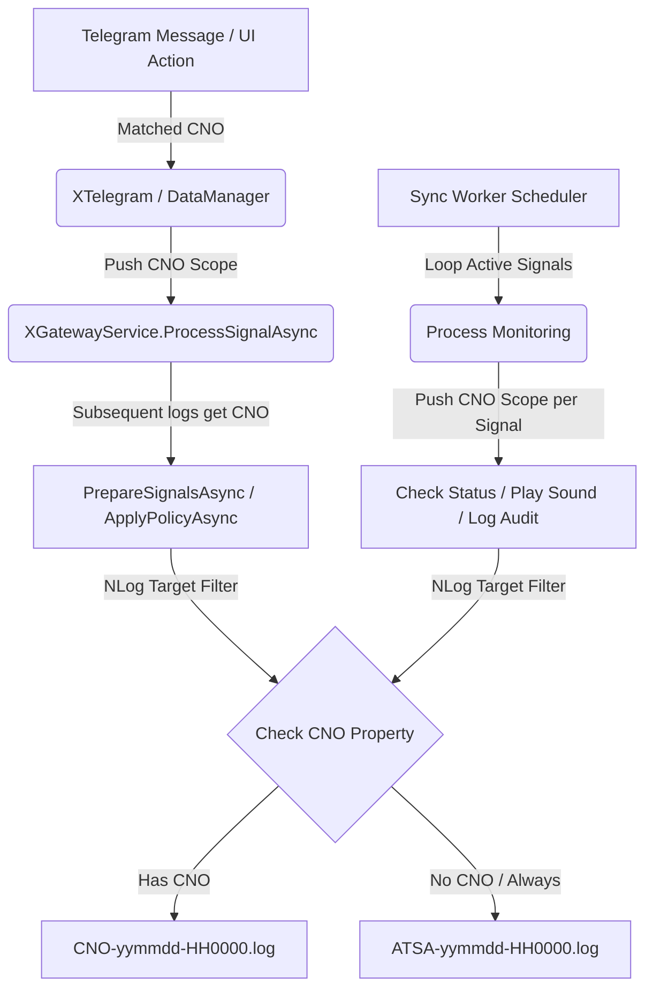

# Design Note: Channel-Specific Logging Improvements v1.0

## Context & Objectives
In ATSA, log messages are routed dynamically. System-wide logs go to `sysFile` while channel-specific logs should go to `channelFile` (separated by `CNO`).
However, the previous implementation did not consistently attach the channel identifier (`CNO`) to the logging context during asynchronous operations, sequence steps, and event updates. This resulted in empty channel log files and missing diagnostic context.

To resolve this without altering every single `logger.Info` signature, we integrate NLog 5.x **`ScopeContext`**. By wrapping key entry points and loop iterations with `NLog.ScopeContext.PushProperty("CNO", cno)`, any log written inside that thread or asynchronous task sequence will automatically inherit the `CNO` property and be routed correctly.

Additionally, to ensure complete traceability of trading signals, we must log the raw incoming Telegram message text and match it with the fully parsed/interpreted `XSignal` information directly inside the channel-specific log file upon message receipt.

## Architecture & Data Flow



## Detailed Changes

### 1. NLog Configuration (`ATSA/NLog.config`)
We update the layout format and filtering rule condition to respect `scopeproperty` (NLog 5.0+ standard for ScopeContext property lookup) alongside `event-properties` and `mdlc`.

```xml
<!-- Layout Modification -->
fileName="${basedir}/_log/${scopeproperty:item=CNO:whenEmpty=${event-properties:item=CNO:whenEmpty=${mdlc:item=CNO}}}-${date:format=yyMMdd-HH0000}.log"

<!-- Filter Rule Modification -->
<filters defaultAction="Ignore">
  <when condition="length('${scopeproperty:item=CNO}') > 0 or length('${event-properties:item=CNO}') > 0 or length('${mdlc:item=CNO}') > 0" action="Log" />
</filters>
```

### 2. XGatewayService Sequence Scope & Parsed Signal Logging (`XGatewayService.Sequence.cs`)
We chain `CNO` to the NLog `ScopeContext` during asynchronous signal processing and log the details of parsed signals:
```csharp
                    .ConfigureState("Enrich")
                        .OnEntry(async () => {
                            preparedSignals = (ctx.Signal != null) ? await ctx.Signal.PrepareSignalsAsync(xdo) : null;
                            if (preparedSignals == null || preparedSignals.Count == 0) {
                                nlog.Warn($"[Gateway:DROP] No valid signals for MsgId:{xdo.MsgId} | Text: \"{xdo.Text}\"");
                                seq.SetState("Idle");
                            } else {
                                nlog.Info($"[Gateway:INTERPRETED] MsgId:{xdo.MsgId} | Text: \"{xdo.Text}\" -> Generated {preparedSignals.Count} signals.");
                                foreach (var s in preparedSignals)
                                {
                                    nlog.Info(s.ToAuditString("INTERPRETED-SIGNAL"));
                                }
                                seq.SetState("Persistence");
                            }
                        })
```

### 3. XSyncWorker Monitoring Scope (`XSyncWorker.Methods.cs`)
We wrap monitoring loop iterations with the corresponding signal's or message's CNO to segment sync logs by channel:
- `ProcessErrorMonitoringAsync`
- `ProcessCloseMonitoringAsync`
- `ProcessEntryMonitoringAsync`
- `ProcessRecoveryAsync`

### 4. XTelegram Gateway Matching Scope (`XTelegram.cs`)
During `HandleUpdate`, once a message is mapped to one or more registered channels, we wrap the processing and gateway dispatching under a `CNO` ScopeContext block.

## Verification
- Run local simulation scenario.
- Verify `_log/1001-*.log` and `_log/1002-*.log` are created and contain sequence, validation, and sync events.
