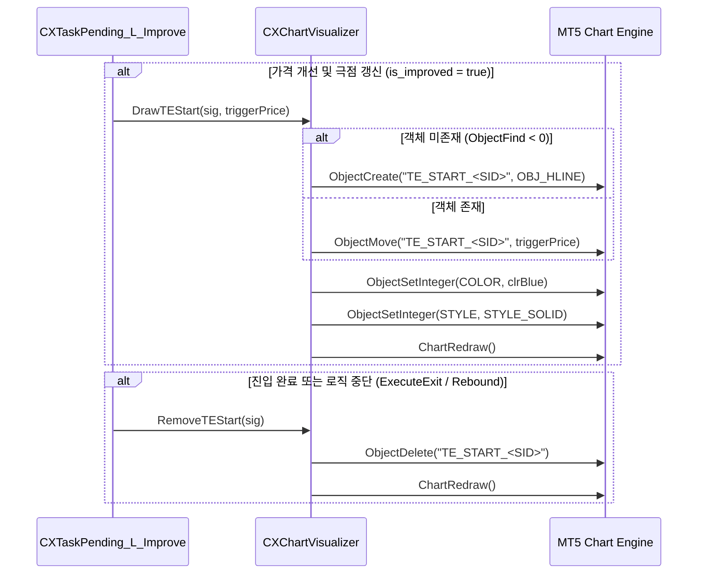

# ATSE TE_START 차트 시각화 설계 명세서 (v1.0)

## 1. 개요 (Overview)
진입 트레일링(Trailing Entry, 이하 진트) 실행 중, 트레이더가 현재 추격 중인 가격 기준선(최저점/최고점 대비 `TE_START` 만큼 역전된 진입 목표가)을 차트 상에서 직관적으로 파악할 수 있도록 실시간 가로선(Horizontal Line) 객체를 렌더링하고 동적 업데이트하는 시각화 엔진 `CXChartVisualizer`를 설계합니다.

---

## 2. 시각화 요구 조건 (Visualization Requirements)
1. **고유성 (Uniqueness)**: 여러 세션이 동시에 진트를 실행하더라도 객체가 겹치거나 왜곡되지 않도록 세션 식별자(`SID`)를 기반으로 고유한 객체 명칭(`"TE_START_" + SID`)을 확보해야 합니다.
2. **시각적 차별성 (Distinction)**: MT5 플랫폼의 기본 대기 주문선(점선 형태)과 혼동되지 않도록 실선(Solid Line) 및 전용 색상(Blue)을 강제 지정합니다.
3. **자원 정리 (Garbage Collection)**: 진입이 완료되거나 오류로 인해 중단될 때, 혹은 세션이 청산될 때 차트 상의 시각화 객체를 누수 없이 원자적으로 제거해야 합니다.

---

## 3. 상세 동작 매커니즘 (Internal Logic)

### 3.1 트리거 라인 생성 및 갱신 (`DrawTEStart`)
* **메서드 정의**: `static void DrawTEStart(ICXSignal* sig, double triggerPrice)`
* **처리 흐름**:
  1. 매개변수 유효성 검사 (`sig` 검증, `triggerPrice > 0` 확인).
  2. 세션 고유 키 생성: `string name = "TE_START_" + sig.GetSid();`
  3. `ObjectFind(0, name)` 호출을 통해 기생성 여부 판정:
     * 미존재 시: `line.Create(0, name, 0, triggerPrice)`를 통해 차트 서브윈도우 0번에 신규 생성.
     * 존재 시: `line.Attach(0, name, 0, 1)`로 기존 핸들을 획득한 후 `line.Price(0, triggerPrice)`로 Y축 가격 좌표 이동.
  4. 시각적 스타일 일관성 지정:
     * **색상**: `clrBlue` (파란색 일선으로 통일)
     * **스타일**: `STYLE_SOLID` (실선)
     * **두께**: `Width(1)`
     * **설명**: `"TE Start Trigger (" + sig.GetSid() + ")"` (마우스 호버 시 툴팁 표시용)
  5. `ChartRedraw(0)` 호출을 통해 차트 즉시 재렌더링 강제.

### 3.2 트리거 라인 해제 (`RemoveTEStart`)
* **메서드 정의**: `static void RemoveTEStart(ICXSignal* sig)`
* **처리 흐름**:
  1. 진입 완료(체결), 시장가 전환(Rebound), 또는 에러 발생 시 [CXTaskPending_L_Improve](file:///d:/Projects/ATS/ATSE/CXTrade/Session/Workflow/Pending/CXTaskPending_L_Improve.mqh)나 관련 트랜잭션 태스크가 소멸 메서드를 실행합니다.
  2. `ObjectDelete(0, "TE_START_" + sig.GetSid())`를 통해 차트 객체 메모리를 영구 해제합니다.

---

## 4. 라이프사이클 통합 분석 (Integration)

시공간 차트 표시 기능은 [Stage_OrderOptimization](file:///d:/Projects/ATS/ATSE/CXTrade/Session/Workflow/Pending/CXTaskPending_L_Improve.mqh) 내부의 태스크 실행 주기에 종속되어 호출됩니다:

1. **진입 추격 중 (Pulse 시점)**:
   * [CXTaskPending_L_Improve](file:///d:/Projects/ATS/ATSE/CXTrade/Session/Workflow/Pending/CXTaskPending_L_Improve.mqh) 실행 시 극점이 개선될 때마다 `CXChartVisualizer::DrawTEStart`가 호출되어 라인이 실시간 하향(Buy) 또는 상향(Sell) 이동합니다.
2. **트레일링 종료 시점**:
   * [CXTaskPending_L_Rebound](file:///d:/Projects/ATS/ATSE/CXTrade/Session/Workflow/Pending/CXTaskPending_L_Rebound.mqh)에서 시장가 전환 트리거 작동 시 `CXChartVisualizer::RemoveTEStart`를 호출하여 차트를 청소합니다.
   * [CXTaskPending_L_Improve](file:///d:/Projects/ATS/ATSE/CXTrade/Session/Workflow/Pending/CXTaskPending_L_Improve.mqh) 진입 완료 혹은 타임아웃/로직 중단 분기(`xp.GetInt() == 10`) 시에도 마찬가지로 라인이 소멸됩니다.
