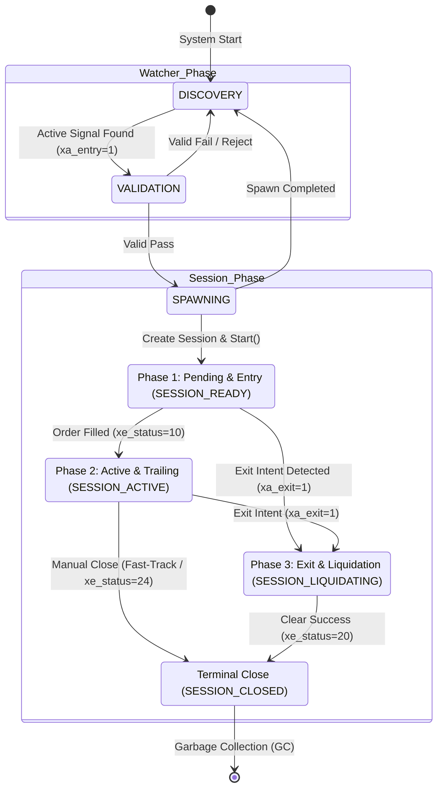

# [Design] Centralized Sequence Orchestrator & 3-Phase Lifecycle (v1.1)

## 1. 개요 (Overview)
본 설계 문서는 ATSE 프로젝트의 시퀀스 파싱, 로딩, 3-Phase(진입-액티브-청산) 라이프사이클 관리 프레임워크의 최신 진화 사항(v16.7+)을 명세합니다.
기존의 하드코딩된 정수 매핑 구조를 탈피하고, 다형성 상속 구조(`CXSequenceOrchestrator` $\rightarrow$ `AppOrchestrator`)와 기호 명칭 기반 DSL 파서, 그리고 실시간 터미널 실물 자산 피드백을 적용하여 시스템의 회복력(Resilience)과 가독성을 극대화합니다.

---

## 2. 핵심 설계 변경 사항 (Core Evolutions)

### 2.1 추상 베이스 클래스와 구체 구현체의 분리 (v16.7)
*   **`CXSequenceOrchestrator`**: 공통 DSL 파서 메커니즘, 기호 해석(`ResolveId`), 스케줄러 기능 및 기호 테이블(`m_registry`) 관리 등의 기반 로직을 소유하는 프레임워크 베이스 클래스입니다.
*   **`AppOrchestrator`**: 비즈니스 로직에 결합되는 구체 클래스로서, 실질적인 진입/청산 상태 코드 및 DSL 구문을 정의하고 바인딩합니다.

### 2.2 기호(Symbolic Name) 기반 DSL 파서 (Enum-less)
*   기존의 하드코딩된 정수 Enum 타입 검사를 걷어내고, DSL 파서가 기호 명칭(예: `"Step_Discovery"`, `"TASK_E_R_ORDER"`)을 문자열로 해석하여 직접 구상 Step 및 Task 인스턴스를 동적으로 생성할 수 있도록 단순화했습니다.

### 2.3 터미널 자산 피드백 기반 시퀀스 지름길 (Fast-Path & Bypass)
1.  **청산 선제 처리 (Bypass)**: Watcher 단계(`Step_Validation`)에서 청산 의도(`xa_exit = 1`)가 주입된 신호를 감지했을 때, 터미널 상에 관련 실물 자산이 존재하지 않는 경우 세션 스포닝을 건너뛰고 DB 상태를 즉시 `XE_CLOSED_SIGNAL` (값: 20)로 강제 종결시킵니다.
2.  **수동 청산 패스트 트랙 (Fast-Track)**: 세션 기동 중 사용자가 터미널에서 포지션을 강제로 수동 청산하면, `CXTaskIntentWatch`가 즉시 자산 소멸을 감지하여 DB 상태를 `xe_status = 24` (XE_CLOSED_MANUAL) 및 `xa_exit = 2` (XA_CLOSED_COMPLETED)로 직권 업데이트한 뒤 세션을 즉각 완전 종료합니다.

---

## 3. 라이프사이클 및 의존성 흐름 (Lifecycle & Dependency Flow)

### 3.1 3-Phase 상태 전이 매트릭스



---

## 4. 구체적 DSL 정의 명세 (DSL Spec)

### 4.1 Watcher DSL
```cpp
"WATCHER_DISCOVERY  | Discovery:Step_Discovery   ? WATCHER_VALIDATION ! WATCHER_DISCOVERY @ 0s, 0x"
"WATCHER_VALIDATION | Validation:Step_Validation ? WATCHER_SPAWNING   ! WATCHER_DISCOVERY @ 0s, 0x"
"WATCHER_SPAWNING   | Spawning:Step_Spawning     ? WATCHER_DISCOVERY  ! WATCHER_DISCOVERY @ 0s, 0x"
```

### 4.2 3-Phase Session DSL
#### Phase 1: Pending & Entry (`SESSION_READY`)
*   **성공 조건**: 포지션 체결 완료 (`SESSION_ACTIVE`로 전환)
*   **분기 규칙**: `XE_EXECUTED=SESSION_ACTIVE`, `XE_CLOSED_SIGNAL=SESSION_LIQUIDATING`
```cpp
"SESSION_READY                                                                 "
"| Composite:Step_Pending                                                      "
"  : TASK_A_INTENT_WATCH, TASK_E_L_REDIRECT, TASK_E_L_IDENTITY, TASK_E_L_RISK, "
"    TASK_E_P_INTENT,     TASK_E_R_ORDER,    TASK_E_V_ERROR,    TASK_E_V_TICKET, "
"    TASK_E_V_REAL,       TASK_E_V_DOUBLECHECK, TASK_E_P_FINALIZE,             "
"    TASK_P_V_SYNC,       TASK_P_L_REBOUND,  TASK_P_L_IMPROVE,  TASK_P_R_APPLY "
"? SESSION_ACTIVE                                                              "
"! SESSION_ERROR                                                               "
"@ 3600s, 0x                                                                   "
```

#### Phase 2: Active & Profit Trailing (`SESSION_ACTIVE`)
*   **성공 조건**: 청산 의도 감지 (`SESSION_LIQUIDATING`으로 전환)
*   **분기 규칙**: `XE_CLOSED_SIGNAL=SESSION_LIQUIDATING`
```cpp
"SESSION_ACTIVE                                                                "
"| Composite:Step_Active                                                       "
"  : TASK_A_INTENT_WATCH, TASK_A_V_STATUS, TASK_A_V_TERMINAL, TASK_A_P_ALIGN,  "
"    TASK_A_ALPHA_CALC,   TASK_A_ALPHA_APPLY                                   "
"? SESSION_LIQUIDATING                                                         "
"! SESSION_ERROR                                                               "
"@ 72000s, 0x                                                                  "
```

#### Phase 3: Liquidation & Finalization (`SESSION_LIQUIDATING`)
*   **성공 조건**: 청산 완료 (`SESSION_CLOSED` 즉 `30`번 상태로 전환)
```cpp
"SESSION_LIQUIDATING                                                           "
"| Composite:Step_Exit                                                         "
"  : TASK_A_INTENT_WATCH, TASK_X_L_PREPARE, TASK_X_P_LOCK, TASK_X_R_ORDER,      "
"    TASK_X_V_ERROR,      TASK_X_V_TERMINAL, TASK_X_P_FINALIZE                 "
"? SESSION_CLOSED                                                              "
"! SESSION_ERROR                                                               "
"@ 300s, 3x                                                                    "
```

---

## 5. 결론 및 향후 과제
*   **예외 상태의 일관성 보장**: 이제 모든 비정상 상태(XE_ERROR, 수동 청산, 실물 없는 청산 신호 등)는 중간 과정에서의 시퀀스 데드락 없이 즉시 최후 터미널 상태로 수렴합니다.
*   **메모리 GC 고도화**: 컨텍스트 청소 기능(`RemoveChild` 등)의 적극적인 적용을 통해 장기 기동 시 발생할 수 있는 메모리 조각화를 예방해야 합니다.
