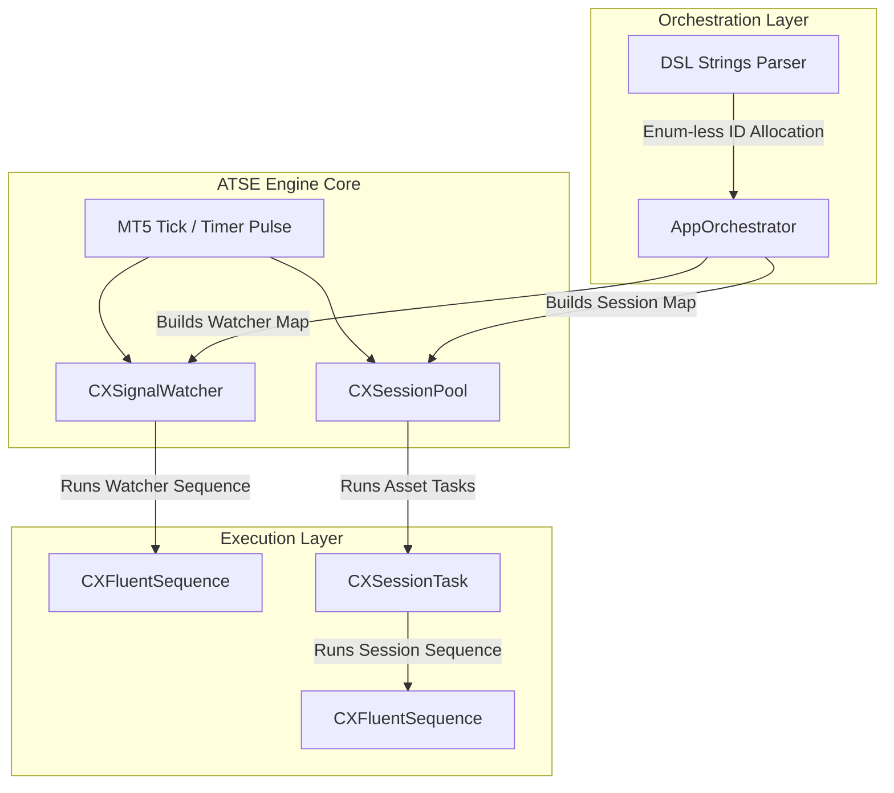
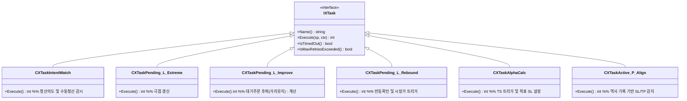
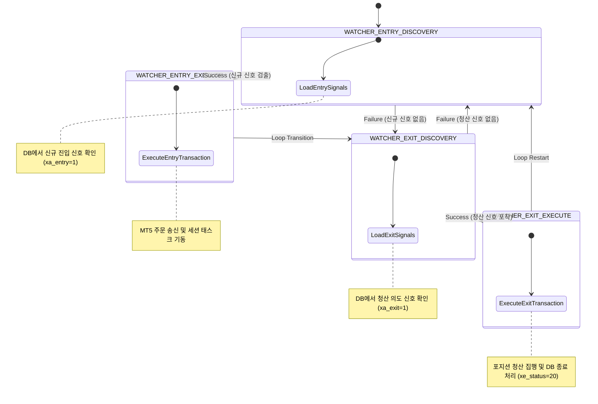
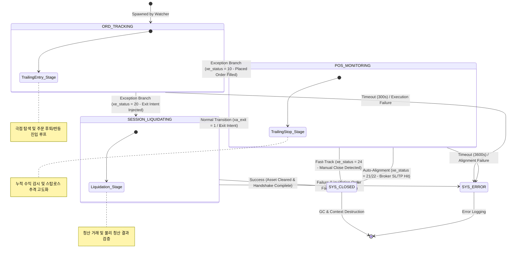
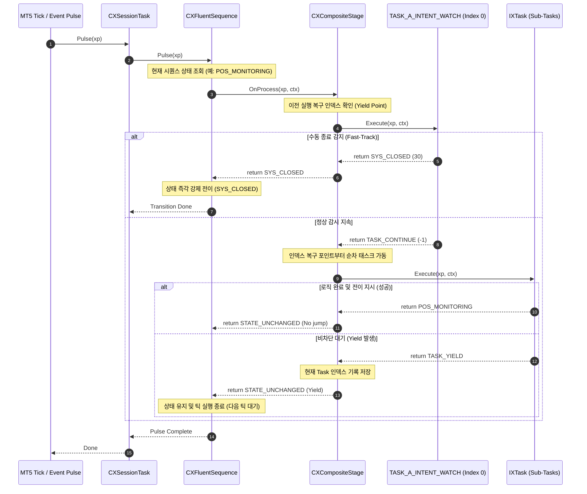

# [Analysis] ATSE 스테이지 및 시퀀스 매트릭스 정밀 분석 보고서 (v1.0)

본 보고서는 ATSE(Active Trading Session Engine)의 핵심 구동 체계인 **선언적 DSL 기반 시퀀스 및 스테이지 아키텍처**를 정밀 분석합니다. 워커(Watcher)와 개별 세션(Session)의 상태 전이 매트릭스를 테이블로 명세하고, Mermaid를 활용한 상태 차트 및 시퀀스 다이어그램을 제공하여 시스템 제어 구조를 시각화합니다.

---

## 1. ATSE 시퀀스 제어 아키텍처 개요

ATSE는 MetaTrader 5 환경에서 복잡한 비즈니스 규칙과 실행 제어 흐름을 분리하기 위해 **기호 명칭(Symbolic Name) 기반 DSL 파서** 및 **Composite Task 조합형 스테이지 엔진**을 채택하고 있습니다.



### 1.1 핵심 아키텍처 설계 원칙

1. **상수 매핑 없는 완전 동적 DSL (Enum-less Mapping)**
   * `m_registry.Add`에 의한 MQL5 정수 상수 수동 정의를 배제합니다. 
   * 런타임에 [AppOrchestrator.mqh](file:///d:/Projects/ATS/ATSE/CXTrade/App/Orchestration/AppOrchestrator.mqh)가 DSL 구문을 로드할 때, 새로운 기호(예: `WATCHER_ENTRY_DISCOVERY`)를 감지하면 내부 카운터(`m_auto_id_counter` = 1000)를 기준으로 동적 ID를 자동 발행하여 바인딩합니다.
2. **복합 태스크 조립 모델 (Composite Task Assembly)**
   * 세션 라이프사이클의 개별 국면(Phase)은 복합 스테이지인 [CXCompositeStage.mqh](file:///d:/Projects/ATS/ATSE/CXTrade/Session/Workflow/CXCompositeStage.mqh)로 정의됩니다. 
   * 각 복합 스테이지는 [CXTaskFactory.mqh](file:///d:/Projects/ATS/ATSE/CXTrade/App/Orchestration/CXTaskFactory.mqh)가 동적 생성한 마이크로 태스크(`IXTask` 상속 객체) 군을 소유하며, 매 틱 순차 실행(`OnProcess`)합니다.
3. **단일 연산 원천 (Single Source of Calculation - SSOC)**
   * 가격 계산, 리스크(마진/로트) 검증, 터미널 심볼 사양 조회 및 실물 매칭은 전역 관리 클래스(`ICXPriceManager`, `ICXRiskManager`, `ICXSymbolManager`, `ICXInventoryManager`)에 의존하여 계산 일관성을 유지합니다.
4. **루프 안정성 및 아토믹 일괄 삭제 규칙 (v11.4)**
   * 리스트(CArrayObj 등)를 순회하는 도중 인덱스를 동적으로 임의 조작(`Detach`, `i--`, `total--` 등)하는 것을 절대 금지합니다. 순방향 순회 후 `SAFE_DELETE(list)` 또는 `Clear()`를 통한 아토믹 일괄 메모리 해제를 준수합니다.

---

## 2. 워처(Watcher) 스테이지 & 시퀀스 매트릭스

워처 시퀀스는 SQLite DB의 상태와 MT5 실물 자산 목록을 대조하며 **신규 진입 신호 처리** 및 **청산 명령 처리**를 조율하는 전역 무한 감시 파이프라인입니다.

### 2.1 워처 DSL 정의
```cpp
"WATCHER_ENTRY_DISCOVERY   > EntryDiscovery     ? WATCHER_ENTRY_EXECUTE    ! WATCHER_EXIT_DISCOVERY    @ 0s, 0x"
"WATCHER_ENTRY_EXECUTE     > EntryExecute       ? WATCHER_EXIT_DISCOVERY   ! WATCHER_EXIT_DISCOVERY    @ 0s, 0x"

"WATCHER_EXIT_DISCOVERY    > ExitDiscovery      ? WATCHER_EXIT_EXECUTE     ! WATCHER_ENTRY_DISCOVERY   @ 0s, 0x"
"WATCHER_EXIT_EXECUTE      > ExitExecute        ? WATCHER_ENTRY_DISCOVERY  ! WATCHER_ENTRY_DISCOVERY   @ 0s, 0x"
```

### 2.2 워처 제어 매트릭스 테이블

| 소스 상태 ID (값) | 바인딩 Stage 클래스 | 성공 전이 (`?`) | 실패 전이 (`!`) | 속성 (`@`) | 동작 정의 및 비즈니스 역할 |
| :--- | :--- | :--- | :--- | :---: | :--- |
| **`WATCHER_ENTRY_DISCOVERY`**<br>(동적: 1000) | [CXStageEntryDiscovery](file:///d:/Projects/ATS/ATSE/CXTrade/Watcher/WatcherWorkflow/CXStageEntryDiscovery.mqh) | `WATCHER_ENTRY_EXECUTE` | `WATCHER_EXIT_DISCOVERY` | 0초, 0회 | DB를 스캔하여 신규 진입 신호(`xa_entry=1`, `xe_status < 10`) 탐색. 발견 시 실행 단계로 전이, 없을 시 청산 탐색 단계로 이동. |
| **`WATCHER_ENTRY_EXECUTE`**<br>(동적: 1001) | [CXStageEntryExecute](file:///d:/Projects/ATS/ATSE/CXTrade/Watcher/WatcherWorkflow/CXStageEntryExecute.mqh) | `WATCHER_EXIT_DISCOVERY` | `WATCHER_EXIT_DISCOVERY` | 0초, 0회 | 발견된 진입 신호에 대해 자산 관리 시스템을 호출하여 주문을 전송하고, 개별 자산 감시 세션(`CXSessionTask`) 가동. |
| **`WATCHER_EXIT_DISCOVERY`**<br>(동적: 1002) | [CXStageExitDiscovery](file:///d:/Projects/ATS/ATSE/CXTrade/Watcher/WatcherWorkflow/CXStageExitDiscovery.mqh) | `WATCHER_EXIT_EXECUTE` | `WATCHER_ENTRY_DISCOVERY` | 0초, 0회 | DB에서 청산 요청 신호(`xa_exit=1`, `xe_status < 20`)가 발생한 대상을 스캔. 청산 필요 신호 발견 시 청산 집행 단계로 이동. |
| **`WATCHER_EXIT_EXECUTE`**<br>(동적: 1003) | [CXStageExitExecute](file:///d:/Projects/ATS/ATSE/CXTrade/Watcher/WatcherWorkflow/CXStageExitExecute.mqh) | `WATCHER_ENTRY_DISCOVERY` | `WATCHER_ENTRY_DISCOVERY` | 0초, 0회 | 대상 포지션의 실제 물리 청산 거래를 실행하고 DB 상태를 완료 마킹(`xe_status=20`, `xa_exit=2`). 완료 후 루프 재시작. |

---

## 3. 세션(Session) 스테이지 & 시퀀스 매트릭스

세션 시퀀스는 신호(자산)별로 동적 스폰된 `CXSessionTask` 인스턴스 내부에서 구동되는 생애주기 제어 흐름입니다. 대기 주문 관리, 포지션 가격 감시, 청산 및 리소스 최종 소멸 과정을 책임집니다.

### 3.1 세션 DSL 정의
```cpp
// A. 대기 주문 관리 태스크 (Pending & Trailing Entry)
"ORD_TRACKING                                                                  "
"> Stage_OrderOptimization                                                     "
"  : TASK_A_INTENT_WATCH, TASK_P_L_EXTREME, TASK_P_L_REBOUND, TASK_P_L_IMPROVE,  "
"    TASK_P_R_APPLY, TASK_P_V_SYNC                                             "
"? ORD_TRACKING                                                                "
"! SYS_ERROR                                                                   "
"@ 300s, 0x                                                                    "
"* 10=POS_MONITORING, 20=SYS_CLOSED"

// B. 포지션 관리 태스크 (Positioned & Trailing Stop)
"POS_MONITORING                                                                "
"> Stage_PositionGovernance                                                    "
"  : TASK_A_INTENT_WATCH, TASK_A_ALPHA_CALC, TASK_A_ALPHA_APPLY, TASK_A_V_TERMINAL,"
"    TASK_A_P_ALIGN                                                            "
"? POS_MONITORING                                                              "
"! SYS_ERROR                                                                   "
"@ 3600s, 0x                                                                   "
"* 20=SYS_CLOSED"

// C. 청산 관리 태스크 (Exit/Liquidation)
"SESSION_LIQUIDATING                                                           "
"> Stage_PositionLiquidation                                                   "
"  : TASK_A_INTENT_WATCH, TASK_X_L_PREPARE, TASK_X_P_LOCK, TASK_X_R_ORDER,      "
"    TASK_X_V_ERROR,      TASK_X_V_TERMINAL, TASK_X_P_FINALIZE                 "
"? SYS_CLOSED                                                                  "
"! SYS_ERROR                                                                   "
"@ 300s, 3x"
```

### 3.2 세션 제어 매트릭스 테이블

| 소스 상태 (값) | 바인딩 Stage 명칭 (Alias) | 내포된 마이크로 태스크 리스트 (`IXTask`) | 성공 경로 (`?`) | 실패 경로 (`!`) | 제한 속성 (`@`) | 예외 분기 (`*` - Case) | 비즈니스 역할 및 흐름 제어 |
| :--- | :--- | :--- | :---: | :---: | :---: | :--- | :--- |
| **`ORD_TRACKING`**<br>(`ORD_TRAILING`: 5) | `Stage_OrderOptimization` | `TASK_A_INTENT_WATCH`<br>`TASK_P_L_EXTREME`<br>`TASK_P_L_REBOUND`<br>`TASK_P_L_IMPROVE`<br>`TASK_P_R_APPLY`<br>`TASK_P_V_SYNC` | `ORD_TRACKING` | `SYS_ERROR` | 300초,<br>재시도 무제한 | `10=POS_MONITORING`<br>`20=SYS_CLOSED` | 대기 주문 상태에서 가격 하락 추격 진입(진트) 가동.<br>- 오더 체결 발생 시 (`xe_status=10`), 즉시 `POS_MONITORING` 점프.<br>- 청산 신호 주입 시 (`xe_status=20`), `SYS_CLOSED`로 우회. |
| **`POS_MONITORING`**<br>(`POS_ACTIVE`: 10) | `Stage_PositionGovernance` | `TASK_A_INTENT_WATCH`<br>`TASK_A_ALPHA_CALC`<br>`TASK_A_ALPHA_APPLY`<br>`TASK_A_V_TERMINAL`<br>`TASK_A_P_ALIGN` | `POS_MONITORING` | `SYS_ERROR` | 3600초,<br>재시도 무제한 | `20=SYS_CLOSED` | 포지션 체결 이후 활성 관리 가동.<br>- 수익 임계치 초과 시 트레일링 스탑(익트) 자동 수행.<br>- 외부 청산 신호에 의해 청산 개시 시 (`xe_status=20`), `SYS_CLOSED` 유도. |
| **`SESSION_LIQUIDATING`**<br>(`SESSION_LIQUIDATING`: 20) | `Stage_PositionLiquidation` | `TASK_A_INTENT_WATCH`<br>`TASK_X_L_PREPARE`<br>`TASK_X_P_LOCK`<br>`TASK_X_R_ORDER`<br>`TASK_X_V_ERROR`<br>`TASK_X_V_TERMINAL`<br>`TASK_X_P_FINALIZE` | `SYS_CLOSED` | `SYS_ERROR` | 300초,<br>3회 재시도 | N/A | 청산 신호가 확인되어 포지션 회수 거래를 실행하는 과정.<br>- 성공적으로 청산 완료 시 최종 `SYS_CLOSED` 수렴. |
| **`SYS_CLOSED`**<br>(`SESSION_CLOSED`: 30) | N/A | N/A | N/A | N/A | N/A | N/A | **세션 최종 종료 상태.** 해당 자산에 대한 모든 리소스(메모리 컨텍스트, 차트 그래픽 등) 완전 해제 및 소멸. |
| **`SYS_ERROR`**<br>(`SESSION_ERROR`: 99) | N/A | N/A | N/A | N/A | N/A | N/A | **시스템 오류 종착지.** 타임아웃 발생 및 트레이딩 명령 처리 피드백 오류 시 로그 생성 후 안전 수렴. |

---

## 4. 마이크로 태스크(Micro-Task) 실행 명세

각 복합 스테이지(`CXCompositeStage`) 내부에서 순차적으로 호출되는 원자적 태스크(`IXTask`)의 명세입니다.



### 4.1 핵심 태스크 목록 및 비즈니스 역할

1. **`TASK_A_INTENT_WATCH`** ([CXTaskIntentWatch.mqh](file:///d:/Projects/ATS/ATSE/CXTrade/Session/Workflow/Active/CXTaskIntentWatch.mqh))
   * **역할**: 매 틱 세션 관련 DB 청산 의도(`xa_exit = 1`) 및 터미널 상의 물리 자산 소멸 여부를 실시간 폴링 감시합니다.
   * **특징**: 이 태스크는 Yield나 Pause 상태와 상관없이 **"매 틱 무조건 실행(Index 0 고정)"** 되며, 수동 청산 발견 시 즉시 Fast-Track 경로를 가동하여 세션을 폭파 종료합니다.
2. **`TASK_P_L_EXTREME`** ([CXTaskPending_L_Extreme.mqh](file:///d:/Projects/ATS/ATSE/CXTrade/Session/Workflow/Pending/CXTaskPending_L_Extreme.mqh))
   * **역할**: 대기 주문 상태에서 현재 가격의 극점(하락 매수 시 최저가, 상승 매도 시 최고가)을 실시간으로 갱신하여 저정밀 잔파동에 오인 진입하지 않도록 방지합니다.
3. **`TASK_P_L_IMPROVE`** ([CXTaskPending_L_Improve.mqh](file:///d:/Projects/ATS/ATSE/CXTrade/Session/Workflow/Pending/CXTaskPending_L_Improve.mqh))
   * **역할**: 가격이 급락할 시, 극점 기준 `TE_START` 포인트 및 안전 거리 제한선 `ELIMIT`을 계산하여 오더 거리가 좁혀지면 기존 대기 주문 가격을 강제로 뒤로 후퇴(Modify)시키는 보정 플래그를 생성합니다.
4. **`TASK_P_L_REBOUND`** ([CXTaskPending_L_Rebound.mqh](file:///d:/Projects/ATS/ATSE/CXTrade/Session/Workflow/Pending/CXTaskPending_L_Rebound.mqh))
   * **역할**: 극점(바닥) 형성 이후 가격이 유리한 방향으로 `ESTEP` 포인트 이상 확실하게 반등(Rebound)하는지 감시합니다. 반등 조건 만족 시 기존 대기 오더를 파괴하고 즉시 시장가 진입 의사결정을 하달합니다.
5. **`TASK_P_R_APPLY`** ([CXTaskPending_R_Apply.mqh](file:///d:/Projects/ATS/ATSE/CXTrade/Session/Workflow/Pending/CXTaskPending_R_Apply.mqh))
   * **역할**: 앞단 태스크의 연산 결과를 실제 MT5 거래 시스템에 전송하여 오더의 가격 변경 요청이나 파괴 및 시장가 전환 매매를 처리합니다.
6. **`TASK_P_V_SYNC`** ([CXTaskPending_V_Sync.mqh](file:///d:/Projects/ATS/ATSE/CXTrade/Session/Workflow/Pending/CXTaskPending_V_Sync.mqh))
   * **역할**: 터미널 오더 사양과 메모리 내의 `SelectedSignal` 데이터 간의 싱크로나이즈 정합성을 유지합니다.
7. **`TASK_A_ALPHA_CALC`** ([CXTaskAlphaCalc.mqh](file:///d:/Projects/ATS/ATSE/CXTrade/Session/Workflow/Active/CXTaskAlphaCalc.mqh))
   * **역할**: 포지션 진입 완료 후, 누적 수익이 최초 임계치 `TS_START` 포인트를 초과하는지 판단하고, 도달 시 고점을 따라가며 확보할 스탑라인 가격(Target SL)을 역동적으로 산출합니다.
8. **`TASK_A_ALPHA_APPLY`** ([CXTaskAlphaApply.mqh](file:///d:/Projects/ATS/ATSE/CXTrade/Session/Workflow/Active/CXTaskAlphaApply.mqh))
   * **역할**: 산출된 Target SL이 브로커의 StopsLevel 위반 없이 최소 `TS_STEP` 이상 상향된 경우, 터미널 API를 통해 실제 스탑로스 조정을 신청하고 성공 로그를 남깁니다.
9. **`TASK_A_V_TERMINAL`** ([CXTaskActive_V_Terminal.mqh](file:///d:/Projects/ATS/ATSE/CXTrade/Session/Workflow/Active/CXTaskActive_V_Terminal.mqh))
   * **역할**: 포지션의 실물 상태 및 주문 속성(SL, TP 등)이 DB의 기획 규격과 정렬되어 있는지 대조합니다.
10. **`TASK_A_P_ALIGN`** ([CXTaskActive_P_Align.mqh](file:///d:/Projects/ATS/ATSE/CXTrade/Session/Workflow/Active/CXTaskActive_P_Align.mqh))
    * **역할**: **[v18.39 자산 정합성 정밀 필터]** 브로커에 의한 포지션의 자동 소멸(SL/TP 강제 청산)을 감시합니다. 터미널 자산 소멸 시, MT5 거래 이력 데이터베이스(`CheckHistoryClosure`)를 정밀 스캔하여 종료 원인이 손절선 터치(`XE_CLOSED_SL`)인지 익절선 터치(`XE_CLOSED_TP`)인지 정밀 분석하고, DB 상태를 올바르게 분기 기록합니다. (해당 태스크 누락 시 모든 자동 청산이 단순 수동 청산으로 오인되어 데이터 통계 왜곡이 발생하므로 필수 선언되어야 함).

---

## 5. 시퀀스 전이 상태 차트 (Mermaid State Diagrams)

### 5.1 워처 제어 흐름 차트 (Watcher Loop Chart)

워처 루프는 대기 없이 무한 순환하며 각 단계를 순차 진행합니다.



### 5.2 세션 라이프사이클 전이 차트 (Session Lifecycle Chart)

세션 생명주기는 오더에서 포지션, 그리고 최종 청산에 이르기까지 실물 자산 피드백 및 예외 조건에 의해 비대칭형 분기 흐름을 띱니다.



---

## 6. 시퀀스 런타임 실행 다이어그램 (Sequence Execution Diagram)

매 틱마다 MT5 플랫폼 이벤트에서 태스크 엔진이 구동되어 복합 스테이지 및 하부 태스크들을 호출해 상태를 제어하는 시퀀스 구동 절차입니다.



---

## 7. 주요 비즈니스 시나리오 상세 추적 (Traces)

### 7.1 진입 가격 추격 (진트: Trailing Entry) 흐름
* **활성 조건**: `ORD_TRACKING` 상태 진입 시, 최초가 대비 현재가 차이가 `ESTART` 포인트 이상 벌어졌을 때 (`>=` Inclusive 평가 규칙 준수) 활성화됩니다.
* **진행 루프**:
  1. `TASK_P_L_EXTREME`: 시장이 계속해서 추가 하락하면 최저 바닥가(Extreme Peak)를 실시간 하향 기록합니다.
  2. `TASK_P_L_IMPROVE`: 가격이 극점을 경신하여 오더 가격과의 간격이 `ELIMIT` 포인트 이내로 좁혀지면, 시장의 슬리피지 예방을 위해 대기 주문(Limit Order)을 더 뒤로 하향 이동(`OrderModify`)하도록 제어합니다.
  3. `TASK_P_L_REBOUND`: 하락세가 멈추고 최저 극점 대비 `ESTEP` 포인트 이상 확실하게 반등(`현재가 - 극점 >= ESTEP`)하면, 시장가 매매 트리거를 위해 기존 대기 오더를 삭제(`OrderDelete`)하고 시장가 진입 명령(`xp.SetInt(10)`)을 하달합니다.
  4. `TASK_P_R_APPLY`: 브로커에게 주문 철회 및 신규 시장가 거래 계약 명령을 완수합니다.

### 7.2 수익 보존 추격 (익트: Trailing Stop) 흐름
* **활성 조건**: `POS_MONITORING` 상태 진입 후 포지션의 누적 수익 포인트가 설정된 진입 안전 범위 `TS_START`에 도달하면 동작합니다.
* **진행 루프**:
  1. `TASK_A_ALPHA_CALC`: 시장가가 상승하는 도중 고점(Peak)을 감시하며, 고점 대비 `TS_START`만큼 완충을 둔 동적 스탑로스 가격을 실시간으로 도출합니다.
  2. `TASK_A_ALPHA_APPLY`: 시장가가 갱신됨에 따라 계산된 동적 스탑로스 가격이 기존 스탑로스 대비 `TS_STEP` 포인트 이상 더 유리한 방향(상향)으로 벌어졌는가 검증합니다. 통과 시 터미널을 통해 브로커에 포지션 수정(`PositionModify`)을 명령하고 DB 정보와 매칭시킵니다.

### 7.3 브로커 SL/TP 도달에 의한 자동 청산 및 정합성 보정
* **동작 원리**: 사용자가 지정해 둔 하드웨어 스탑라인(SL/TP)에 가격이 도달하여 브로커가 포지션을 강제 청산하면 터미널의 실물 자산이 소멸합니다.
* **추적 순서**:
  1. `TASK_A_V_TERMINAL`이 터미널 포지션 소멸을 감지합니다.
  2. `TASK_A_P_ALIGN`이 거래 기록을 분석하기 위해 `CheckHistoryClosure` 함수를 가동합니다.
  3. 최근 거래 티켓의 만료 사유(Deal Reason)를 해석하여 SL 터치로 인한 종료 시 `xe_status`를 `XE_CLOSED_SL (21)`, TP 터치 시 `XE_CLOSED_TP (22)`로 분류하여 SQLite DB에 업데이트합니다.
  4. 예외 상태 전이 규칙 `* 20=SYS_CLOSED`에 기반해 세션 시퀀스는 정밀 청산 정보 기록을 마치고 `SYS_CLOSED` 상태로 안전 이관 처리됩니다.

### 7.4 수동 종료 감지 패스트 트랙 (Manual-Close Fast-Track)
* **동작 원리**: 외부 터미널(모바일 MT5 또는 수동 조작)에서 사용자가 임의로 포지션을 강제 청산하여 자산이 사전에 파괴되는 상황입니다.
* **추적 순서**:
  1. `TASK_A_INTENT_WATCH`가 터미널 감시 시점에 실물 포지션이 소멸되었음을 탐색합니다.
  2. `TASK_A_P_ALIGN`의 이력 조회 전, `TASK_A_INTENT_WATCH`가 이를 수동 소멸로 마킹합니다.
  3. `xe_status`를 `XE_CLOSED_MANUAL (24)`, `xa_exit`를 `XA_CLOSED_COMPLETED (2)`로 강제 설정합니다.
  4. 복잡한 청산 전송 연산(`Composite:Step_Exit`)을 전면 생략(Bypass)하여 즉시 `SYS_CLOSED (30)` 상태로 전이합니다.
  5. 세션 리소스 소멸 및 데이터베이스 종료 처리를 완료합니다.
