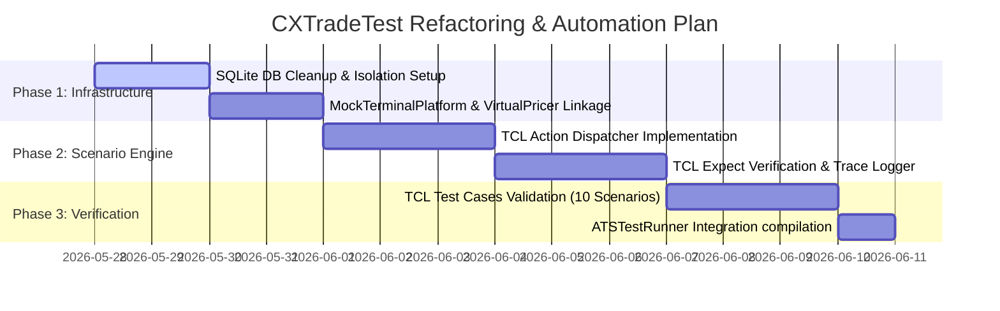

# [Plan] ATSE 테스트 시나리오 설계 및 테스트 프로젝트 리팩토링 계획서 (v1.0)

본 문서는 ATSE(Active Trading Session Engine)의 스테이지, 시퀀스, 그리고 개별 마이크로 태스크를 원자(Atomic) 수준에서 독립적으로 검증하기 위한 **TCL 기반 단위/통합 테스트 시나리오 설계**와 **기존 테스트 프로젝트(`CXTradeTest`)의 리팩토링 및 고도화 작업 계획**을 기술합니다.

---

## 1. 테스트 프로젝트 현황 및 문맥 분석 (Context Analysis)

현재 ATSE의 테스트 환경인 `CXTradeTest`는 두 개의 테스트 실행 축으로 구성되어 있습니다:
1. **정적 단위 테스트 (`ATSTestRunner.mq5`)**: MQL5 소스 코드 내에서 가상 컨텍스트 및 모의 객체(Mock)를 프로그래밍 방식으로 조립하여 특정 마이크로 태스크의 입력/출력을 직접 검증합니다.
2. **동적 시나리오 테스트 (`CXScenarioRunner.mq5`)**: 선언적 TCL 스크립트 파일을 해석([CXTclParser.mqh](file:///d:/Projects/ATS/ATSE/CXTradeTest/Scenarios/CXTclParser.mqh))하고 가상 가격 공급기([CXVirtualPricer.mqh](file:///d:/Projects/ATS/ATSE/CXTradeTest/Scenarios/CXVirtualPricer.mqh))를 활용해 E2E 트레이딩 라이프사이클을 매 틱 모의 검증합니다.

### 1.1 발견된 핵심 결함 및 개선 기회

* **시나리오 실행 엔진의 미완성**: 현재 구현된 [CXScenarioRunner.mq5](file:///d:/Projects/ATS/ATSE/CXTradeTest/CXScenarioRunner.mq5)는 TCL 파일 로딩 및 파싱 기능은 갖추었으나, 파싱된 액션(`INJECT`, `MARKET`)을 실제 모의 터미널([MockTerminalPlatform.mqh](file:///d:/Projects/ATS/ATSE/CXTradeTest/Mocks/MockTerminalPlatform.mqh))에 주입하거나 검증값(`EXPECT`)을 대조하여 Pass/Fail을 판정하는 핵심 구동 로직이 누락되어 있습니다.
* **Mocks 결합도 문제**: 모의 자산 관리 기능인 `MockTerminalPlatform::InjectMockAsset`이 정의만 되어 있고 실행 경로가 없어 E2E 자동화 테스트가 실질적으로 동작하지 못하는 상태입니다.
* **테스트 격리 부족**: 각 단위 테스트 수행 시 SQLite 데이터베이스 상태가 완전히 정리되지 않아 이전 테스트 케이스의 데이터가 간섭을 일으킬 위험이 있습니다.

---

## 2. 테스트 프로젝트 폴더 구조 재설계 (Directory Redesign)

모듈의 성격(원자 태스크 검증 vs 시나리오 검증 vs 공통 인프라 Mocks)을 직관적으로 격리하기 위해 다음과 같이 테스트 프로젝트 구조를 개선 정의합니다.

```
d:\Projects\ATS\ATSE\CXTradeTest\
│
├── ATSTestRunner.mq5               # 프로그램 방식 Task 단위 테스트 실행기
├── CXScenarioRunner.mq5             # TCL 기반 E2E 시나리오 테스트 실행기
│
├── Mocks\                          # 모의 인프라 모듈
│   ├── CXTestServiceFactory.mqh    # 테스트 전용 모의 컨텍스트 팩토리
│   ├── MockPriceManager.mqh        # 가격 계산 모의기
│   ├── MockTerminalPlatform.mqh    # 브로커/MT5 거래 환경 모의기 (InjectMockAsset 소유)
│   └── MockGuard.mqh               # 리스크/마진 검증 모의 가드
│
├── Scenarios\                      # TCL 해석 엔진 및 가상 모델
│   ├── CXTclParser.mqh             # TCL 스크립트 파서
│   ├── CXVirtualPricer.mqh         # 가상 호가(Bid/Ask) 공급기
│   └── CXScenarioParam.mqh         # 구형 호환성 매개변수 구조체
│
└── UnitTests\                      # [NEW] 원자 단위(Atomic) 테스트 스위트
    ├── TestSequenceDSL.mqh         # DSL 파서 및 레지스트리 빌드 검증
    ├── TestEntryValidate.mqh       # 마진/로트 밸리데이터 태스크 검증
    ├── TestRedirectRecovery.mqh    # 세션 복구 및 상태 리디렉션 검증
    ├── TestTrailingEntry.mqh       # [NEW] 진트(Trailing Entry) 알고리즘 태스크 검증
    ├── TestTrailingStop.mqh        # [NEW] 익트(Trailing Stop) 알고리즘 태스크 검증
    └── TestManualExitBypass.mqh    # [NEW] 수동 종료 감지 패스트 트랙 검증
```

---

## 3. 원자 단위 테스트 시나리오 설계 (TCL DSL)

TCL 스크립트를 활용하여 각 스테이지, 시퀀스, 마이크로 태스크의 한계 조건 및 예외 흐름을 강제로 발생시키고 검증하는 시나리오를 설계합니다.

### 3.1 [TCL Scenario 1] 대기 주문 가격 수정 한계 검증 (진트 후퇴 임계치 테스트)
* **목적**: `TASK_P_L_IMPROVE` 및 `TASK_P_R_APPLY`가 가격 급락 시 오더 간격 `ELIMIT`을 안전하게 보호하며 주문을 후퇴(Modify) 시키는지 검증합니다.

```tcl
# test_trailing_entry_limit.tcl
SCENARIO: SCEN_TE_LIMIT_01 : "Trailing Entry Limit Buffer Guard Validation"
DEFINE: SYMBOL=EURUSD, CNO=2001, SNO=01, GNO=01, DIR=1, TYPE=1

# 시작 시장가: 1.0950, 스프레드 2pt
PRICER: EURUSD > TREND : trend_slope=0.0, jump_prob=0.0, start=1.0950, spread=2

# Tick 1: 신규 진입 신호 주입 (ELIMIT=50pt, TE_START=10pt)
TICK: 1   > INJECT: signals : xa_entry=1, xa_exit=0, price_signal=1.0950, \
                              cno=2001, yymmddhh=26052704, sno=01, gno=01, dir=1, type=1, \
                              te_start=10, te_step=5, te_limit=50
          ? EXPECT: session : state=ORD_READY

# Tick 2: 대기 주문 등록 완료 모의 (1.0950 - 50pt = 1.0900에 Buy Limit 오더 등록)
TICK: 2   > INJECT: terminal: order_fill=false, ticket=80001
          ? EXPECT: session : state=ORD_TRAILING * xe_status=XE_PENDING_PLACED

# Tick 3: 가격이 1.0920으로 급락 (오더 가격 1.0900과의 간격이 20pt로 좁혀짐 < ELIMIT 50pt)
# 예상 결과: 안전거리 유지를 위해 오더를 1.0920 - 50pt = 1.0870으로 즉시 후퇴 수정 요청 발생
TICK: 3   > MARKET: EURUSD  : price=1.0920
          ? EXPECT: session : state=ORD_TRAILING * xe_status=XE_PENDING_PLACED
          # Verify terminal order price adjusted to 1.0870
```

### 3.2 [TCL Scenario 2] 반등 진입 검증 (진트 시장가 체결 전환 테스트)
* **목적**: `TASK_P_L_REBOUND`가 바닥 다지기 후 `ESTEP` 포인트 이상의 반등을 정확히 감지해 대기 오더 삭제 후 시장가로 안전 체결시키는지 검증합니다.

```tcl
# test_trailing_entry_rebound.tcl
SCENARIO: SCEN_TE_REBOUND_01 : "Trailing Entry Rebound & Market Execution"
DEFINE: SYMBOL=EURUSD, CNO=2002, SNO=01, GNO=01, DIR=1, TYPE=1

PRICER: EURUSD > TREND : trend_slope=0.0, jump_prob=0.0, start=1.0950, spread=2

# Tick 1: 신호 주입 (TE_START=10, TE_STEP=5, TE_LIMIT=50)
TICK: 1   > INJECT: signals : xa_entry=1, xa_exit=0, price_signal=1.0950, \
                              cno=2002, yymmddhh=26052704, sno=01, gno=01, dir=1, type=1, \
                              te_start=10, te_step=5, te_limit=50
TICK: 2   > INJECT: terminal: order_fill=false, ticket=80002
          ? EXPECT: session : state=ORD_TRAILING

# Tick 3: 바닥 갱신 (시장가 1.0930 도달, 진트 동작 활성화)
TICK: 3   > MARKET: EURUSD  : price=1.0930
          ? EXPECT: session : state=ORD_TRAILING

# Tick 4: 5pt 이상 반등 발생 (현재가 1.0936, 바닥 1.0930 대비 +6pt 반등 >= TE_STEP 5pt)
# 예상 결과: 대기주문 80002 삭제 요청 및 즉시 시장가 매매 체결
TICK: 4   > MARKET: EURUSD  : price=1.0936
          ? EXPECT: session : state=POS_ACTIVE * xe_status=XE_EXECUTED ! FAIL_MSG: "Rebound entry failed to transition to active position"
```

### 3.3 [TCL Scenario 3] 브로커 SL/TP 도달 감지 및 정합성 보정 검증
* **목적**: `TASK_A_P_ALIGN`이 거래 플랫폼에서 포지션 소멸 시 역사 기록 조회를 통해 단순 수동 종료가 아닌 `XE_CLOSED_SL` 또는 `XE_CLOSED_TP`로 정밀 구분해 DB를 복구하는지 검증합니다.

```tcl
# test_broker_sl_tp_detection.tcl
SCENARIO: SCEN_BROKER_SL_TP_01 : "Broker SL/TP Target Auto-Alignment"
DEFINE: SYMBOL=EURUSD, CNO=2003, SNO=01, GNO=01, DIR=1, TYPE=0

PRICER: EURUSD > TREND : trend_slope=0.0, jump_prob=0.0, start=1.0950, spread=2

# Tick 1: 포지션 즉시 진입 및 활성화 (SL=50pt, TP=100pt)
TICK: 1   > INJECT: signals : xa_entry=1, xa_exit=0, price_signal=1.0950, \
                              cno=2003, yymmddhh=26052704, sno=01, gno=01, dir=1, type=0, \
                              sl=50, tp=100
TICK: 2   > INJECT: terminal: order_fill=true, ticket=80003
          ? EXPECT: session : state=POS_ACTIVE * xe_status=XE_EXECUTED

# Tick 3: 시장가가 손절라인(1.0945) 이하로 폭락 (1.0940)
# 예상 결과: MockBroker가 SL을 트리거하여 실물 포지션이 소멸하고 이력 생성.
# Engine의 TASK_A_P_ALIGN이 역사 기록을 조회하여 정밀 수렴.
TICK: 3   > MARKET: EURUSD  : price=1.0940
          ? EXPECT: session : state=SYS_CLOSED * xe_status=XE_CLOSED_SL ! FAIL_MSG: "Failed to align broker SL hit status"
```

### 3.4 [TCL Scenario 4] 수동 청산 패스트 트랙 검증 (Bypass)
* **목적**: `TASK_A_INTENT_WATCH`가 물리 포지션 조기 소멸 시 복잡한 청산 오더 생성 절차(`Stage_PositionLiquidation`)를 타지 않고, `xe_status=24`, `xa_exit=2` 상태로 즉각 우회(Bypass)하여 종료되는지 확인합니다.

```tcl
# test_manual_exit_fasttrack.tcl
SCENARIO: SCEN_MANUAL_EXIT_FT_01 : "Manual Exit Fast-Track Detection"
DEFINE: SYMBOL=EURUSD, CNO=2004, SNO=01, GNO=01, DIR=1, TYPE=0

PRICER: EURUSD > TREND : trend_slope=0.0, jump_prob=0.0, start=1.0950, spread=2

TICK: 1   > INJECT: signals : xa_entry=1, xa_exit=0, price_signal=1.0950, \
                              cno=2004, yymmddhh=26052704, sno=01, gno=01, dir=1, type=0
TICK: 2   > INJECT: terminal: order_fill=true, ticket=80004
          ? EXPECT: session : state=POS_ACTIVE

# Tick 3: 사용자가 모바일 MT5 등으로 포지션 수동 종료 (ticket=0 주입으로 터미널 자산 증발 모의)
TICK: 3   > INJECT: terminal: order_fill=false, ticket=0
          ? EXPECT: session : state=SYS_CLOSED * xe_status=XE_CLOSED_MANUAL ! FAIL_MSG: "Manual close fast-track failed"
```

---

## 4. 테스트 시나리오 및 검증 기대값 매트릭스

| 시나리오 ID | 검증 대상 (Stage/Task) | 주요 동작 흐름 (TCL commands) | 세션 상태 기대값 (`state`) | DB 실행 상태 기대값 (`xe_status`) | DB 명령 의도 기대값 (`xa_exit`/`xa_entry`) | 검증 포인트 및 판정 기준 |
| :--- | :--- | :--- | :---: | :---: | :---: | :--- |
| **SCEN_TE_LIMIT_01** | `Stage_OrderOptimization`<br>`TASK_P_L_IMPROVE` | 시장가 하락 $\rightarrow$ 대기 오더 간격 `ELIMIT` 이내 침범 | `ORD_TRAILING` | `XE_PENDING_PLACED` | `xa_entry=1`<br>`xa_exit=0` | 대기 주문이 터미널에서 파괴되지 않고 더 낮은 가격으로 하향 조정(Modify)되었는가? |
| **SCEN_TE_REBOUND_01**| `Stage_OrderOptimization`<br>`TASK_P_L_REBOUND` | 저점 갱신 후 `ESTEP` 임계치 이상 반등 가격 발생 | `POS_ACTIVE` | `XE_EXECUTED` | `xa_entry=1`<br>`xa_exit=0` | 기존 대기 오더가 삭제되고, 시장가 신규 진입 매수 포지션 티켓이 정상 발급되었는가? |
| **SCEN_BROKER_SL_TP_01**| `Stage_PositionGovernance`<br>`TASK_A_P_ALIGN` | 시장가가 포지션의 손절(SL) 가격 이하로 터치 | `SYS_CLOSED` | `XE_CLOSED_SL` | `xa_entry=1`<br>`xa_exit=2` | 실물 포지션 소멸 시 거래 역사를 조회해 단순 수동이 아닌 `XE_CLOSED_SL`로 정밀 정합성 정렬되었는가? |
| **SCEN_MANUAL_EXIT_FT_01**| `Stage_PositionGovernance`<br>`TASK_A_INTENT_WATCH`| 모바일 수동 청산 실행 (자산 목록에서 티켓 증발) | `SYS_CLOSED` | `XE_CLOSED_MANUAL` | `xa_entry=1`<br>`xa_exit=2` | 청산 주문 송신 단계를 우회(Bypass)하여 즉시 세션을 폭파 해제(GC) 처리하였는가? |
| **SCEN_DUP_INJECT_01**| `EntryDiscovery`<br>Orchestrator Registry | 중복 SID 신호 DB 추가 삽입 시도 | `ORD_READY` | `XE_READY` | `xa_entry=1`<br>`xa_exit=0` | 동일 키에 대해 세션을 중복 생성하지 않고 단일 상태를 유지하며 동기화를 보호하는가? |
| **SCEN_ZOMBIE_RECOVERY_01**| `ZombieDiscovery`<br>`ReverseInject` | DB에는 없는 미등록 물리 포지션이 터미널에 존재 | `POS_ACTIVE` | `XE_QUARANTINED` | `xa_entry=1`<br>`xa_exit=0` | 불일치 자산을 감지해 DB 역주입(Reverse Inject)을 수행하고 격리 대기 상태로 유도하는가? |

---

## 5. 테스트 프로젝트 코드 리팩토링 작업 계획 (Refactoring Plan)

미완성된 시나리오 테스트 실행기(`CXScenarioRunner.mq5`)를 완비하고, 검증의 실효성을 부여하기 위한 상세 구현 단계입니다.



### 5.1 Step 1: 테스트 환경 데이터베이스 격리 설계
* **목적**: E2E 시나리오 테스트 실행 시 실제 운영 데이터베이스인 `ATS.db`가 훼손되거나 기존 레코드가 간섭하는 것을 방지합니다.
* **조치 계획**:
  1. `CXScenarioRunner.mq5` 기동 시 테스트 전용 격리 DB 파일(`ATS_TEST.db`)을 지정하여 `InpDatabaseName`을 통해 오픈합니다.
  2. `OnInit` 시점에 기존 테이블 데이터 및 잔여 신호 레코드를 완전히 초기화(Truncate)하는 클린업 메서드를 리포지토리에 보강합니다.

### 5.2 Step 2: `MockTerminalPlatform` 고도화 및 가상 가격 공급기 연동
* **목적**: TCL 스크립트에서 발행되는 호가 변동(`> MARKET`)과 자산 상태 주입(`> INJECT: terminal`)이 가상 플랫폼에 실시간으로 반영되도록 결합합니다.
* **조치 계획**:
  1. `CXScenarioRunner::ExecuteTick` 내부에서 `g_pricer.UpdatePrice()`를 호출하여 가상 호가를 한 틱 진행시킵니다.
  2. 업데이트된 가격(Bid/Ask)을 `g_mockTerminal.UpdateBrokerTriggeredExits()`에 매 틱 주입하여 브로커 스탑로스(SL/TP) 트리거 및 지정가 대기 주문 체결 상태를 로컬에서 직접 연산 모의합니다.

### 5.3 Step 3: TCL 액션 디스패처 (Action Dispatcher) 구현
* **목적**: `CXTclParser`에 의해 추출된 틱별 액션 인스턴스(`CXTclAction`)들을 순회하며 실제 시스템 상태에 주입합니다.
* **조치 계획**:
  1. `INJECT: signals` 액션 발생 시: `CXTclAction` 파라미터 값들을 읽어 `CXSignal` 객체를 채우고 `g_repo.SaveSignal(sig)`를 실행해 DB에 신규 주입하여 `CXSignalWatcher`가 폴링하도록 지원합니다.
  2. `INJECT: terminal` 액션 발생 시: `order_fill`, `ticket`, `sid`, `lot`, `price`, `sl`, `tp` 등의 속성을 해석하여 `g_mockTerminal.InjectMockAsset()`을 호출해 가상 터미널 환경을 갱신합니다.
  3. `MARKET` 액션 발생 시: 지정된 심볼의 현재 모의 가격을 즉시 변동 셋업합니다.

### 5.4 Step 4: TCL 검증기 (Expect Verifier) 및 결과 레포터 구현
* **목적**: 매 틱 처리가 끝난 후 `EXPECT` 구문 규격에 따라 활성 세션 상태 및 DB 레코드를 검증하고 테스트 성공 유무를 출력합니다.
* **조치 계획**:
  1. `g_scenario.m_steps`에 등록된 검증 정보(`CXTclExpect`)를 획득합니다.
  2. 세션 풀(`CXSessionPoolManager` 등) 또는 컨텍스트를 스캔하여 지정된 SID 세션 인스턴스의 현재 상태(`state`)와 DB의 `xe_status`를 로드합니다.
  3. `state` 및 `xe_status`가 기대값 문자열(예: `ORD_TRAILING`, `XE_PENDING_PLACED`)과 일치하는지 비교 연산합니다.
  4. 불일치 시 에러 메시지(`FAIL_MSG`)와 함께 터미널 로그에 붉은색 에러 출력 및 `passed=false` 처리합니다.
  5. 최종 틱 종료 시 전체 시나리오의 종합 리포트(Trace Log Summary)를 출력하고 `ExpertRemove()`를 실행해 자동 하차합니다.

### 5.5 Step 5: 단위 테스트 폴더 이전 및 MQL5 컴파일 점검
* **목적**: 재설계된 폴더 구조에 맞게 파일을 정렬하고 MQL5 빌드 컴파일을 수행하여 종속 관계 깨짐이 없는지 검증합니다.
* **조치 계획**:
  1. `Scenarios/Test*.mqh`에 있는 개별 프로그램 방식의 원자 단위 테스트 파일들을 `UnitTests/` 폴더로 이동합니다.
  2. `ATSE\build.ps1` 스크립트를 사용하여 MQL5 환경에서 리팩토링된 `ATSTestRunner.mq5` 및 `CXScenarioRunner.mq5`를 컴파일하고 빌드 로그 에러 유무를 확인합니다.
