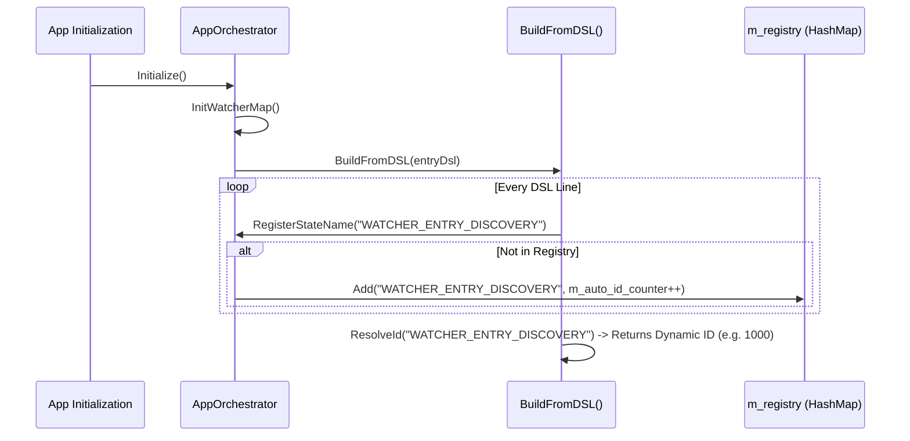

# 설계 보고서: 상수 매핑 없는 DSL 기반 동적 시퀀스 구축 방안 (v1.0)

본 보고서는 워크플로우 제어용 커스텀 상태 문자열에 대해 명시적인 정수 상수 등록(`m_registry.Add("WATCHER_ENTRY_DISCOVERY", 101)`)을 배제하고, DSL 문자열만으로 시퀀스를 동적으로 빌드하여 구동하는 설계 구조를 제시합니다.

---

## 1. 배경 및 필요성
기존 구조에서는 신규 워처 상태(`WATCHER_ENTRY_DISCOVERY`, `WATCHER_ENTRY_EXECUTE` 등)를 추가할 때마다 아래와 같이 상수를 레지스트리에 수동 등록해야 했습니다.
```mql5
m_registry.Add("WATCHER_ENTRY_DISCOVERY", 101);
m_registry.Add("WATCHER_ENTRY_EXECUTE",   102);
```
이 방식은 MQL5 소스코드 상에서의 불필요한 상태 상수 관리를 유발하고, DSL의 핵심 장점인 **"선언적 유연성(Declarative Flexibility)"**을 저해합니다. 

이에 따라, DSL 파싱 시점에 상태명을 동적 매핑하고 런타임에 이를 유동적으로 조회하는 **상수 매핑 없는 완전 동적 DSL 설계**로 전환합니다.

---

## 2. 동적 매핑 메커니즘 분석
이미 [CXSequenceOrchestrator.mqh](file:///d:/Projects/ATS/ATSE/CXTrade/Platform/Core/Sequence/CXSequenceOrchestrator.mqh) 프레임워크에는 동적 문자열-ID 매핑을 처리하는 핵심 구조가 구축되어 있습니다.



### 2.1 자동 ID 할당 엔진
`CXSequenceOrchestrator` 클래스는 생성 시점에 `m_auto_id_counter = 1000`으로 카운터를 초기화하며, 아래의 두 가지 핵심 메서드로 상태명을 관리합니다:

1. **`RegisterStateName(string name)`**:
   - 해시맵(`m_registry`)에 존재하지 않는 순수 문자열 상태명이 유입되면, 카운터 값(`m_auto_id_counter++`)을 ID로 부여하고 자동으로 해시맵에 등록합니다.
2. **`ResolveId(string value)`**:
   - 유입된 값이 숫자로만 구성되어 있으면 즉시 해당 정수값(예: `SESSION_ACTIVE` 등 고정 Enum 값)으로 파싱합니다.
   - 텍스트 문자열인 경우, 해시맵에서 기존 등록 여부를 찾고, 없으면 `RegisterStateName`을 호출하여 런타임에 즉시 신규 ID를 발행 및 반환합니다.

```mql5
int ResolveId(string value) {
    string val = Clean(value);
    if(val == "") return -1;
    if(IsDigit(val)) return (int)StringToInteger(val);
    int id;
    if(m_registry.TryGetValue(val, id)) return id;
    RegisterStateName(val);
    m_registry.TryGetValue(val, id);
    return id;
}
```

---

## 3. 상수 매핑 제거 시 시퀀스 동작 프로세스

상수 등록부(`m_registry.Add`)를 전면 삭제하더라도 시퀀스는 다음과 같이 완벽하게 빌드되고 구동됩니다.

### Step 1: DSL 정의 및 동적 등록
`AppOrchestrator`에서 아래와 같이 상수 매핑 없이 순수하게 DSL 배열을 선언하여 전달합니다.
```mql5
string entryDsl[] = {
    "WATCHER_ENTRY_DISCOVERY  > EntryDiscovery   ? WATCHER_ENTRY_EXECUTE   ! WATCHER_ENTRY_DISCOVERY @ 0s, 0x",
    "WATCHER_ENTRY_EXECUTE    > EntryExecute     ? WATCHER_ENTRY_DISCOVERY ! WATCHER_ENTRY_DISCOVERY @ 0s, 0x"
};
BuildFromDSL(entryDsl, m_watcher_map);
```
- `BuildFromDSL`은 첫 번째 패스에서 각 라인의 첫 문자인 `"WATCHER_ENTRY_DISCOVERY"`, `"WATCHER_ENTRY_EXECUTE"`를 스캔하고, 레지스트리에 없으므로 각각 자동 ID `1000`, `1001`을 동적 할당합니다.

### Step 2: 조건부 분기 매핑
- 파서가 분기 조건문(`? WATCHER_ENTRY_EXECUTE ! WATCHER_ENTRY_DISCOVERY`)을 해석할 때 `ResolveId`를 호출합니다.
- 이미 Step 1에서 등록된 해시맵을 조회하여 성공 분기(`?`) 대상에는 `1001`, 실패 분기(`!`) 대상에는 `1000` 정수 ID를 완벽하게 매핑하여 시퀀스 객체를 빌드합니다.

### Step 3: 런타임 상태 전이 검증
Step 클래스(예: `CXStepEntrySpawning`) 내에서 시퀀스 상태를 변경하거나 완료 보고를 할 때 다음과 같이 동작합니다.
```mql5
return IS_VALID(orchestrator) ? orchestrator.ResolveId("WATCHER_ENTRY_DISCOVERY") : STATE_UNCHANGED;
```
- 실행 엔진은 런타임에 `"WATCHER_ENTRY_DISCOVERY"` 텍스트를 인자로 하여 `ResolveId`를 실행합니다.
- 레지스트리 해시맵을 통해 동적으로 할당되었던 ID `1000`을 즉시 리턴하므로, 시퀀스는 오류 없이 해당 상태로 정상 전이합니다.

---

## 4. 리팩토링 구현 방안

### 4.1 불필요한 매핑 제거
[AppOrchestrator.mqh](file:///d:/Projects/ATS/ATSE/CXTrade/App/Orchestration/AppOrchestrator.mqh) 내의 워처 관련 하드코딩 매핑(52~55라인)을 제거합니다:

```diff
-       m_registry.Add("WATCHER_ENTRY_DISCOVERY", 101);
-       m_registry.Add("WATCHER_ENTRY_EXECUTE",   102);
-       m_registry.Add("WATCHER_EXIT_DISCOVERY",  201);
-       m_registry.Add("WATCHER_EXIT_EXECUTE",    202);
```

### 4.2 고정 상수 영역과의 격리 규칙
- **고정 고유 Enum 상수가 필요한 영역**:
  - `xe_status` 값(예: `XE_READY(0)`, `XE_PENDING_PLACED(5)`, `XE_CLOSED_SIGNAL(20)`) 및 `SESSION_STATE`와 같이 데이터베이스 저장 스키마 또는 외부 API(ATSA)와의 연동에 직접 쓰이는 상수는 `RegisterStandardNames()`를 통한 명시적 상수 매핑을 필수로 유지합니다.
- **순수 시퀀스 흐름 제어 영역**:
  - 워처 전이 상태나 세션 내부 하위 제어 상태는 순수하게 시퀀스 오케스트레이터의 샌드박스 내부에서만 흐르므로, 100% 동적 자동 ID 매핑 영역으로 분류하여 상수 지정을 전면 생략합니다.

---

## 5. 기대 효과
1. **높은 확장성**: 시퀀스 정의 문서(DSL)만 수정하고 새로운 상태 문자열을 적으면, MQL5 엔진 코드를 수정하거나 컴파일을 매번 복잡하게 거치지 않고도 신규 상태 분기를 가동할 수 있습니다.
2. **코드 간결성**: `m_registry.Add`에 의한 불필요한 상용구 코드가 전면 정리되어 가독성과 관리성이 대폭 향상됩니다.
3. **충돌 방지**: 수동 정수 지정 실수로 인한 ID 중복 충돌 버그가 원천 방지됩니다.
