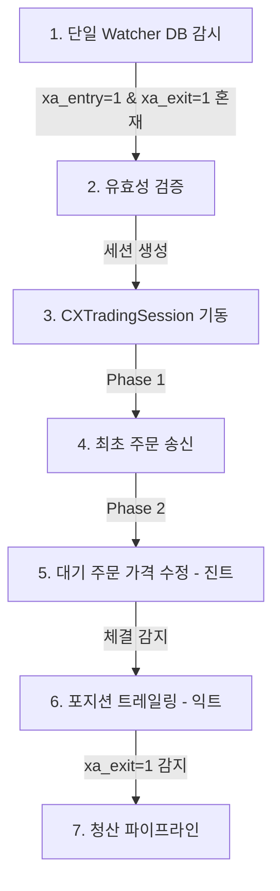

# [Report] ATSE 기존 vs 신규 시퀀스 설계 차이점 비교 분석 보고서 (v1.0)

## 1. 개요 (Overview)
본 보고서는 ATSE(MetaTrader 5 Expert Advisor) 프레임워크의 성능, 회복력, 유지보수성을 극대화하기 위해 제안된 **신규 자산 주도형 디커플링 시퀀스 설계**와 **기존 통합 시퀀스 설계**의 구조적 차이점을 상세히 비교 분석합니다.

기존 시퀀스가 가졌던 설계적 한계를 극복하고, 신규 시퀀스 도입 시 얻을 수 있는 아키텍처적 이점을 다각도로 평가합니다.

---

## 2. 기존 vs 신규 시퀀스 흐름 비교 (Flow Comparison)

### 2.1 기존 시퀀스 흐름 (Unified & State-Driven)
기존 시퀀스는 단일 감시 루프(`CXSignalWatcher`)와 신호 상태(`xe_status`)를 중심 축으로 하여 모든 단계가 긴밀하게 결합된 구조였습니다.



*   **한계**: 세션 인스턴스가 생성되면 최초 주문 송신부터 익절/손절(익트), 청산까지 동일한 세션 생명주기 하에서 실행되어 모듈 간 결합도가 매우 높았습니다.

### 2.2 신규 시퀀스 흐름 (Asset-Driven & Decoupled)
신규 설계는 감시 엔진이 최초 오더 접수만 완료하면 역할을 끝내며, 이후 흐름은 MT5 터미널 상의 **물리적 자산(오더/포지션)의 존재 여부**에 따라 각 매니저가 주도하는 비동기 분할 구조입니다.

```mermaid
graph TD
    %% 1. 진입 구역
    DB[(SQLite)] -->|xa_entry=1| WE[진입신호감지기]
    WE -->|최초 주문 접수| TM[MT5 터미널]
    TM -->|Ticket & Placed Price| DB
    Note over WE: 진입 시퀀스 종료 및 소멸

    %% 2. 오더 구역
    TM -->|대기 오더 스캔| OM[오더 관리자]
    OM -->|오더 세션 Pool 등록| OM_Pool[진트 시퀀스 독자 가동]

    %% 3. 포지션 구역
    TM -->|포지션 체결 스캔| PM[포지션 관리자]
    PM -->|포지션 Pool 등록| PM_Pool[익트 시퀀스 독자 가동]

    %% 4. 청산 구역
    DB -->|xa_exit=1| WX[청산신호감지기]
    WX -->|즉각 주문취소 / 포지션 청산| TM
```

---

## 3. 핵심 아키텍처 차이점 분석 (Key Architectural Differences)

| 비교 항목 | 기존 시퀀스 설계 | 신규 시퀀스 설계 | 개선 효과 및 기대 아키텍처 가치 |
| :--- | :--- | :--- | :--- |
| **제어권의 소유 (Control Ownership)** | **워처/세션 주도형**<br>단일 세션(`CXTradingSession`)이 진입부터 청산까지의 시퀀스 전체 제어권을 독점 소유. | **자산 주도형 (Asset-Driven)**<br>실물 오더가 있으면 `orderManager`가, 실물 포지션이 있으면 `positionManager`가 제어권을 개별 소유. | **결합도 제거**<br>특정 단계(예: 진트)의 버그가 전체 세션 상태를 데드락 시키는 결함 전파 차단. |
| **워처 폴링 효율성** | **통합 단일 폴링**<br>Entry 신호와 Exit 신호를 단일 스레드 루프 내에서 동일 주기로 감시. | **이원화 독립 폴링**<br>`signalWatcherEntry`와 `signalWatcherExit`가 독립 동작하며, 청산 폴링 속도를 고주파로 설정 가능. | **청산 지연(Latency) 최소화**<br>급변하는 시장에서 청산 신호 유입 시 즉시 처리가 가능해 슬리피지 방지. |
| **진입 및 SL/TP 기준** | **신호 가격 중심**<br>주입된 신호 가격을 보정하며 SL/TP 기준을 계산하려 함. | **시장가 및 실물 접수 가격 기준**<br>진입신호감지기가 접수한 **실제 체결 가격(Placed Price)**을 기준으로 절대 SL/TP를 셋팅. | **오더 체결 정밀도 향상**<br>브로커 StopsLevel 위반에 따른 `10015` 에러 원천 차단 및 정확한 손익비 보장. |
| **장애 복구력 (Crash Resilience)** | **DB 상태 기반 복구**<br>EA 재기동 시 SQLite DB의 `xe_status`를 파싱하여 이전 세션 상태를 재구축해야 함. | **실물 자산 기반 복구**<br>DB 복구 로직 없이, 기동 즉시 터미널 자산을 스캔해 오더/포지션 Pool에 분배하면 복구 완료. | **안정성 극대화**<br>DB 훼손 및 동기화 누락 시에도 좀비 자산 발생 위험 0% 실현. |
| **역주입 규칙 (Reverse Injection)** | **동일 상태 분기**<br>오더와 포지션을 명확히 구분하지 않고 `XE_QUARANTINED` 등으로 묶어 일괄 처리. | **자산별 옵션 차등 적용**<br>오더는 `진트/익트/SL/TP` 전체를 바인딩하고, 포지션은 `진트`를 배제하고 `익트/SL/TP`만 복구. | **불필요한 연산 방지**<br>이미 체결된 포지션에 대한 무의미한 진입 트레일링 연산 버그를 원천 배제. |
| **수동 청산 감지 (Manual Exit)** | **세션 내부 태스크 처리**<br>`TASK_A_V_TERMINAL`이 세션 내에서 돌며 물리 소멸을 간접 감지. | **독립형 수동 청산 감지기**<br>전용 감지 모듈이 터미널을 직시하며, 감지 즉시 `ForceUpdateIntent()`를 통해 DB 동기화. | **데이터 실시간성 확보**<br>터미널과 DB 간 동기화 지연을 최소화하여 다중 EA 기동 시 오작동 예방. |

---

## 4. 시나리오별 작동 시뮬레이션 비교 (Scenario Simulation)

### 시나리오 A: 진입 트레일링(진트) 도중 EA 비정상 종료 후 재부팅

*   **기존 시퀀스**:
    1.  EA 재부팅 시 DB의 `xe_status`를 읽음. `XE_PENDING_PLACED` 또는 `XE_IN_TRANSIT` 상태 복구 시도.
    2.  당시 활성화되어 있던 메모리 상의 임시 변수(`최저점`, `반등 지점` 등) 복구를 위해 DB 로그를 재파싱하거나 유실된 채 구동.
    3.  복구 과정에서 오더 가격과 DB 기록 가격 불일치 발생 시 에러 처리.
*   **신규 시퀀스**:
    1.  EA 재부팅 시 `orderManager`가 터미널의 대기 주문을 스캔하여 발견.
    2.  `ATSA.json`에서 해당 채널의 `Entry` 옵션을 새로 읽어와 **새로운 트레일링 세션**으로 깔끔하게 Pool에 등록.
    3.  터미널 오더의 현재 가격을 기준으로 가격 추적 알고리즘 즉시 정상 시작.

### 시나리오 B: 사용자의 모바일 MT5 수동 청산 감지

*   **기존 시퀀스**:
    1.  포지션 세션이 Pulse를 주기 전까지는 감지 불가.
    2.  세션 내부 태스크가 실물 소멸을 감지하더라도, 전체 세션의 정상 소멸 파이프라인(`SESSION_LIQUIDATING` $\rightarrow$ `SESSION_CLOSED`)을 거치며 지연 발생.
*   **신규 시퀀스**:
    1.  `수동 강제 청산 감지기`가 틱마다 터미널 포지션 목록과 메모리 관리 대상을 교차 비교.
    2.  소멸 감지 즉시 `ForceUpdateIntent()`로 DB 상태를 `XE_CLOSED_MANUAL (24)`로 덮어쓰고, 해당 포지션 Pool 세션을 즉각 완전 종료(GC).

---

## 5. 결론 및 마이그레이션 전략 (Migration Strategy)

### 5.1 요약 평가
신규 시퀀스 설계는 **'상태 중심'**에서 **'자산(물리 실물) 중심'**으로 ATSE의 패러다임을 전환합니다. 이는 EA 시스템의 가장 고질적인 문제인 DB-터미널 간 정합성 불일치 및 갑작스러운 크래시 발생 시의 좀비 자산 방치 문제를 완벽하게 해결해 주는 설계 방식입니다.

### 5.2 마이그레이션 조치 사항
1.  **Orchestrator DSL 업데이트**: `AppOrchestrator`의 DSL 맵을 진입 워처와 청산 워처로 분배하여 재구성해야 합니다.
2.  **Pool Manager 도입**: 오더 세션 Pool과 포지션 관리 Pool을 통합 제어할 전역 `CXSessionPoolManager`의 인터페이스 정립이 필요합니다.
3.  **Reverse Injection 로직 리팩토링**: [CXReverseInjector](file:///d:/Projects/ATS/ATSE/CXTrade/App/Logic/CXReverseInjector.mqh)에 명시된 복구 조건 분기(`IsOrderExists` vs `IsPositionExists`)를 세분화하여 채널 파라미터를 적용하는 리팩토링을 집행합니다.
