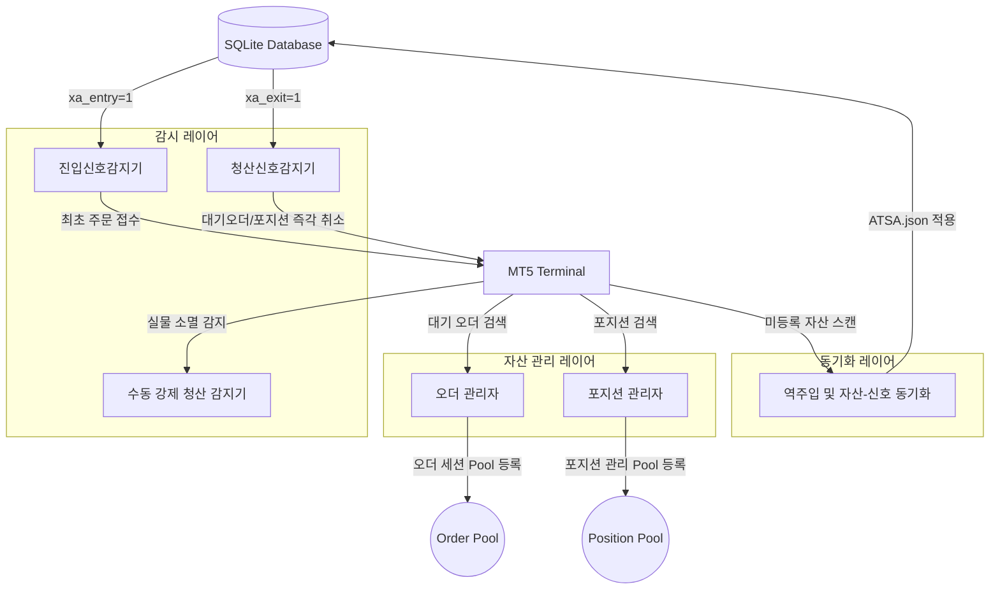
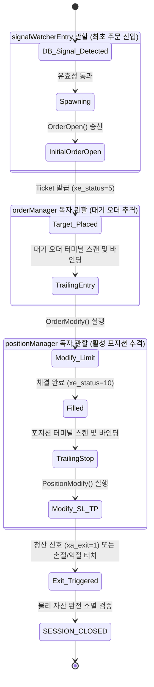

# [Design] ATSE 6-Core Architectural Restructuring & Asset-Driven Decoupling (v1.0)

## 1. 개요 (Overview)
본 설계서는 ATSE(MetaTrader 5 Expert Advisor) 프레임워크 내에서 진입(Entry)과 청산(Exit/Liquidation)의 관심사를 완전히 분리하고, 각각의 역할에 맞춰 **워처(Watcher)**, **매니저(Manager)**, **태스크(Task) 시퀀스** 구조를 고도화하기 위한 설계 명세서입니다.

진입 감시 엔진과 오더 매니저 간의 제어 흐름 결합도를 없애고, 터미널의 실물 자산 상태에 따라 각 모듈이 독자적으로 라이프사이클을 추적·제어하는 **'자산 주도형 디커플링 아키텍처(Asset-Driven Decoupled Architecture)'**를 정의합니다.

---

## 2. 6대 핵심 컴포넌트 상세 설계 (6-Core Components Specification)



---

### 2.1 진입신호감지기 (Entry Signal Detector)
*   **핵심 역할**: SQLite DB 신호 테이블에서 진입을 요청하는 신호(`xa_entry = 1` 및 아직 기동되지 않은 `xe_status < 10` 상태)만을 감지합니다.
*   **진입 오더 접수 메커니즘**:
    1.  현재 실시간 시장가(Ask/Bid)를 수집합니다 (신호 주입가 무시 원칙).
    2.  시장가 기준으로 채널 설정의 **TE Limit(진입 반등 임계값)**을 계산하여 최초 대기 주문(Limit/Stop) 가격을 산출하고 브로커에 전송합니다 (`OrderOpen`).
    3.  브로커로부터 대기 주문 접수(Acceptance) 성공 피드백을 받으면, **실제 접수된 가격(Placed Price)**을 기준으로 손절선(SL) 및 익절선(TP)의 절대 가격 값을 계산하여 오더 속성에 설정합니다.
    4.  DB 신호의 상태를 `XE_PENDING_PLACED (5)`로 마킹하고, **이 시점에서 진입신호감지기의 해당 신호에 대한 제어 시퀀스는 종료**됩니다.

### 2.2 청산신호감지기 (Exit Signal Detector)
*   **핵심 역할**: SQLite DB 신호 테이블에서 청산을 요청하는 신호(`xa_exit = 1`)만을 감지합니다.
*   **청산 처리 메커니즘**:
    1.  감지 즉시 터미널 내에서 해당 `ticket` 또는 `SID`에 바인딩된 자산을 확인합니다.
    2.  해당 자산이 **대기 오더(Pending Order)**인 경우 즉각 브로커에 주문 취소(`OrderDelete`)를 전송합니다.
    3.  해당 자산이 **실물 포지션(Active Position)**인 경우 즉각 브로커에 포지션 청산(`PositionClose`)을 전송합니다.
    4.  실물 자산이 완전히 삭제되었음을 터미널 상에서 교차 검증한 후, DB 상태를 `XE_CLOSED_SIGNAL (20)`로 최종 업데이트하여 종결합니다.

### 2.3 오더 관리자 (Order Manager)
*   **핵심 역할**: 진입신호감지기 또는 외부 요인에 의해 터미널에 기접수된 대기 주문(Pending Order)들을 상시 검색하고 관리합니다.
*   **동작 및 라이프사이클**:
    1.  터미널 API(`OrdersTotal()`)를 스캔하여 매직넘버와 코멘트(SID)가 일치하는 대기 오더를 탐색합니다.
    2.  발견 시 해당 오더를 **오더 세션 Pool**에 동적으로 등록합니다.
    3.  등록과 동시에 해당 오더 전용의 **진트(Trailing Entry) 프로세스 및 시퀀스**(`SESSION_TRAILING_ENTRY`)를 기동하여 실시간 가격 추적 및 조정을 시작합니다.
    4.  대기 오더가 체결되어 사라지면 세션 Pool에서 자동으로 등록 해제 처리합니다.

### 2.4 포지션 관리자 (Position Manager)
*   **핵심 역할**: 터미널 내에서 이미 체결되어 운용 중인 활성 포지션(Active Position)만을 추적하고 제어합니다.
*   **동작 및 라이프사이클**:
    1.  터미널 API(`PositionsTotal()`)를 스캔하여 관리 대상 매직넘버에 속하는 포지션 리스트를 탐색합니다.
    2.  발견 시 해당 포지션을 **포지션 관리 Pool**에 등록합니다.
    3.  등록과 동시에 해당 포지션 전용의 **익트(Trailing Stop/Exit) 프로세스 및 시퀀스**(`SESSION_TRAILING_STOP`)를 기동하여 이익 보존선(SL/TP) 실시간 수정을 실행합니다.

### 2.5 수동 강제 청산 감지기 (Manual Forced Exit Detector)
*   **핵심 역할**: 세션의 정상 흐름 밖에서 사용자가 직접 MT5 터미널을 통해 포지션을 청산하거나 오더를 삭제한 행위를 즉각 감지합니다.
*   **동작 및 라이프사이클**:
    1.  오더/포지션 매니저가 터미널 상에서 관리 중이던 실물 자산(티켓)이 갑자기 소멸했음을 감지합니다.
    2.  `ICXInventoryManager` 및 MT5 거래 이력(`HistoryDeal`) 조회를 통해 브로커의 SL/TP에 의한 자동 종료가 아닌, **사용자의 수동 청산(Manual Intervention)**임을 교차 판정합니다.
    3.  수동 청산 확정 시, DB 신호 테이블에 `xe_status = 24 (XE_CLOSED_MANUAL)` 및 `xa_exit = 2`를 **`ForceUpdateIntent()`**를 통해 강제 반영(MAX 가드 우회)하여 즉각 데이터 정합성을 일치시킵니다.

### 2.6 역주입 및 자산-신호 동기화 (Reverse Injection & Sync)
*   **핵심 역할**: 시스템 시동(EA Boot) 또는 런타임 중에 터미널에는 오더나 포지션 자산이 존재하나, SQLite DB 신호 테이블에는 매칭되는 신호 데이터가 존재하지 않거나 종료된 상태인 경우, 좀비 자산으로 규정하고 동기화를 수행합니다.
*   **역주입시 타입별 옵션 적용 차별화 규칙**:
    *   **대기 주문(Order) 역주입**: 
        *   아직 진입 가격 개선이 가능하므로 해당 채널 설정(`ATSA.json`)에 정의된 **진트(Trailing Entry) 옵션, 익트(Trailing Exit) 옵션, SL, TP**를 모두 주입하여 복구합니다.
        *   이후 오더 세션 Pool에 등록하여 정상적인 대기 주문 추격 단계를 이어받습니다.
    *   **활성 포지션(Position) 역주입**:
        *   이미 진입이 확정되었으므로 진입 트레일링 계산은 의미가 없습니다.
        *   따라서 진트 옵션은 무시하며, 해당 채널의 **익트(Trailing Exit) 옵션, SL, TP**만을 로딩하여 강제 주입합니다.
        *   시퀀스를 `SESSION_ACTIVE`로 즉시 점프시킨 후 포지션 관리 Pool에 등록하여 손절/익절 추적을 즉시 시작합니다.

---

## 3. 시퀀스 DSL 및 세션 풀 매핑 구조 (Sequence DSL & Pool Mapping)

### 3.1 Watcher DSL 분할 구성
Orchestrator는 분리된 진입/청산 워처의 상태 전이를 아래와 같이 이원화하여 기동합니다.

```cpp
// 진입 감시 시퀀스 (Entry Watcher Sequence)
"WATCHER_ENTRY_DISCOVERY  > Discovery:Step_EntryDiscovery  ? WATCHER_ENTRY_SPAWNING ! WATCHER_ENTRY_DISCOVERY"
"WATCHER_ENTRY_SPAWNING   > Spawning:Step_EntrySpawning    ? WATCHER_ENTRY_DISCOVERY ! WATCHER_ENTRY_DISCOVERY"

// 청산 감시 시퀀스 (Exit Watcher Sequence)
"WATCHER_EXIT_DISCOVERY   > Discovery:Step_ExitDiscovery   ? WATCHER_EXIT_EXECUTE    ! WATCHER_EXIT_DISCOVERY"
"WATCHER_EXIT_EXECUTE     > Execute:Step_ExitExecute       ? WATCHER_EXIT_DISCOVERY  ! WATCHER_EXIT_DISCOVERY"
```

### 3.2 세션 풀(Session Pool) 자산 전환 흐름



---

## 4. 검토 의견 및 향후 조치 제안 (Recommendation & Action Items)

1.  **동시 스캔에 따른 대역폭 및 성능 부하**:
    *   `orderManager`와 `positionManager`가 각각 `OrdersTotal()`과 `PositionsTotal()`을 고주파 폴링할 때 발생할 수 있는 CPU 점유율 상승을 방지하기 위해, MT5 `OnTradeTransaction()` 이벤트를 결합한 이벤트 기반 스캔 트리거 구조 보완 검토를 권장합니다.
2.  **DB 스키마 정합성 유지**:
    *   진입신호감지기가 생성하는 `XE_PENDING_PLACED (5)` 상태와 최종 익트 돌입 가격 기준의 SL/TP 컬럼 정보가 오더 매니저 기동 시 유실되지 않도록, DB 트랜잭션 락킹 정책에 대한 사전 검증이 필요합니다.
