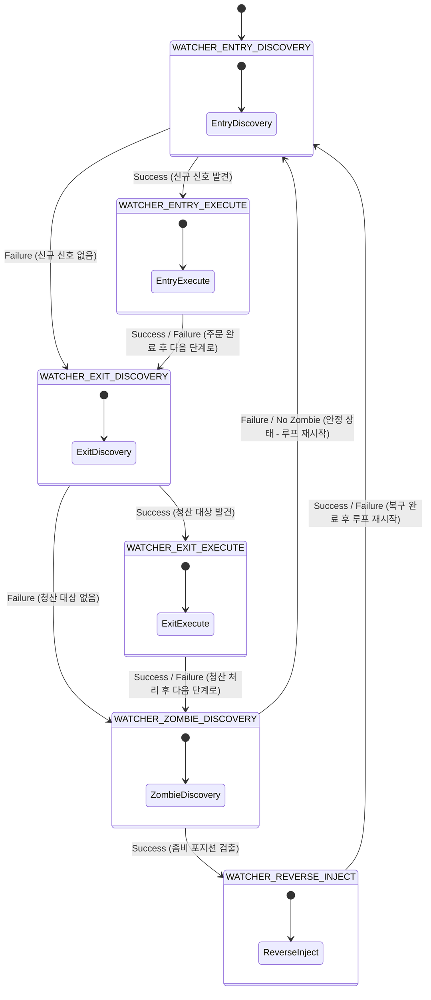
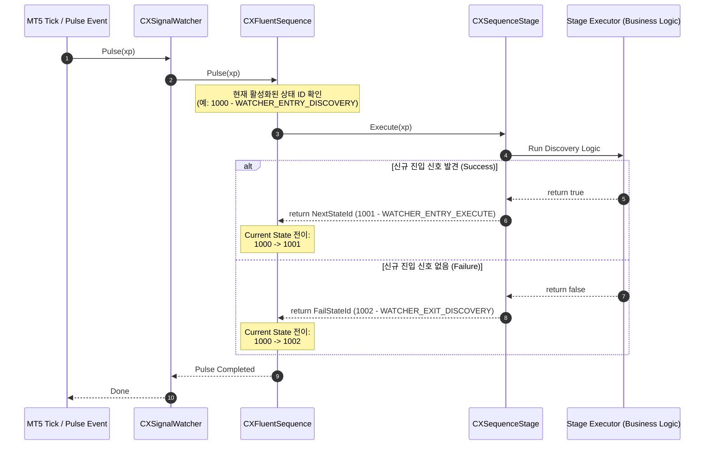

# 설계 및 동작 분석 보고서: DSL 기반 통합 워처 시퀀스 (v1.0)

본 보고서는 `AppOrchestrator.mqh`의 `InitWatcherMap()`에 정의된 선언적 DSL 기반 통합 워처(Unified Watcher) 시퀀스의 동작 구조와 상태 전이 메커니즘을 상세히 기술하고, 시각적 다이어그램을 통해 이를 설명합니다.

---

## 1. 개요 (Overview)

통합 워처 시퀀스는 거래 시스템(ATSE)의 라이프사이클을 통제하는 핵심 순환 파이프라인입니다. 
기존의 하드코딩된 상태 제어 방식 대신, **시맨틱 기호 기반 DSL(Domain Specific Language)**을 사용하여 다음과 같은 3가지 주요 도메인 작업을 단일 순환 흐름으로 통합 및 스케줄링합니다:
1. **진입 관리(Entry)**: 신규 진입 신호 발견 및 체결 처리
2. **청산 관리(Exit)**: 청산 대상 탐색 및 청산 실행
3. **포지션 정합성 복구(Zombie & Reverse Inject)**: 비정상/고립 포지션(Zombie) 탐색 및 정합성 강제 동기화

---

## 2. 워처 DSL 소스코드 및 구문 분석

`AppOrchestrator` 클래스 내에 정의된 워처 시퀀스 DSL 구문은 다음과 같습니다:

```cpp
virtual void InitWatcherMap() override {
    string unifiedDsl[] = {
        "WATCHER_ENTRY_DISCOVERY   > EntryDiscovery     ? WATCHER_ENTRY_EXECUTE    ! WATCHER_EXIT_DISCOVERY    @ 0s, 0x",
        "WATCHER_ENTRY_EXECUTE     > EntryExecute       ? WATCHER_EXIT_DISCOVERY   ! WATCHER_EXIT_DISCOVERY    @ 0s, 0x",
        
        "WATCHER_EXIT_DISCOVERY    > ExitDiscovery      ? WATCHER_EXIT_EXECUTE     ! WATCHER_ZOMBIE_DISCOVERY  @ 0s, 0x",
        "WATCHER_EXIT_EXECUTE      > ExitExecute        ? WATCHER_ZOMBIE_DISCOVERY ! WATCHER_ZOMBIE_DISCOVERY  @ 0s, 0x",
        
        "WATCHER_ZOMBIE_DISCOVERY  > ZombieDiscovery    ? WATCHER_REVERSE_INJECT   ! WATCHER_ENTRY_DISCOVERY   @ 0s, 0x",
        "WATCHER_REVERSE_INJECT    > ReverseInject      ? WATCHER_ENTRY_DISCOVERY  ! WATCHER_ENTRY_DISCOVERY   @ 0s, 0x"
    };
    BuildFromDSL(unifiedDsl, m_watcher_map);
}
```

### 2.1 DSL 토큰 해석 규칙

각 라인은 다음과 같은 의미론적 기호 구조를 갖습니다:
$$\text{현재 상태 명칭} \quad > \text{실행할 단계(Stage)} \quad ? \text{성공 시 전이상태} \quad ! \text{실패 시 전이상태} \quad @ \text{타임아웃, 재시도 횟수}$$

| 항목 | 기호 | 의미 | 예시 |
| :--- | :---: | :--- | :--- |
| **현재 상태** | - | 해당 단계가 활성화되는 메모리 상의 시퀀스 상태 ID명 | `WATCHER_ENTRY_DISCOVERY` |
| **실행 단계** | `>` | 해당 상태에서 실행할 구체적 Stage (비즈니스 로직 단위) | `EntryDiscovery` |
| **성공 전이** | `?` | Stage의 리턴 결과가 `true`이거나 성공적으로 마무리되었을 때 이동할 다음 상태 | `WATCHER_ENTRY_EXECUTE` |
| **실패 전이** | `!` | Stage의 리턴 결과가 `false`이거나 실행 실패 시 이동할 다음 상태 | `WATCHER_EXIT_DISCOVERY` |
| **속성 설정** | `@` | 해당 단계의 타임아웃 제한 시간(초) 및 실행 실패 시의 최대 재시도 횟수 | `0s, 0x` (제한 없음) |

---

## 3. 시퀀스 단계별 상세 명세

| 현재 상태 | 실행 Stage | 성공 전이 (`?`) | 실패 전이 (`!`) | 타임아웃 / 재시도 | 비즈니스 로직 및 설명 |
| :--- | :--- | :--- | :--- | :---: | :--- |
| **WATCHER_ENTRY_DISCOVERY** | `EntryDiscovery` | `WATCHER_ENTRY_EXECUTE` | `WATCHER_EXIT_DISCOVERY` | `0s` / `0x` | 신규 진입 신호 존재 여부 탐색. 신호 발견 시 실행 단계로 전이, 미발견 시 청산 감시로 스킵. |
| **WATCHER_ENTRY_EXECUTE** | `EntryExecute` | `WATCHER_EXIT_DISCOVERY` | `WATCHER_EXIT_DISCOVERY` | `0s` / `0x` | 발견된 진입 신호에 대한 실제 주문 실행 및 관리 세션 구동. 성공/실패 여부와 무관하게 청산 감시로 흐름 전환. |
| **WATCHER_EXIT_DISCOVERY** | `ExitDiscovery` | `WATCHER_EXIT_EXECUTE` | `WATCHER_ZOMBIE_DISCOVERY` | `0s` / `0x` | 실시간 체결 포지션 중 청산(손절/익절/신호청산 등) 신호 발생 대상 탐색. 청산 대상 발견 시 청산 실행으로 전이. |
| **WATCHER_EXIT_EXECUTE** | `ExitExecute` | `WATCHER_ZOMBIE_DISCOVERY` | `WATCHER_ZOMBIE_DISCOVERY` | `0s` / `0x` | 청산 대상 포지션의 실제 청산 주문(Market/Limit) 처리. 완료 후 좀비 포지션 검사로 전이. |
| **WATCHER_ZOMBIE_DISCOVERY** | `ZombieDiscovery` | `WATCHER_REVERSE_INJECT` | `WATCHER_ENTRY_DISCOVERY` | `0s` / `0x` | MT5 실물 포지션과 시스템 DB/메모리 상태 간 불일치(좀비 포지션) 탐색. 좀비 발견 시 복구 전이, 없을 시 초기 단계로 순환. |
| **WATCHER_REVERSE_INJECT** | `ReverseInject` | `WATCHER_ENTRY_DISCOVERY` | `WATCHER_ENTRY_DISCOVERY` | `0s` / `0x` | 고립된 실물 포지션 정보를 DB 및 시스템 메모리에 역주입하여 데이터 정합성 복구. 완료 후 루프 초기 단계로 순환. |

---

## 4. 상수 매핑 배제 및 동적 ID 자동 할당 메커니즘 (Auto-ID Engine)

`AppOrchestrator::RegisterStandardNames()`를 보면 워처용 구버전 상태명(`WATCHER_DISCOVERY` 등)만 수동 등록되어 있고, 위 DSL에서 사용되는 6가지 상태명(`WATCHER_ENTRY_DISCOVERY` 등)은 **레지스트리 등록이 생략**되어 있습니다. 

이는 **상수 매핑이 없는 완전 동적 DSL 설계** 규격에 따른 것으로, 런타임 시 아래 흐름으로 자동 제어됩니다:

1. **초기화 및 스캔**: 오케스트레이터 기동 시 `BuildFromDSL`을 통해 DSL 배열이 로딩됩니다. 
2. **동적 ID 발행**: `RegisterStateName()`이 호출되며, 등록되지 않은 새로운 상태 문자열을 발견하면 내부 카운터(`m_auto_id_counter` = 1000)를 기준으로 1씩 가산하며 ID를 발행하고 해시맵(`m_registry`)에 기록합니다.
   - `WATCHER_ENTRY_DISCOVERY` $\rightarrow$ `1000`
   - `WATCHER_ENTRY_EXECUTE` $\rightarrow$ `1001`
   - `WATCHER_EXIT_DISCOVERY` $\rightarrow$ `1002`
   - `WATCHER_EXIT_EXECUTE` $\rightarrow$ `1003`
   - `WATCHER_ZOMBIE_DISCOVERY` $\rightarrow$ `1004`
   - `WATCHER_REVERSE_INJECT` $\rightarrow$ `1005`
3. **흐름 분기 매핑**: 성공(`?`) 및 실패(`!`) 전이 대상을 조회할 때 `ResolveId("상태명")`을 수행하여 이미 발행된 ID를 반환받아 시퀀스 스테이지 객체 내부 노드를 완벽히 매핑합니다.
4. **비격리성 보장**: 시퀀스 흐름 상태는 오직 ATSE 메모리 상에서만 존재하므로, DB 스키마(영속화 컬럼 `xa_entry`, `xa_exit`, `xe_status` 등)와 격리되어 있어 고유 정수 ID 값이 동적으로 바뀌어도 외부에 사이드 이펙트를 주지 않습니다.

---

## 5. 시퀀스 동작 상태 다이어그램 (State Transition Diagram)

이 통합 워처 시퀀스의 상태 전이도는 다음과 같습니다. 전체 파이프라인이 대기(Idle) 없이 거대한 순환형 루프(Infinite Loop)를 돌며 거래 터미널 전체를 지속적으로 감시하고 복구하는 구조를 띱니다.



---

## 6. 시퀀스 런타임 실행 다이어그램 (Sequence Execution Diagram)

아래의 시퀀스 다이어그램은 메인 스레드(Tick/Timer)에서 `CXSignalWatcher::Pulse`가 호출될 때, DSL 시퀀스 엔진이 등록된 스테이지들을 구동하며 상태를 전환하고 로직을 수행하는 내부 흐름을 나타냅니다.



---

## 7. 주요 비즈니스 시나리오 흐름 추적 (Workflow Scenarios)

### 시나리오 A. 평시(Normal) 동작 흐름 (신호 및 좀비 없음)
> 진입할 신호도 없고, 청산할 포지션도 없으며, 시스템 정합성도 완벽한 상태에서의 순환입니다.
1. **`WATCHER_ENTRY_DISCOVERY`** 실행 $\rightarrow$ 신규 진입 신호 없음 (`Failure` 리턴)
2. **`WATCHER_EXIT_DISCOVERY`**로 전이 후 실행 $\rightarrow$ 청산 대상 포지션 없음 (`Failure` 리턴)
3. **`WATCHER_ZOMBIE_DISCOVERY`**로 전이 후 실행 $\rightarrow$ 좀비 포지션 발견되지 않음 (`Failure` 리턴)
4. **`WATCHER_ENTRY_DISCOVERY`**로 복귀하여 다시 1번부터 감시 수행 (Idle Loop 완료)

### 시나리오 B. 신규 진입 신호 발생 및 체결 흐름
> 새로운 거래 신호가 감지되어 진입 절차를 밟는 흐름입니다.
1. **`WATCHER_ENTRY_DISCOVERY`** 실행 $\rightarrow$ 신규 진입 신호 발견 (`Success` 리턴)
2. **`WATCHER_ENTRY_EXECUTE`**로 전이 후 실행 $\rightarrow$ 브로커 주문 전송 및 거래 세션 생성 (`Success`/`Failure` 무관하게 전이)
3. **`WATCHER_EXIT_DISCOVERY`**로 전이 $\rightarrow$ 청산 대상 없음 (`Failure` 리턴)
4. **`WATCHER_ZOMBIE_DISCOVERY`**로 전이 $\rightarrow$ 좀비 포지션 없음 (`Failure` 리턴)
5. **`WATCHER_ENTRY_DISCOVERY`**로 복귀 (신규 진입 완료 후 다음 주환 주기 시작)

### 시나리오 C. 좀비 포지션 발견 및 자동 복구 흐름
> DB 상에는 없으나 실제 터미널(MT5) 상에 고립되어 방치된 포지션이 포착된 긴급 정합성 복구 흐름입니다.
1. **`WATCHER_ENTRY_DISCOVERY`** 실행 $\rightarrow$ 신규 신호 없음 (`Failure` 리턴)
2. **`WATCHER_EXIT_DISCOVERY`** 실행 $\rightarrow$ 청산 대상 없음 (`Failure` 리턴)
3. **`WATCHER_ZOMBIE_DISCOVERY`** 실행 $\rightarrow$ 좀비 포지션 검출 (`Success` 리턴)
4. **`WATCHER_REVERSE_INJECT`**로 전이 후 실행 $\rightarrow$ 해당 포지션 정보를 DB 및 관리 세션에 역주입하여 동기화 (`Success`/`Failure` 무관하게 전이)
5. **`WATCHER_ENTRY_DISCOVERY`**로 복귀 (비정상 상태 복구 완료 후 정상 감시 재개)

---

## 8. 기대 효과 및 아키텍처적 의의

1. **선언적 흐름 제어 (Declarative Flow Control)**:
   - 복잡하게 꼬여 있던 상태 전이 로직이 6줄의 텍스트 DSL로 완전히 단일화되어, 시각적 시퀀스 구조 가독성이 대폭 향상되었습니다.
2. **무정지 확장성 (Hot-Swap & Enum-less)**:
   - 개발자는 MQL5 코드에 상수를 수동으로 정의하거나 레지스트리를 바인딩하지 않고도, DSL 한 줄을 수정하거나 단계를 덧붙임으로써 런타임 상에서 유연하게 시퀀스를 변형할 수 있습니다.
3. **정밀 격리 (Decoupled Design)**:
   - 메모리 상의 시퀀스 제어 흐름과 데이터베이스 영속화 상태(`xa_entry`/`xa_exit`/`xe_status`)를 엄격하게 경계 분리하여, 잦은 내부 흐름 수정에도 외부 DB 정합성 및 ATSA UI 매칭에 충돌과 정합성 누수가 발생하지 않는 고신뢰성 아키텍처를 실현하였습니다.
