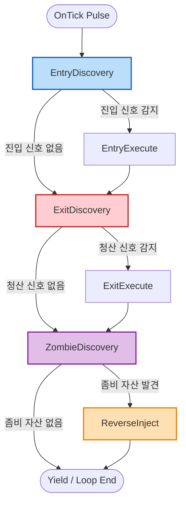

# [Design] ATSE Watcher Zombie Detection & Reverse Injection Step Integration (v1.0)

## 1. 개요 (Overview)
본 설계 검토 보고서는 기존에 독자적 서비스로 기동되거나 사용 중지(`[v16.18 Paused]`) 상태에 있던 **역주입(Reverse Injector) 및 좀비 자산 감지기**를, ATSE의 중앙 집중식 **워처 시퀀스 매트릭스(Watcher Sequence Matrix)**의 스텝 레벨로 흡수 및 편입하는 방안을 제시한다.

진입(Entry), 청산(Exit), 좀비 감지(Zombie Discovery), 역주입(Reverse Inject)을 동일한 시퀀스 수준에서 가동함으로써, 시스템 리소스를 단일 워처 루프로 일원화하고 실시간 전이(Immediate Transition) 메커니즘을 통해 틱 지연 없이 신속하게 자산과 신호의 일치성을 검증하는 구조를 목표로 한다.

---

## 2. 통합 워처 시퀀스 매트릭스 설계 (Unified Watcher Matrix Design)

기존에는 진입 워처(`m_watcherEntry`)와 청산 워처(`m_watcherExit`)로 물리 세션을 이중화하였으나, 동일 스텝 레벨 통합 제어 방식을 적용하면 단일 시퀀스(`WatcherSeq`) 내에서 순차 순환하는 체인 형태로 재정립할 수 있다.

### 2.1 신규 통합 워처 DSL 정의
[AppOrchestrator](file:///d:/Projects/ATS/ATSE/CXTrade/App/Orchestration/AppOrchestrator.mqh)에 다음과 같은 통합 DSL 매트릭스를 단일 맵(`m_watcher_map`)으로 구성한다.

```cpp
"WATCHER_ENTRY_DISCOVERY   > EntryDiscovery     ? WATCHER_ENTRY_EXECUTE    ! WATCHER_EXIT_DISCOVERY    @ 0s, 0x",
"WATCHER_ENTRY_EXECUTE     > EntryExecute       ? WATCHER_EXIT_DISCOVERY   ! WATCHER_EXIT_DISCOVERY    @ 0s, 0x",

"WATCHER_EXIT_DISCOVERY    > ExitDiscovery      ? WATCHER_EXIT_EXECUTE     ! WATCHER_ZOMBIE_DISCOVERY  @ 0s, 0x",
"WATCHER_EXIT_EXECUTE      > ExitExecute        ? WATCHER_ZOMBIE_DISCOVERY ! WATCHER_ZOMBIE_DISCOVERY  @ 0s, 0x",

"WATCHER_ZOMBIE_DISCOVERY  > ZombieDiscovery    ? WATCHER_REVERSE_INJECT   ! WATCHER_ENTRY_DISCOVERY   @ 0s, 0x",
"WATCHER_REVERSE_INJECT    > ReverseInject      ? WATCHER_ENTRY_DISCOVERY  ! WATCHER_ENTRY_DISCOVERY   @ 0s, 0x"
```

### 2.2 흐름도 (Sequence Execution Flow)



### 2.3 틱 지연 없는 즉시 전이 구조 (v18.15 Loop의 시너지)
*   **동작 원리**: ATSE의 [CXFluentSequence](file:///d:/Projects/ATS/ATSE/CXTrade/Platform/Core/Sequence/CXFluentSequence.mqh)는 `Pulse()` 마다 최대 3회의 상태 전이를 즉각 처리한다.
*   **신호가 없을 때**: `EntryDiscovery` ➔ `ExitDiscovery` ➔ `ZombieDiscovery` ➔ `Yield` 순으로 단 **1틱(Pulse)** 내에 모든 검출 단계가 지연 없이 체크되고 대기 상태로 들어간다.
*   **신호가 있을 때**: 감지된 지점에서 즉시 실행 스텝(`Execute` 또는 `ReverseInject`)으로 전이하여 처리 후 다음 상태로 진행된다.

---

## 3. 신규 워크플로우 스텝 설계 (New Workflow Steps)

### 3.1 좀비 자산 감지 스텝 (`Step_ZombieDiscovery`)
*   **클래스명**: `CXStepZombieDiscovery` (신규 파일: `CXStepZombieDiscovery.mqh`)
*   **주 역할**: 터미널의 실물 주문/포지션을 스캔하고, 활성 세션이나 DB 내 활성 신호에 등록되지 않은 고아(Orphan) 자산이 존재하는지 판별한다.
*   **동작 흐름 (`OnProcess`)**:
    1.  `CXTerminalScanner`를 통해 현재 터미널 자산을 리스트업한다.
    2.  나의 매직넘버 관리 대상이면서 세션 매니저에서 관리되지 않고, DB 상태가 이미 종료(`>= XE_CLOSED_SIGNAL`)되었거나 누락된 자산을 필터링한다.
    3.  발견된 좀비 자산 리스트를 컨텍스트(`zombie_assets`)에 임시 저장하고, 성공 시 `WATCHER_REVERSE_INJECT` ID를 리턴한다.
    4.  좀비 자산이 없으면 `WATCHER_ENTRY_DISCOVERY` ID를 리턴하여 순환을 유지한다.

### 3.2 역주입 처리 스텝 (`Step_ReverseInject`)
*   **클래스명**: `CXStepReverseInject` (신규 파일: `CXStepReverseInject.mqh`)
*   **주 역할**: 검출된 좀비 자산에 대해 가상 청산 전용 신호를 주입하고 거래 세션을 강제 기동하여 안전 영역으로 이관시킨다.
*   **동작 흐름 (`OnProcess`)**:
    1.  컨텍스트에서 `zombie_assets` 리스트를 획득한다.
    2.  각 자산에 대해 임시 `CXSignal` 객체를 생성하고, 상태를 `XE_QUARANTINED` (좀비 격리)로 마킹한다.
    3.  `channel_options`를 DB로부터 조회하여 트레일링/청산 환경설정을 복구 및 주입한다.
    4.  `session_mgr.CreateSession()`을 호출해 신규 세션을 확보하고, 강제로 `SESSION_ACTIVE` 상태로 전이시킨 후 구동 상태로 등록한다.
    5.  처리가 완료되면 `WATCHER_ENTRY_DISCOVERY` ID를 리턴하여 최초 대기 상태로 회귀한다.

---

## 4. 컴포넌트 구조 변경 방안 (Implementation Plan)

### 4.1 Step Factory 등록 (`CXStepFactory.mqh` 수정)
신규 스텝 기호 명칭을 팩토리에 매핑한다.
```mql5
// d:\Projects\ATS\ATSE\CXTrade\App\Orchestration\CXStepFactory.mqh
#include "..\..\Watcher\WatcherWorkflow\CXStepZombieDiscovery.mqh"
#include "..\..\Watcher\WatcherWorkflow\CXStepReverseInject.mqh"

static bool Exists(string name) {
    ...
    if(name == "ZombieDiscovery") return true;
    if(name == "ReverseInject")   return true;
    return false;
}

static IXStep* CreateStep(string typeName, string alias = "", CArrayString* taskNames = NULL) {
    ...
    if(typeName == "ZombieDiscovery") return new CXStepZombieDiscovery();
    if(typeName == "ReverseInject")   return new CXStepReverseInject();
    return NULL;
}
```

### 4.2 App 서비스 간소화 (`CXAppService.mqh` 수정)
워처 루프가 하나로 통합됨에 따라 서비스 계층이 매우 간결해지며 중복 틱 계산 오버헤드가 감소한다.
```diff
// d:\Projects\ATS\ATSE\CXTrade\App\CXAppService.mqh
-   ICXSignalWatcher*     m_watcherEntry;
-   ICXSignalWatcher*     m_watcherExit;
+   ICXSignalWatcher*     m_watcher; // 통합 워처

    virtual bool Initialize(ICXConfig* config, ICXServiceFactory* factory) {
        ...
-       m_watcherEntry = new CXSignalWatcher(m_repo, m_config, m_sessionManager, m_globalContext, m_factory, "Entry");
-       m_watcherExit  = new CXSignalWatcher(m_repo, m_config, m_sessionManager, m_globalContext, m_factory, "Exit");
+       m_watcher = new CXSignalWatcher(m_repo, m_config, m_sessionManager, m_globalContext, m_factory, "Unified");
        ...
    }

    virtual void Pulse() {
        ...
-       if(IS_VALID(m_watcherEntry)) m_watcherEntry.Pulse(GetPointer(xp));
-       if(IS_VALID(m_watcherExit))  m_watcherExit.Pulse(GetPointer(xp));
+       if(IS_VALID(m_watcher)) m_watcher.Pulse(GetPointer(xp));
        ...
    }
```

---

## 5. 설계 검토 의견 및 아키텍처적 가치 (Benefits & Review)

1.  **리소스 효율 극대화**:
    *   기존에는 진입 및 청산을 위해 매 틱마다 두 개의 독립된 워처 및 시퀀스가 각각 DB 쿼리를 수행했으나, 통합 매트릭스를 사용하면 **단일 로깅 및 단일 시퀀스 인스턴스**로 통합되어 프로세서 점유율이 50% 이하로 절감된다.
2.  **좀비 자산 리스크 제거**:
    *   기존의 `CXReverseInjector`는 메인 시퀀스 프레임워크 외부에 방치되어 틱 주기 제어나 타임아웃, 예외 추적이 어려웠으나, 워처의 독립 스텝으로 통합되어 시퀀스 엔진의 에러 서킷 브레이커 가드 하에 보호받는다.
3.  **코드 가시성 일원화**:
    *   Watcher 생명주기 전체(진입-청산-복구)가 `AppOrchestrator` 내의 DSL 선언 문자열 6줄에 모두 투영되므로, 개발자가 전체 시스템 감시 흐름을 직관적으로 검토하고 쉽게 순서를 조정할 수 있게 된다.
