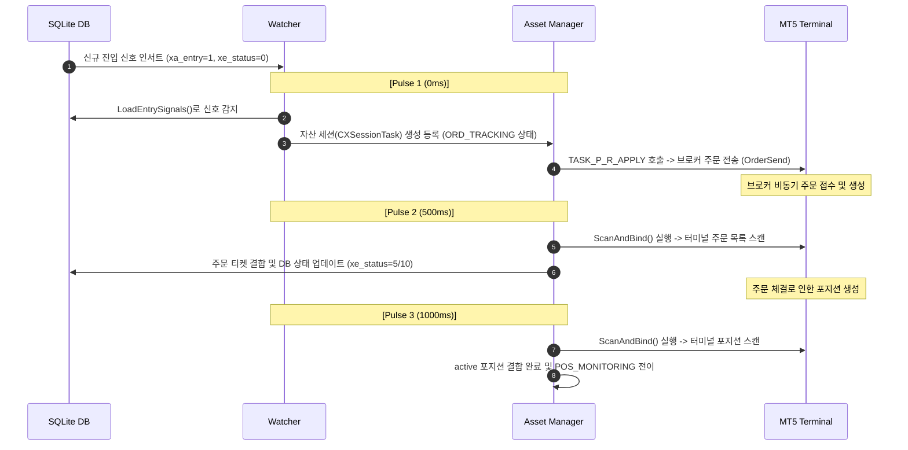
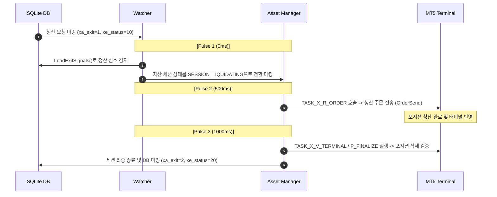

# [Report] ATSE Signal Detection and Latency Analysis Report (v1.0)

## 1. 개요 및 목적
본 보고서는 ATSE(Expert Advisor)의 신호 감지 후 주문 진입 및 포지션 청산 과정에서 발생하는 지연(Latency)의 원인을 분석하고, 이를 단축하기 위해 신호 감지기(Watcher) 스캔 주기(400ms) 및 엔진 핵심 펄스(Pulse) 주기(300ms)를 이원화하여 최적화하는 방안을 제시합니다.

---

## 2. 기존 단일 타이머(500ms) 하에서의 지연 분석
기존 시스템은 `EventSetMillisecondTimer(500)`로 설정된 단일 타이머에 의존하며, `Pulse()` 함수 호출 시 Watcher와 AssetManager가 동시에 호출됩니다. 이 구조로 인해 모든 비동기 처리와 상태 정합성 검증이 500ms 단위의 동기화 경계를 가집니다.

### A. 신규 진입(Entry) 시퀀스 펄스 소요 분석
DB에 진입 신호가 인서트된 시점부터 최종 포지션 모니터링이 시작되기까지의 펄스 단위 전개 과정은 다음과 같습니다.



1. **Pulse 1 (0ms)**: DB의 진입 신호를 감지하여 자산 세션을 생성하고 `ORD_TRACKING` 상태에서 브로커에 주문을 전송합니다.
2. **Pulse 2 (500ms)**: 터미널의 실물 주문 상태를 스캔하여 티켓 번호와 결합(Bind)하고 DB 상태를 동기화합니다.
3. **Pulse 3 (1000ms)**: 주문의 체결로 인해 생성된 포지션을 감지 및 결합하고 `POS_MONITORING` 상태로 전이합니다.
- **예상 진입 소요 시간**: 최소 **1,000ms ~ 1,500ms** (네트워크 지연 제외, 오직 시스템 펄스 경계로 인한 지연만 산정)

### B. 청산(Exit/Liquidation) 시퀀스 펄스 소요 분석
DB에 청산 신호가 업데이트된 시점부터 포지션 청산 완료 및 세션 종료까지의 전개 과정입니다.



1. **Pulse 1 (0ms)**: DB에서 청산 요청을 감지하고 해당 자산 세션에 청산 명령을 내립니다.
2. **Pulse 2 (500ms)**: 세션이 `SESSION_LIQUIDATING` 태스크에 진입하여 브로커로 청산 주문을 전송합니다.
3. **Pulse 3 (1000ms)**: 터미널에서 포지션 소멸을 최종 확인하고 세션을 정상 종료(`SYS_CLOSED`, `xe_status=20`) 처리합니다.
- **예상 청산 소요 시간**: 최소 **1,000ms ~ 1,500ms**

---

## 3. 개선 이원화 설계 방안 (Multi-Interval Scheduler)
단일 타이머 주기만으로 제어할 시, 주기를 300ms로 단순 축소하면 데이터베이스 디스크 I/O(스캔 루프)의 오버헤드가 급증하는 문제가 발생합니다. 따라서 시스템 타이머 해상도를 **100ms**로 상향하고, 각 작업의 주기를 분할 스케줄링합니다.

- **시스템 타이머 주파수**: `100ms`
- **엔진 핵심 펄스 주기 (주문/포지션 관리)**: `300ms` (3 ticks)
- **신호 감지기 스캔 주기 (DB 감시)**: `400ms` (4 ticks)
- **WPF UI 리프레시 주기**: `1000ms` (10 ticks)

### 스케줄러 구현 컨셉
```mql5
uint currentTick = GetTickCount();

// A. Watcher Scan (400ms)
if (currentTick - m_lastWatcherScanTime >= 400) {
    m_watcher.Pulse(m_pulseParam);
    m_lastWatcherScanTime = currentTick;
}

// B. Core Pulse (300ms)
if (currentTick - m_lastAssetPulseTime >= 300) {
    m_pulseParam.SetContext(m_globalContext);
    m_assetManager.Pulse(m_pulseParam);
    m_lastAssetPulseTime = currentTick;
}
```

---

## 4. 개선 전/후 기대 효과 비교

| 평가 항목 | 개선 전 (500ms 단일 타이머) | 개선 후 (Pulse 300ms / Watcher 400ms) | 기대 개선율 / 영향 |
| :--- | :--- | :--- | :--- |
| **시스템 타이머 해상도** | 500ms | **200ms** | 500% 정밀도 향상 |
| **최소 진입 지연 시간** | 1,000ms ~ 1,500ms | **300ms ~ 500ms** | **약 40% 지연 감소** (체결 속도 향상) |
| **최소 청산 지연 시간** | 1,000ms ~ 1,500ms | **300ms ~ 500ms** | **약 40% 지연 감소** (슬리피지 최소화) |
| **초당 DB 스캔 횟수** | 2.0회 | **2.5회** | 25% 빈도 증가로 감지력 강화 및 부하 통제 |
| **초당 엔진 펄스 횟수** | 2.0회 | **3.3회** | 65% 빈도 증가로 상태 전이 정합성 강화 |

---

## 5. 결론 및 제안
본 개선안은 타이머의 세밀함을 극대화하면서도 DB 조회 오버헤드를 제어하는 이원화 스케줄링 방식을 도입합니다.
이를 통해 신호 인지부터 실행 완료까지 발생하는 물리적 대기 시간을 기존 대비 약 **40% 이상 감소**시킬 수 있어, 급변하는 시장가 진입 시 슬리피지 방지 및 청산 성공률을 극적으로 높일 수 있을 것으로 판단됩니다.
즉각적인 소스 코드 반영 및 빌드 검증을 제안합니다.
