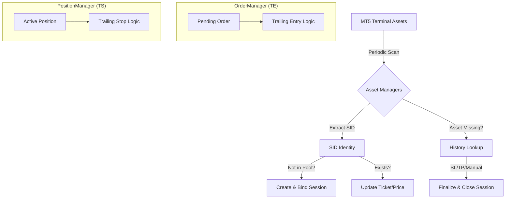

# [DESIGN] 자산 관리자 독립화 및 SID 기반 세션 라이프사이클 설계 보고서 (v1.0)

본 보고서는 ATSE 엔진의 핵심인 오더 및 포지션 관리자의 독립성을 강화하고, 터미널 자산을 직접 스캔하여 SID(Signal ID) 단위로 세션 풀을 관리하는 '자율형 자산 관리 아키텍처'를 설계합니다.

---

## 1. 배경 및 필요성
기존 구조에서 오더/포지션 관리자는 `AppOrchestrator` 및 `CXSignalWatcher`의 흐름에 일부 의존하고 있어, 터미널 자산의 변동(수동 종료, 네트워크 지연 등)에 대한 실시간 대응이 분산되어 있었습니다. 이를 관리자가 직접 주기적으로 체크하고 독자적으로 세션을 유지하도록 개선함으로써 시스템의 견고성(Resilience)을 확보하고자 합니다.

---

## 2. 핵심 설계 원칙

### 2.1 독립적 동작 (Independence)
*   **Decoupling**: 오더/포지션 관리자는 `AppOrchestrator`의 스테이지 전환에 의존하지 않고, 자체적인 루프(`OnTimer`, `OnTick`) 내에서 자산의 생존 여부와 상태를 관리합니다.
*   **Self-Discovery**: 터미널의 모든 오더/포지션 자산을 전수 조사하여, 현재 세션 풀에 등록되지 않은 자산(SID 존재 시)을 자동으로 바인딩(Bind)합니다.

### 2.2 SID 중심 세션 관리 (SID-Based Pooling)
*   **Unique Identity**: 모든 자산의 `Comment` 필드에 저장된 **SID**를 유일한 키(Key)로 사용합니다.
*   **Session Pool**: `ICXAssetManager` 내의 세션 리스트를 SID 기준으로 유지하며, 티켓(Ticket) 번호가 변경되더라도(오더 수정 등) SID가 유지되면 세션은 연속성을 가집니다.

### 2.3 역할의 명확한 분리
*   **오더 관리자 (OrderManager)**: 진입 트레일링(**Trailing Entry, 진트**) 전문 관리.
*   **포지션 관리자 (PositionManager)**: 익절 트레일링(**Trailing Stop, 익트**) 전문 관리.

---

## 3. 상세 아키텍처 (Detailed Architecture)

### 3.1 자산 스캔 및 세션 바인딩 워크플로우
매 `OnTimer` 또는 `OnTick` 주기마다 다음 프로세스를 실행합니다.

1.  **Terminal Inventory Scan**:
    *   `OrderGetTicket(i)`, `PositionGetTicket(i)`를 통해 터미널의 모든 활성 자산 순회.
2.  **SID Extraction & Filtering**:
    *   `Comment`에서 SID 추출. 유효한 SID가 없거나 관리 대상 Magic Number가 아니면 무시.
3.  **Pool Synchronization**:
    *   **신규 발견**: 세션 풀에 해당 SID가 없으면 `IRepository`에서 신호를 조회하여 즉시 세션을 생성하고 `Start()` 호출.
    *   **티켓 갱신**: 세션은 존재하나 티켓 번호가 다른 경우(브로커에 의한 오더 갱신 등) 세션 내의 티켓 정보를 업데이트.
    *   **부재 확인**: 세션 풀에는 존재하나 터미널에서 사라진 경우, 히스토리(History)를 조회하여 청산 사유(SL, TP, Manual)를 파악하고 세션 종료(`Stop()`).

### 3.2 오더 관리자 (CXOrderManager: Trailing Entry)
*   **목적**: 지정가 오더가 체결되기 전까지 유리한 가격으로 `LIMIT` 가격을 추격.
*   **핵심 태스크**:
    *   `P_L_Extreme`: 유리한 방향의 극점 추적.
    *   `P_L_Improve`: 극점 대비 일정 거리 이격 시 `OrderModify` 수행.
    *   `P_L_Rebound`: 반등 시 시장가 전환 진입 결정.

### 3.3 포지션 관리자 (CXPositionManager: Trailing Stop)
*   **목적**: 체결된 포지션의 이익을 보호하기 위해 `SL` 가격을 추격.
*   **핵심 태스크**:
    *   `A_TS_TriggerWatch`: 트레일링 시작 조건 감시.
    *   `A_Alpha_Calc`: 실시간 SL 목표가 계산.
    *   `A_Alpha_Apply`: 브로커 서버에 `PositionModify` (SL 수정) 요청.

---

## 4. 데이터 흐름도 (Data Flow)

---

## 5. 구현 전략 (Implementation Strategy)

### 5.1 ICXAssetManager의 역할 강화
`ICXAssetManager`는 단순한 리스트 보관소를 넘어, 오더/포지션 관리자가 발견한 자산을 세션 객체로 변환하고 생명주기를 통제하는 **'세션 팩토리'** 역할을 겸임합니다.

### 5.2 Pulse() 메서드의 주기적 호출
`OnTick()`에서는 가격 변동에 따른 트레일링 계산을 수행하고, `OnTimer()`에서는 터미널 자산과의 동기화 및 누락된 자산 복구(Zombie recovery)를 수행하여 이중화된 감시 체계를 구축합니다.

---

## 6. 결론
본 설계를 통해 ATSE는 오케스트레이터의 중앙 집중식 제어에서 벗어나, 개별 자산이 자신의 상태를 스스로 증명하고 관리하는 **분산 자율형 시스템**으로 진화합니다. 이는 네트워크 장애나 터미널 재시작과 같은 예외 상황에서도 SID만 보존된다면 완벽한 복구와 지속적인 트레이딩을 보장하는 기반이 될 것입니다.
