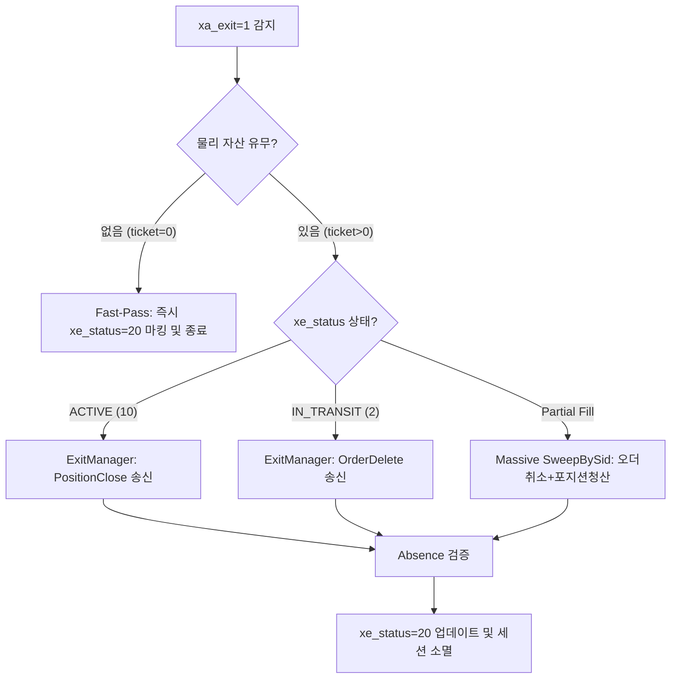

# Exit Sequence Scenario Analysis Report (v1.0)

## 1. 개요 (Executive Summary)
본 보고서는 ATSE (Active Trading State Engine)의 **청산(Exit) 시퀀스**에 대하여, 기본 규칙 및 실전 예외를 포함한 **총 8가지 시나리오(A~H)의 동작 메커니즘을 종합적으로 분석**한다.

청산 파이프라인은 자산 보호의 최우선 가치에 입각하여 지연 없는 전이(0ms)와 강력한 물리 자산 매칭 검증을 목표로 한다. 본 분석을 통해 설계의 무결성을 점검하고, 런타임 상에서 각 시나리오가 어떻게 유기적으로 전이되는지 증명한다.

---

## 2. 청산 처리 핵심 규칙 (Core Rules)
ATSE 청산 엔진은 어떠한 상황에서도 다음 4대 기본 아키텍처 원칙을 엄격하게 고수한다.

* **의도-실행 분리 (Intent-Execution Decoupling)**: 
  * EA(ATSE)는 사용자가 수립한 의도(`xa_exit`)를 직접 수정하지 않는다. 
  * 단지 실행 계층의 상세 상태(`xe_status`)를 `20 (CLOSED)`으로 갱신하여 청산 완료를 보고한다. (데이터 감사 추적성 보장)
* **식별자 우선순위 (Identifier Hierarchy)**:
  * 신호 ID(`SID`)의 매칭에 오류가 있거나 유실되더라도, `CNO`(채널) 및 `SNO`(세션 번호)가 터미널의 Magic Number 및 Comment 정보와 교차 대조하여 일치하면 청산 대상 자산으로 인정하고 복구 청산한다.
* **지연 없는 즉시 전이 (Immediate Transition)**:
  * 청산 신호(`xa_exit=1`)가 포진된 신호는 감시 태스크(`Task_IntentWatch`) 감지 즉시 다음 틱이나 타이머를 기다리지 않고 **0ms 내에** 브로커 호출 단계(`Step_Exit`)로 강제 강하(Force-Jump)한다.
* **선제적 무결성 검사 (Absence/Presence Audit)**:
  * 세션을 가동하기 전 또는 청산 명령을 브로커에 쏘기 직전, `ICXInventoryManager`를 통해 실제 터미널 내에 살아있는 포지션/대기오더 티켓이 존재하는지 이중으로 확인하여 유령 신호(Ghost Signal)에 의한 불필요한 네트워크 지연을 방지한다.

---

## 3. 청산 시나리오 정밀 분석 (8-Scenario Matrix)

### 3.1. 시나리오 A: 정상 포지션 청산 (XE_EXECUTED 상태)
* **트리거**: 포지션이 체결되어 활성 거래 중(`xe_status=10`) 사용자가 청산 버튼을 누르거나 시스템 익절/손절이 발생한 경우.
* **프로세스**:
  1. `Task_IntentWatch`가 DB의 `xa_exit=1`을 감지한다.
  2. 세션 상태가 즉시 `SESSION_LIQUIDATING (20)`으로 전이된다.
  3. `CXTaskExit_R_Order` 태스크가 구동되며 `CXExitManager`가 물리적 티켓 번호를 획득, 브로커에 `PositionClose` 명령을 송신한다.
  4. 터미널 스캐너가 실물 포지션 소멸을 최종 확인하면 DB에 `xe_status=20 (CLOSED_SIGNAL)` 및 `xa_exit=2`를 마킹하고 세션을 해제한다.

### 3.2. 시나리오 B: 주문 송신 직하 취소 (XE_IN_TRANSIT 상태)
* **트리거**: 시장가/지정가 주문을 브로커에 보냈으나 아직 체결되지 않은 찰나(`xe_status=2(IN_TRANSIT)`)에 취소 의도가 접수된 경우.
* **프로세스**:
  1. `Step_Executing` 단계의 `IntentWatch`가 즉각 `xa_exit=1`을 인터럽트 감지한다.
  2. `CXExitManager`가 해당 티켓이 포지션이 아닌 대기 주문(`Order`) 상태임을 매핑한다.
  3. `OrderDelete` 명령을 발송하여 체결 전 안전하게 대기 오더를 취소하고 시퀀스를 마무리한다.

### 3.3. 시나리오 C: 유령 신호 정리 (Fast-Pass 시나리오)
* **트리거**: DB 상에는 신호가 살아있으나 터미널 실물 자산은 이미 소멸(사용자의 수동 종료 등)하여 티켓이 유실(`ticket=0`)된 경우.
* **프로세스**:
  1. `CXStepValidation` (Watcher) 단계에서 `xa_exit=1`을 감지한다.
  2. `ICXInventoryManager` 전수조사 결과 해당 `SID`를 갖는 자산이 터미널에 존재하지 않는다.
  3. 세션을 스폰하지 않고 Watcher 레이어에서 직접 `xe_status=20` 및 `xa_exit=2`를 단일 트랜잭션으로 업데이트하여 시스템 리소스를 보존한다.

### 3.4. 시나리오 D: 레이스 컨디션 방어 (Double-Check 시나리오)
* **트리거**: SQLite DB 동기화 지연으로 Watcher와 활성 세션이 동시에 `xa_exit=1`을 처리하려고 경쟁하는 경우.
* **프로세스**:
  1. Watcher가 `xa_exit=1`인 신호를 감지하고 Fast-Pass 처리를 하려 시도한다.
  2. `CXSessionManager` 스캔 결과 이미 해당 `SID`를 묶어 처리 중인 활성 세션 객체가 존재함을 파악한다.
  3. Watcher는 해당 신호를 즉시 건너뛰고(Skip), 활성 세션이 안전하게 청산 및 디스크 쓰기를 완료하도록 제어권을 양보한다.

### 3.5. 시나리오 E: 부분 체결 후 긴급 청산 (Partial Fill Scenario)
* **트리거**: 지정가 대기 오더 중 일부 수량만 체결되고 잔여 물량이 대기 중인 상태에서 청산 명령이 접수된 경우.
* **프로세스**:
  1. `CXExitManager`는 단일 티켓 처리 루틴을 우회하고 `SweepBySid`를 실행한다.
  2. 동일 `SID`를 갖는 체결된 포지션 티켓과 미체결 주문 티켓을 어레이로 수집한다.
  3. 주문은 즉시 취소(`OrderDelete`)하고 포지션은 즉시 시장가 청산(`PositionClose`)하여 미체결 오더가 체결되는 위험을 차단한다.

### 3.6. 시나리오 F: 통신 장애 및 서버 단절 (Broker Disconnect Scenario)
* **트리거**: 청산 송신 시점에 브로커 서버와의 연결이 끊겨 `10006 (Re-connect)` 등의 거절 코드가 발생하는 경우.
* **프로세스**:
  1. `CXTerminalPlatform`이 송신 에러를 포착하고 즉시 세션을 파괴하지 않고 `Exit Retry Loop`로 진입한다.
  2. 최대 30초 동안 1초 주기로 청산 명령을 지속 재시도한다.
  3. 30초 내 복구 시 정상 청산 완료 처리하며, 30초 초과 시 회로 차단기(Circuit Breaker)를 가동해 시스템 전체를 긴급 멈춤(`EMERGENCY`) 상태로 전환한다.

### 3.7. 시나리오 G: 다중 좀비 신호 일괄 소멸 (Massive Zombie Re-sweep)
* **트리거**: 통신 또는 데이터베이스 장애가 복구된 직후 다량의 좀비 신호들에 일제히 청산 의도가 걸리는 경우.
* **프로세스**:
  1. Watcher가 `xa_exit=1`인 신호 다수를 로드하여 세션별 틱 순회 대기를 타지 않고 즉시 **비동기 벌크 Sweep 스레드**를 가동한다.
  2. 대상 Magic 넘버의 자산들을 일제히 브로커로 청산 명령 방출 후 단일 DB 트랜잭션으로 한꺼번에 `xe_status=20` 마킹을 수행한다.

### 3.8. 시나리오 H: 터미널 실물 SL/TP 임의 조작 대응 (Manual SL/TP Drift)
* **트리거**: 사용자가 외부에서 임의로 포지션의 손절가(SL) 및 익절가(TP)를 수정한 직후 청산 명령이 도달한 경우.
* **프로세스**:
  1. `CXExitManager`는 청산 패킷 송신 직전 `ICXInventoryManager`를 통해 터미널의 실제 포지션 정보를 최종 Shadowing하여 메모리 모델을 갱신한다.
  2. 서버 상의 실제 Volume 및 개설 가격을 정합한 후 청산 명령을 발송하여 데이터 불일치 에러를 방지한다.

---

## 4. 시나리오별 파이프라인 실행 상태 매핑 테이블

| 시나리오 | 타겟 자산 유형 | 트리거 단계 | 핵심 처리 태스크 | 최종 상태 (`xe_status`) |
| :--- | :--- | :--- | :--- | :--- |
| **A** | 포지션 | `SESSION_ACTIVE` | `CXTaskExit_R_Order` (PositionClose) | `XE_CLOSED_SIGNAL (20)` |
| **B** | 주문 (Order) | `SESSION_EXECUTING`| `CXTaskExit_R_Order` (OrderDelete) | `XE_CLOSED_SIGNAL (20)` |
| **C** | 없음 (유령) | `Step_Validation` | `Fast-Pass` (Watcher 직권 마킹) | `XE_CLOSED_SIGNAL (20)` |
| **D** | 포지션/주문 | `Step_Spawning` | `Double-Check` (Watcher 양보) | `XE_CLOSED_SIGNAL (20)` |
| **E** | 포지션 + 주문 | `SESSION_ACTIVE` | `SweepBySid` (벌크 해제) | `XE_CLOSED_SIGNAL (20)` |
| **F** | 포지션/주문 | `Platform` | `Exit Retry Loop` (최대 30회) | `XE_ERROR (99) / EMERGENCY`|
| **G** | 다중 포지션/주문 | `Watcher` | `Asynchronous Bulk Sweep` | `XE_CLOSED_SIGNAL (20)` |
| **H** | 포지션 | `SESSION_ACTIVE` | `Pre-Close Shadowing Sync` | `XE_CLOSED_SIGNAL (20)` |

---
**문서 버전**: v1.0 (PDCA/Design Storage Standard 준수)
**작성 주체**: Antigravity AI Coding System
**승인 상태**: 최초 작성 및 검토 대기
