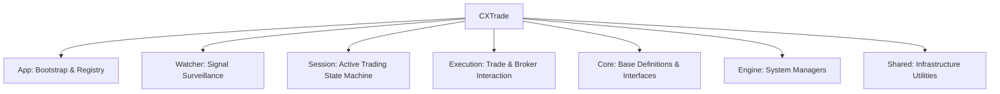
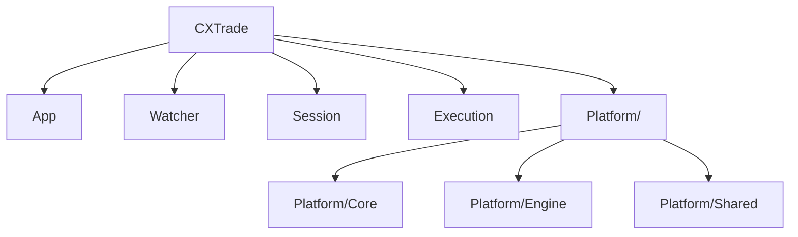

# ATSE Folder Structure Redesign Feasibility Report (v1.0)

## 1. Executive Summary

This report reviews the feasibility, benefits, risks, and implementation strategies of reorganizing the **ATSE (MQL5)** folder structure. 

The current directory layout under `CXTrade/` places core business components alongside system-level infrastructure at the same hierarchy level. To improve modularity, simplify code comprehension, and align with modern software architecture patterns, we propose grouping system-level utility components (`Core`, `Engine`, `Shared`) under a single parent directory named `Platform/`.

---

## 2. Current Folder Layout & Architectural Analysis

Currently, `CXTrade/` contains seven top-level folders:



### Architectural Classification
- **Domain/Business Logic Layer**:
  - `App/`: App orchestrator, service bootstrap, and dependency factories.
  - `Watcher/`: Discovers incoming signals, validates formats, and manages session spawning.
  - `Session/`: State machine handling active signals through trailing/positioned/exit workflows.
  - `Execution/`: Coordinates order sending, position modifications, and fallback sweeps.
- **System/Infrastructure Layer**:
  - `Core/`: Basic macros, type definitions, base interfaces, and models.
  - `Engine/`: Centralized analysis engines providing state-free calculation data (Price, Risk, Symbol, Inventory).
  - `Shared/`: Core utilities (Logging, Database, Guards, Chart Graphics).

### Current Drawbacks
- **Cluttered Root Hierarchy**: Business logic (what the system *does* as a trading system) is mixed with platform-level details (how the system *saves*, *logs*, or *calculates*), increasing cognitive load for developers.
- **Vague Layering Boundaries**: The lack of a parent boundary for infrastructure makes it easier to introduce circular dependencies or violate architectural layering rules.

---

## 3. Proposed Folder Redesign

We propose consolidating all system-level helper folders under a new top-level folder named `Platform/` (or `Infra/`).

### Proposed Directory Layout



### Advantages
1. **Strict Architectural Separation**:
   - Top-level folders under `CXTrade/` represent pure business domains (`App`, `Watcher`, `Session`, `Execution`).
   - Low-level system implementations are cleanly isolated under `Platform/`.
2. **Simplified Path Reasoning**: Developers easily know that anything outside `Platform/` is a core trading workflow, whereas anything inside `Platform/` is supporting system machinery.
3. **Preservation of Internal Structure**: Keeping `Core/`, `Engine/`, and `Shared/` folder structures intact under `Platform/` minimizes code changes within these components.

---

## 4. Feasibility & Impact Study

### A. Relative `#include` Paths Update
Moving `Core/`, `Engine/`, and `Shared/` one level deeper into `Platform/` requires updating relative include paths in almost every file in the codebase.

- **Internal References (within Platform)**:
  - References between `Core`, `Engine`, and `Shared` will require minimal changes or slight adjustment of parent depth (e.g. `..\Core` ➔ `..\Core` remains identical if they reside in the same parent `Platform`).
- **External References (from Business Layers)**:
  - Business layers (`App`, `Watcher`, `Session`, `Execution`) referencing `Core`, `Engine`, or `Shared` must add `Platform/` to their include path:
    - `..\..\Core\Interfaces\IXStep.mqh` ➔ `..\..\Platform\Core\Interfaces\IXStep.mqh`
    - `..\..\Engine\Price\CXPriceTracker.mqh` ➔ `..\..\Platform\Engine\Price\CXPriceTracker.mqh`
    - `..\..\Shared\Logging\CXAuditFormatter.mqh` ➔ `..\..\Platform\Shared\Logging\CXAuditFormatter.mqh`

### B. Compilation & Tooling Impact
MQL5 relies on static compilation. As long as all `#include` paths are resolved perfectly, there is **zero runtime overhead** or performance regression.

### C. Git History Retention
To prevent losing the git history of moved files, we must execute the migration using `git mv`:
```powershell
git mv CXTrade/Core CXTrade/Platform/Core
git mv CXTrade/Engine CXTrade/Platform/Engine
git mv CXTrade/Shared CXTrade/Platform/Shared
```

---

## 5. Refactoring Cost & Implementation Plan

| Step | Task Description | Estimated Effort | Risk | Mitigation |
| :--- | :--- | :--- | :--- | :--- |
| **1** | Create `CXTrade/Platform/` directory and run `git mv` | 10 mins | Low | Verify no untracked files are left behind. |
| **2** | Perform regex search & replace on `#include` statements | 1 hour | Medium | Use automated script/IDE tool. Review all modifications. |
| **3** | Resolve compiler errors sequentially | 1 hour | Medium | Run automated builds (`build_atse.ps1`) iteratively until successful. |
| **4** | Verify testing suite compilation | 30 mins | Low | Ensure unit/integration tests build cleanly. |

---

## 6. Recommendations & Decision Points

We recommend adopting this folder restructure to make the codebase cleaner, more maintainable, and aligned with modern architectural patterns.

### Next Steps for Implementation
1. **Approval**: Confirm whether you prefer `Platform/` or `Infra/` as the parent folder name.
2. **Execution Timing**: Because this affects almost all files, it is best done in a single dedicated commit when no other major features are being developed, to avoid merge conflicts.
3. **Action**: If approved, we will formulate the `task.md` for this restructuring and begin execution.
