# Pipeline Verification Strategy Report (v1.0)

## 1. 개요 (Executive Summary)
본 보고서는 **ATSE (Active Trading State Engine)**의 폴더 구조 리팩토링(Platform 레이어 통합) 및 10대 스펙 위반 사항(SSOC, `>=` 연산자, 로트 안전 Ceiling 제한 등)에 대한 교정 조치를 완료한 후, **신호 감지(Discovery)부터 최종 청산(Sweep) 및 세션 해제(Finalize)**까지 이어지는 전체 파이프라인의 연결 상태와 기능 정합성을 정밀하게 검증하기 위한 종합 테스트 및 감시 전략을 제시한다.

이 보고서는 개발/운영 계층에서 시스템이 정의된 스펙에 맞게 정상적으로 결합하고 비동기 이벤트에 유기적으로 반응하는지 확인하는 검증 프로토콜 역할을 한다.

---

## 2. End-to-End 파이프라인 핵심 연결 흐름

ATSE 파이프라인은 SQLite 데이터베이스(SSOT)의 신호 상태를 감시하여 물리적인 MT5 주문으로 변환하고, 다시 DB에 실행 결과를 동기화하는 순환 고리(Remapping Loop)로 구성되어 있다.

```mermaid
graph LR
    %% Style Definition
    classDef db fill:#eceff1,stroke:#37474f,stroke-width:2px;
    classDef engine fill:#e3f2fd,stroke:#0d47a1,stroke-width:2px;
    classDef terminal fill:#ffebee,stroke:#b71c1c,stroke-width:2px;

    %% Nodes
    DB1[(SQLite DB)]:::db
    Watcher(CXSignalWatcher):::engine
    Session(CXTradingSession):::engine
    Tasks[Workflow Tasks<br>Entry/Trailing/Exit]:::engine
    Platform(CXTerminalPlatform):::engine
    Broker(MT5 / Broker):::terminal

    %% Connections
    DB1 -->|1. Detect xa_entry=1| Watcher
    Watcher -->|2. Spawn Session| Session
    Session -->|3. Run Steps| Tasks
    Tasks -->|4. Request execution via SSOC| Platform
    Platform -->|5. OrderSend| Broker
    Broker -->|6. MqlTradeResult| Platform
    Platform -->|7. Ticket & State Sync| Tasks
    Tasks -->|8. Update Status / xa_exit| DB1
```



### 파이프라인 결합점 (Touchpoints) 상세

1. **신호 감지 및 세션 생성 (P1: Discovery & Spawn)**
   * **동작**: `CXSignalWatcher`가 SQLite에서 `xa_entry=1, xa_exit=0, xe_status=0(READY)` 상태의 레코드를 쿼리하여 감지.
   * **결합**: `CXGuard`를 통한 리스크/심볼 검증 통과 시 `CXSessionManager`에 의해 `CXTradingSession`이 생성되고, DB 상태는 즉시 `xe_status=1(PENDING_REQ)`로 전이.
2. **진입 주문 실행 및 티켓 리매핑 (P2: Order Execution & Remapping)**
   * **동작**: `Step_Executing` 단계에서 `CXTaskEntry_R_Order` 실행.
   * **결합**: `ICXPriceManager`로 연산된 진입가, SL, TP를 토대로 `CXTerminalPlatform`이 MT5 API (`OrderSend`)를 호출.
   * **성공 처리**: 브로커로부터 발급된 물리 Ticket 번호를 메모리 내 `XSignal` 모델에 매핑하고, SQLite DB를 `xe_status=2(IN_TRANSIT)` 또는 `xe_status=10(EXECUTED)`로 업데이트.
3. **지정가 트레일링 진입 (P3: Trailing Entry)**
   * **동작**: `Step_TrailingEntry` 단계에서 대기 주문의 진입 단가를 시장 움직임에 맞추어 개선.
   * **결합**: `CXTaskPending_L_Rebound`, `CXTaskPending_L_Improve`가 반등을 감시하고, `CXTaskPending_R_Apply`가 `CXTerminalPlatform.OrderModify`를 실행하여 브로커 터미널에 지정가를 업데이트하고 DB 상태를 `xe_status=5(PENDING_PLACED)`로 유지.
4. **포지션 트레일링 스탑 (P4: Active Trailing Stop)**
   * **동작**: 포지션 체결 이후 `Step_Active`에서 수익을 감시하고 스탑 가격을 최적화.
   * **결합**: `CXTaskActive_TS_TriggerWatch`가 포지션의 평가 수익이 `TSStart`에 도달하면 `Step_TrailingStop`으로 전이. `CXTaskAlphaApply`가 `CXTerminalPlatform.PositionModify`를 통해 스탑 로스를 올리고 DB를 업데이트.
5. **청산 및 잔여 정리 (P5: Termination & Sweep)**
   * **동작**: 신호 종료 의도 감지 또는 물리적 강제 청산 처리.
   * **결합**: `CXTaskIntentWatch`가 DB에서 `xa_exit=1`을 감지하거나 터미널에서 포지션 소멸을 감시. `CXTaskExit_R_Order`가 `SweepBySid`를 통해 남아 있는 모든 대기 주문을 취소하고 활성 포지션을 시장가 종료.
   * **최종 완료**: 물리 자산 소멸 확인 직후 `xe_status=20(CLOSED_SIGNAL)` 및 `xa_exit=2(COMP)`를 DB에 업데이트하고 세션을 안전하게 해제.

---

## 3. 검증 방법론 및 테스트 전략

### 방법 A: XTA.Test 시나리오 기반 가상 시뮬레이션
가상 클락(Virtual Clock)과 Mock 인프라를 활용하여 물리적인 MT5 터미널 연결 없이 ATSA(Application) 레벨에서 결정론적으로 파이프라인 흐름을 검증한다.

* **동작 원리**: Step-Lock 프로토콜을 통하여 가상 시간의 1초 동안 모든 세션의 태스크 처리가 끝난 것을 보장한 뒤 시간을 진행시켜, 멀티 스레딩 및 비동기 상태 변화의 불확정성을 제거하고 100% 재현성을 확보한다.
* **시나리오 CSV 명세 예시 (`_config/scenarios/E2E_Normal_Flow.csv`)**:
  ```csv
  # Time, Action, TargetState, TargetStatus, Parameter
  0, INJECT, READY, 0, "symbol=EURUSD,dir=1,type=9,lot=0.1,te_start=0,ts_start=100,ts_step=20"
  2, AWAIT_STATE, EXECUTING, 2, "ticket > 0"
  5, INJECT@ASSET_FILL, ACTIVE, 10, "price_open=1.08500"
  10, UPDATE_PRICE, ASK=1.08700, BID=1.08690, "Spread=10"
  12, AWAIT_STATE, TRAILING_STOP, 15, "sl_improved > 0"
  15, INJECT_DB_EXIT, ACTIVE, 10, "xa_exit=1"
  18, AWAIT_STATE, CLOSED, 20, "xa_exit=2"
  ```
* **검증 액션**:
  ```powershell
  # XTA.Test 시나리오 실행 커맨드 (ATSA CLI 활용)
  .\ATSA.exe -test-scenario "E2E_Normal_Flow.csv" -config "ATSA.json"
  ```
  * 결과 검증: 시뮬레이션 종료 후 생성되는 테스트 리포트에서 `Expected Status`와 `Actual Status` 매칭률이 100%인지 확인한다.

---

### 방법 B: SQLite 직접 조작을 통한 E2E 연동 검증
개발/데모 환경의 MT5 터미널에 ATSE가 구동 중인 상태에서, 외부에서 직접 SQLite 데이터베이스를 수정하여 실제 주문이 나가고 청산이 완료되는 E2E 연결 상태를 실시간 검증한다.

```powershell
# 1. SQLite DB에 신규 진입 신호 강제 주입 (xa_entry=1, xa_exit=0, xe_status=0)
sqlite3 ATS.db "INSERT INTO signals (sid, gid, cno, sno, symbol, dir, type, lot, te_start, ts_start, ts_step, sl, tp, xa_entry, xa_exit, xe_status, created) VALUES ('TEST-26052615-01-00-1-9', 'TEST-26052615-01-00', 1, 1, 'EURUSD', 1, 9, 0.1, 0, 100, 20, 150, 300, 1, 0, 0, datetime('now'));"
```

* **체크 포인트**:
  * `CXSignalWatcher`가 로그에 `[WATCHER] New signal detected: TEST-26052615-01-00-1-9`를 출력하는지 확인.
  * MT5 터미널에 `0.1 Lot` 매수 시장가 주문이 실제로 진입되고, 티켓 번호(예: `12345678`)가 반환되는지 확인.
  * SQLite DB의 동일 레코드에 `ticket=12345678`, `xe_status=10`, `xe_status_msg='Ticket Obtained'`가 성공적으로 써지는지(Remapping) 조회.
  ```sql
  SELECT ticket, xe_status, xe_status_msg FROM signals WHERE sid='TEST-26052615-01-00-1-9';
  ```

```powershell
# 2. SQLite DB에 청산 요청 강제 주입 (xa_exit=1)
sqlite3 ATS.db "UPDATE signals SET xa_exit=1 WHERE sid='TEST-26052615-01-00-1-9';"
```

* **체크 포인트**:
  * `CXTaskIntentWatch`가 즉시 이를 감지하고 `xe_status`를 `20(CLOSED_SIGNAL)` 상태로 전이시키는지 확인.
  * MT5 터미널에서 티켓 `12345678` 포지션이 물리적으로 완전히 청산되는지 확인.
  * SQLite DB의 레코드가 최종적으로 `xa_exit=2(COMP)`, `xe_status=20` 상태로 마킹되는지 확인.

---

### 방법 C: 경계 조건 및 예외(Negative) 테스트 설계

#### 1. Risk Manager 로트 천장 제한 테스트 (`Lot <= 0` 또는 `Lot > 50`)
* **테스트 설계**: `lot=55.0`인 비정상 신호를 DB에 주입한다.
* **예상 결과**: `CXGuard` 또는 `CXRiskManager`의 `ValidateLot`이 작동하여 물리적 주문 송신을 원천 차단하고, DB에는 `xe_status=99(ERROR)`, `xe_status_msg`에 `RISK-LOT-CEILING-VIOLATION` 에러 사유를 기록해야 한다.
* **로그 확인**: `Experts` 탭 또는 시스템 로그 파일에 `[RISK-LOT-CEILING-VIOLATION] Lot:55.00 forbidden` 로그가 적재되었는지 확인한다.

#### 2. 가격 역전 및 10015 에러 방지 테스트
* **테스트 설계**: Buy Limit 대기 주문을 주입하되, 현재 시장가(Ask=1.0850)보다 높은 가격(1.0900)을 진입 가격(`price_signal`)으로 설정해 본다.
* **예상 결과**: `ICXPriceManager`가 이를 실시간 시장가 기준으로 보정(Correction)하여 즉시 체결 가능한 시장가 수준으로 매끄럽게 보정 및 주문 송신이 되어야 하며, 브로커로부터 `10015 (Invalid price)` 거절을 당하지 않아야 한다.

#### 3. 사용자 수동 청산 패스트 트랙 테스트 (Zombie Protection)
* **테스트 설계**: E2E 테스트 도중, MT5 터미널에서 구동되고 있는 활성 포지션을 사용자가 수동으로 'X' 버튼을 눌러 청산한다.
* **예상 결과**: 매 틱마다 감시 중인 `CXTaskIntentWatch`가 티켓 부재를 감지하고, 즉시 `xe_status=24(CLOSED_MANUAL)` 및 `xa_exit=2(COMP)`를 마킹한 뒤 세션을 정상 종료 처리해야 한다.

---

## 4. 스펙 규격 준수 체크리스트 (Specification Compliance Checklist)

파이프라인 실행 중 발생하는 데이터와 로그가 ATS 표준 스펙을 충족하는지 검증하기 위한 상세 매칭 매뉴얼이다.

### 4.1. Trading Logging Standard (v11.1 - Extended) 로그 규격
주문 변경이나 트레이딩 함수 호출이 발생할 때, 로그 파일에 아래 프리픽스와 구조를 완벽하게 갖추어 기록하는지 정규식 또는 문자열 검색을 통해 검증한다.

| 트레이딩 함수 | 로그 프리픽스 | 필수 필드 검증 |
| :--- | :--- | :--- |
| **주문 진입** | `[EXEC-ENTRY]` | `Sym`, `Type`, `Lot`, `Price`, `SL`, `TP`, `Mkt`, `M` (Magic), `SID` |
| **진입 실패** | `[EXEC-ENTRY-FAIL]` | `Broker Code`, `SysErr`, `Raw: [Sym, Lot, P, SL, TP, M, SID]` |
| **주문 수정** | `[ORDER-MODIFY]` | `Ticket`, `M` (Magic), `Price`, `SL`, `TP` |
| **수정 실패** | `[ORDER-MODIFY-FAIL]` | `Broker Code`, `SysErr`, `Raw: [Ticket, M, Price, SL, TP]` |
| **포지션 수정**| `[POS-MODIFY]` | `Ticket`, `M` (Magic), `SL`, `TP` |
| **포지션 실패**| `[POS-MODIFY-FAIL]` | `Broker Code`, `SysErr`, `Raw: [Ticket, M, SL, TP]` |
| **주문 삭제** | `[ORDER-DELETE]` | `Ticket`, `M` |
| **삭제 실패** | `[ORDER-DELETE-FAIL]` | `Broker Code`, `SysErr`, `Raw: [Ticket, M]` |

> **검증 로그 패턴 예시 (성공 진입 시)**
> `[EXEC-ENTRY] Sending Order: [Sym:EURUSD, Type:9, Lot:0.10, Price:1.08520, SL:1.08370, TP:1.08820, Mkt:1.08520, M:102030, SID:CNO1-26052615-01-01-1-9]`

---

### 4.2. Trading Process Standard (v11.3 - SSOC) 검증 지점
모든 연산 및 상태 처리가 단일 의존성(Single Source of Calculation) 채널을 타는지 소스 코드 및 디버그 로깅 수준에서 교차 확인한다.

1. **ICXPriceManager 의존 확인**:
   * 진입 태스크(`CXTaskEntry_R_Order`) 및 지정가 트레일링 수정 태스크(`CXTaskPending_R_Apply`) 내에서 수식을 직접 사용한 가격 계산(`NormalizeDouble`, 직접 포인트 뺄셈 등)이 완전히 제거되고, 오직 `priceMgr.CalculateExecPrice(...)`, `CalculateSL(...)`, `CalculateTP(...)` 메서드를 통해서만 타겟 단가가 결정되는지 검증한다.
2. **ICXSymbolManager 의존 확인**:
   * `CXGuard.mqh` 및 태스크 내에서 raw MQL5 API인 `SymbolInfoDouble(symbol, ...)` 또는 `SymbolInfoInteger(...)`를 통해 `Point`, `Digits`, `StopsLevel`을 가져오던 로직이 모두 `symMgr.GetPoint(symbol)`, `symMgr.GetDigits(symbol)`, `symMgr.GetStopsLevel(symbol)`로 대체되어 동작하는지 확인한다.
3. **ICXInventoryManager 의존 확인**:
   * 로컬 세션의 티켓 존재 확인 및 속성 섀도잉(Shadowing) 시, 플랫폼에 등록된 `inventoryMgr`을 경유하여 터미널의 실물 상태를 동기화하는지 검증한다.

---

### 4.3. `>=` Evaluation Mandate (v11.11) 동작 검증
경계 및 임계값 조건문에서 오작동을 유발하는 단순 초과(`>`)나 미만(`<`) 연산자가 사용되지 않고, 스펙에 정의된 `>=` 연산자가 올바르게 쓰였는지 확인한다.

* **체크 대상 파라미터**: `ESTART`, `ESTEP`, `ELIMIT`, `SSTART`, `SSTEP`
* **주요 체크 조건문**:
  * **지정가 트레일링 변동 폭 검증**: `MathAbs(newPrice - currentPrice) >= sig.GetTEStep() * point`
  * **트레일링 스탑 진입 조건**: `evalProfit >= sig.GetTSStart()`
  * **트레일링 스탑 가격 개선**: `MathAbs(newSL - currentSL) >= sig.GetTSStep() * point`
* **검증 방법**:
  * `TEStep` 또는 `TSStep`이 `20` 포인트일 때, 가상 시나리오 상에서 정확히 `20` 포인트만큼 가격 변동이 일어났을 때 조건이 정상적으로 참(True)으로 평가되어 트레이딩 수정 API가 트리거되는지 바운더리 테스트를 실행한다.

---

### 4.4. DataManager State Transition Matrix (v9.8.11 & v9.8.11a) 정밀 검증
파이프라인 통제 Matrix의 규칙에 어긋나는 비정상 상태 도약(예: READY(0)에서 뜬금없이 EXECUTED(10)로 바로 변경 등)이 발생하지 않는지 감시한다.

```
[READY: 0] ───────────────► [PENDING_REQ: 1] ───────────────► [IN_TRANSIT: 2]
                                                                     │
                                                                     ▼
[CLOSED_SIGNAL: 20] ◄──────── [SESSION_ACTIVE: 10] ◄──────── [PENDING_PLACED: 5]
[CLOSED_SL: 21]               (Active Position)               (Pending Order Placed)
[CLOSED_TP: 22]                      │
[CLOSED_MANUAL: 24] ◄────────────────┘ (수동 청산 감지 시 Direct Jump)
```

* **DB 상태 전이 감시 SQL**:
  * 테스트 기간 중 아래 SQL을 백그라운드 크론 또는 트리거로 실행시켜 규격 외의 상태 전이를 기록한 신호가 있는지 스캔한다.
  ```sql
  -- 정상적이지 않은 상태 값(예: 3, 4, 6 등 정의되지 않은 코드)이 삽입되었는지 스캔
  SELECT id, sid, xe_status, xe_status_msg FROM signals WHERE xe_status NOT IN (0, 1, 2, 5, 10, 15, 20, 21, 22, 24, 25, 99);
  ```

---

## 5. 로그 분석 및 문제 추적 가이드 (Playbook)

파이프라인 연결 중 통신 단절, DB 잠금, 브로커 에러 등으로 인해 파이프라인이 멈추거나 오작동할 경우, **SID** 및 **GID**를 바탕으로 문제를 신속히 추적하는 가이드라인이다.

### 5.1. 추적 키 구조 확인
* **SID (23자)**: `CNO(4)-YYMMDDHH(8)-SNO(2)-GNO(2)-DIR(1)-TYPE(1)`
  * 예: `0001-26052615-01-00-1-9` (채널1, 2026년 5월 26일 15시, 세션1, 그룹0, Buy, Market)
* **GID (19자)**: `0001-26052615-01-00`

### 5.2. 로그 분석 4단계 프로세스

#### 1단계: 감지 여부 및 세션 스폰 실패 추적
* **검색 조건**: `grep "0001-26052615-01-00-1-9" _log/Experts_*.log`
* **원인 진단**:
  * 로그에 신호 식별자가 아예 없다면 `CXSignalWatcher`가 SQLite DB에서 신호를 감지하지 못했음 (DB 커넥션 에러 또는 쿼리 조건 불일치).
  * `[GUARD-FAIL]` 또는 `[RISK-FAIL]` 로그가 발견된다면 리스크 한도나 스프레드 필터에 의해 진입이 거절된 것임.

#### 2단계: 브로커 오더 거절 디버깅
* **검색 조건**: `grep "[EXEC-ENTRY-FAIL]" _log/Experts_*.log`
* **원인 진단**:
  * `Broker Code:134(Not enough money)` ➔ 증거금 부족. `CXRiskManager`의 사전 마진 검증 로직이 제대로 통과되었는지 또는 실제 터미널 잔액과 불일치가 있는지 검증 필요.
  * `Broker Code:10015(Invalid price)` ➔ 지정가 오더 시 단가 오류. `ICXPriceManager`의 시장가 역전 자동 보정 함수에 버그가 있는지 확인 필요.

#### 3단계: 트레일링 멈춤 및 수정 에러
* **검색 조건**: `grep -E "([ORDER-MODIFY-FAIL]|[POS-MODIFY-FAIL])" _log/Experts_*.log`
* **원인 진단**:
  * `Broker Code:10027(Enable Trade)` ➔ 이전 주문이 아직 처리 중인데 중복 호출을 넣은 상황. 중복 방지 락(Lock) 메커니즘을 점검해야 함.
  * 가격 변동이 심한데도 `[ORDER-MODIFY]`가 아예 찍히지 않는 경우, `>=` 비교 구문에서 계산 단위(포인트 ➔ 실가격 변환) 불일치가 일어났는지 변수 타입을 추적해야 함.

#### 4단계: 청산 실패 및 잔여 오더 잔존 (Zombie/Orphan)
* **검색 조건**: `grep "[ORDER-DELETE-FAIL]" _log/Experts_*.log` 또는 `grep "SweepBySid" _log/Experts_*.log`
* **원인 진단**:
  * 청산 시점에 `xa_exit=2(COMP)`로 상태는 종료되었으나 실제 터미널에는 대기 주문이 그대로 남아 있는 경우, `CXTaskExit_R_Order`의 `SweepBySid` 루프에서 예외가 발생했거나, DB 세션 해제가 실제 물리 자산 청산 완료 확인(Physical Absence Verification) 전 성급하게 이루어졌을 가능성이 높음.

---
**문서 버전**: v1.0 (PDCA/Design Storage Standard 준수)
**작성 주체**: Antigravity AI Coding System
**승인 상태**: 최초 작성 및 검토 대기
