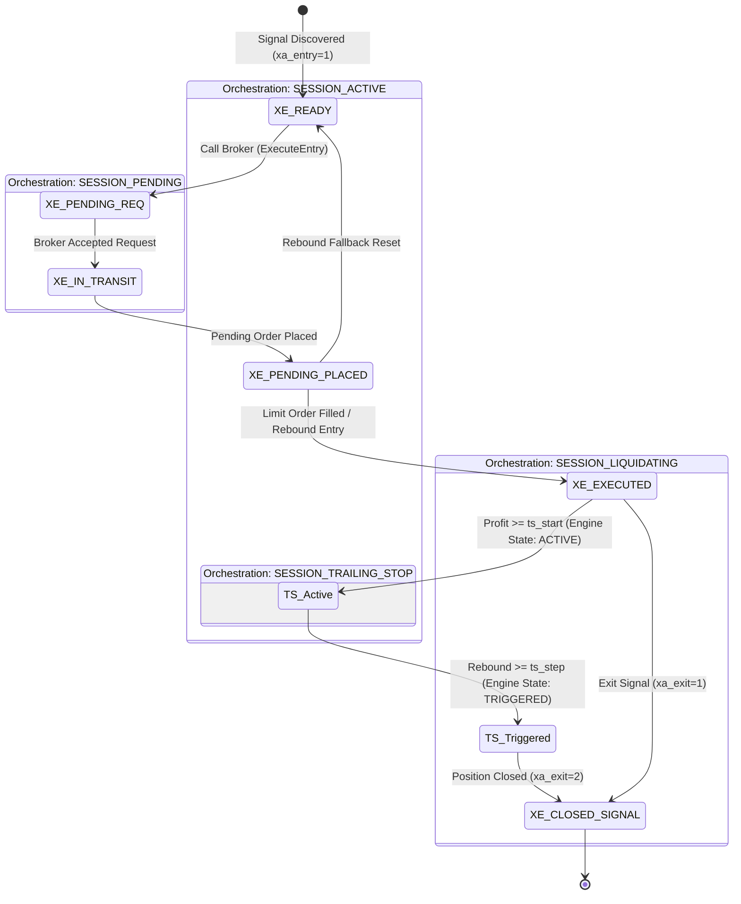
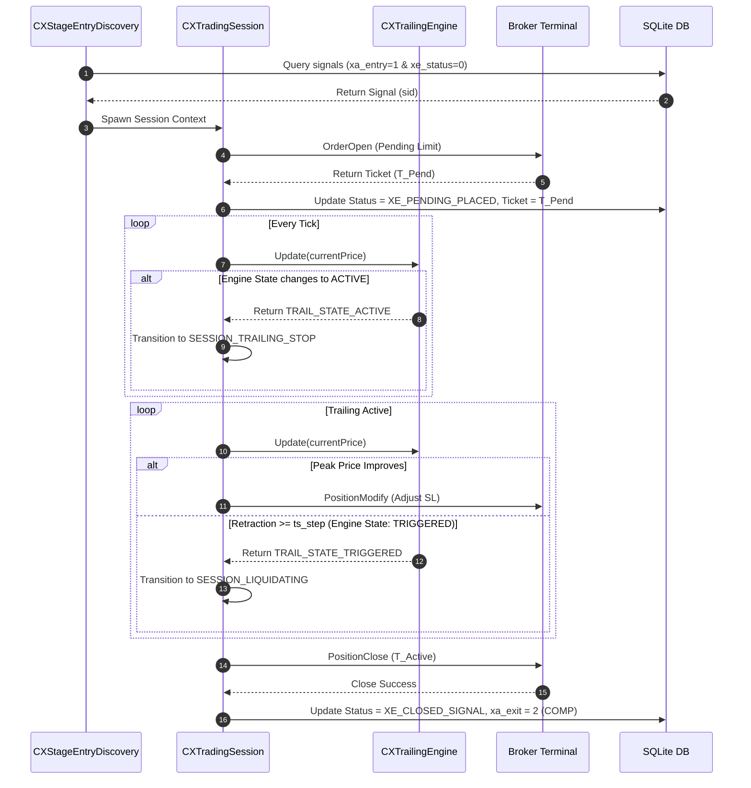

# REPORT: Full Lifecycle Orchestration & State Transition Design (v1.1)

This report details the standardized architectural matrix, sequence workflows, state transitions, and execution pipelines of the ATSE engine—covering the entire lifecycle from signal detection to exit/liquidation, incorporating the newly integrated `CXTrailingEngine`.

---

## 1. Stage, Sequence, and Task Structure Matrix

The trading engine manages the lifecycle using four high-level execution Stages, each mapping to specific Sequence IDs and processing pipelines of atomic Tasks. All task class names follow the strict `CXTask{Stage}_{Phase}_{Name}` naming standard.

| Stage                  | Sequence ID / State        | Key Standardized Tasks                                                                                                                   | Trailing Engine Role      | Responsibility                                                                                                                                                                                             |
| :--------------------- | :------------------------- | :--------------------------------------------------------------------------------------------------------------------------------------- | :------------------------ | :--------------------------------------------------------------------------------------------------------------------------------------------------------------------------------------------------------- |
| **StageDiscovery**     | `SESSION_DISCOVERY` (0)    | `CXStageEntryDiscovery` `CXStageExitDiscovery`                                                                                        | *None*                    | Discovers signals with `xa_entry=1` or `xa_exit=1` from SQLite database.                                                                                                                                   |
| **StageEntryExecute**  | `SESSION_PENDING` (1)      | `CXTaskPending_V_Sync` `CXTaskPending_L_Extreme` `CXTaskPending_L_Improve` `CXTaskPending_L_Rebound` `CXTaskPending_R_Apply` | Optional (Entry Trailing) | Validates pending order status, tracks extremities, dynamically pushes back limit orders, and triggers market fallback on rebound.                                                                         |
| **StageActiveExecute** | `SESSION_ACTIVE` (5)       | `CXTaskActive_L_TS_TriggerWatch` `CXTaskActive_L_AlphaCalc` `CXTaskActive_R_AlphaApply` `CXTaskActive_P_Closed`                 | Active (Exit Trailing)    | **`TS_TriggerWatch`**: Configures engine to watch profit >= `ts_start`. **`AlphaCalc`**: Updates peak price to compute SL adjustments. **`AlphaApply`**: Submits target SL/TP modification requests. |
| **StageExitExecute**   | `SESSION_LIQUIDATING` (10) | `CXTaskExit_L_Prepare` `CXTaskExit_P_Lock` `CXTaskExit_R_Order` `CXTaskExit_V_Terminal` `CXTaskExit_P_Finalize`              | *None*                    | Deletes orders or closes physical positions on the broker terminal to finish the exit loop.                                                                                                                |

---

## 2. State Transition Diagram

The diagram below maps both the internal signal state (`xe_status`) and the session orchestration states.

---

## 3. Sequence Diagram (Signal to Liquidation)

This diagram details the sequence of ticks, trailing engine updates, order placements, and position closures.

---

## 4. Step-by-Step Process Explanation

### Step 1: Signal Discovery & Spawning (`StageDiscovery`)
- The `CXStageEntryDiscovery` and `CXStageExitDiscovery` stages poll the SQLite `signals` table for any entry records (`xa_entry=1`) or exit records (`xa_exit=1`).
- Once found, a session-specific context (`CXTradingSession`) is spawned to isolate the execution state.

### Step 2: Order Placement & Trailing Entry (`StageEntryExecute`)
- The session submits a pending limit order to the broker.
- If Trailing Entry (진트) is configured, the `CXTaskPending_L_Rebound` task tracks the price drop extreme. On a rebound, it deletes the pending limit order and opens a market position instead (`ENTRY_TE_REBOUND`).

### Step 3: Activation & Trailing Stop (`StageActiveExecute`)
- Once the position is filled (`XE_EXECUTED`), the active stage tracks the running profit.
- `CXTaskActive_L_TS_TriggerWatch` initializes the `CXTrailingEngine` with the position open price, `ts_start`, and `ts_step`.
- When profit reaches `ts_start` points, the engine moves to `TRAIL_STATE_ACTIVE` and the session switches to `SESSION_TRAILING_STOP`.
- `CXTaskActive_L_AlphaCalc` reads the tracked peak price from the engine on every tick.
- `CXTaskActive_R_AlphaApply` updates the SL order (`PositionModify`) as the market moves in favor of the trade.

### Step 4: Retraction & Position Liquidation (`StageExitExecute`)
- When the price retraces by `ts_step` points from the peak, the engine transitions to `TRAIL_STATE_TRIGGERED`.
- The session transitions to `SESSION_LIQUIDATING` (`StageExitExecute`).
- The `CXTaskExit_R_Order` task submits the closing order to the broker, the scanner binds the history ticket, and the repository is finalized with `xa_exit=2` (CLOSED).

Logger 시스템 개선
	SID 별 로그는 sqlite table에 기록하는 설계 검토
	신호 감지 후 SID 확보됨
	감진된 신호 정보와 트레이딩 세션의 중요 관리정보 ,트레일링 변화정보 , 청산 정보의 이벤트별 변화에 따랄 table에 행으로 추가하는 설계
	table : atse_log
	id int auto key
	sid string
	datetime time
	msg string
	