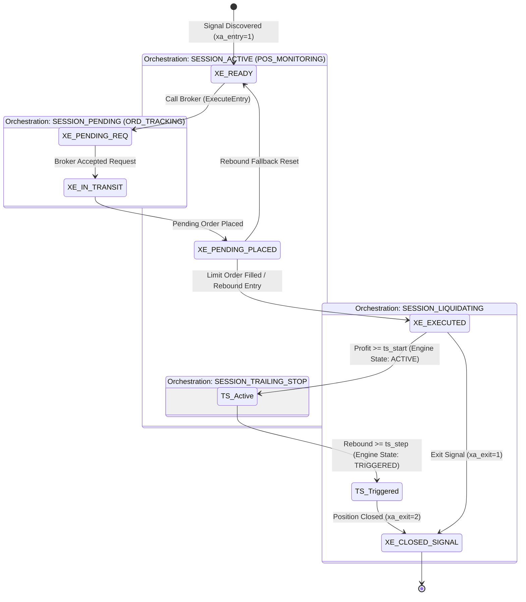

# REPORT: Full Lifecycle Orchestration & State Transition Design (v1.2)

This report details the standardized architectural matrix, sequence workflows, state transitions, execution pipelines, and database logging systems of the ATSE engine.

---

## 1. Stage, Sequence, and Task Structure Matrix

The trading engine manages the lifecycle using four high-level execution Stages. All task class names follow the strict `CXTask{Stage}_{Phase}_{Name}` naming standard.

| Stage                  | Sequence ID / State        | Key Standardized Tasks                                                                                                                   | Trailing Engine Role      | Responsibility                                                                                                                                                                                             |
| :--------------------- | :------------------------- | :--------------------------------------------------------------------------------------------------------------------------------------- | :------------------------ | :--------------------------------------------------------------------------------------------------------------------------------------------------------------------------------------------------------- |
| **StageDiscovery**     | `SESSION_DISCOVERY` (0)    | `CXStageEntryDiscovery`<br>`CXStageExitDiscovery`                                                                                        | *None*                    | Discovers signals with `xa_entry=1` or `xa_exit=1` from SQLite database.                                                                                                                                   |
| **StageEntryExecute**  | `SESSION_PENDING` (3)      | `CXTaskPending_V_Sync`<br>`CXTaskPending_L_Extreme`<br>`CXTaskPending_L_Improve`<br>`CXTaskPending_L_Rebound`<br>`CXTaskPending_R_Apply` | Optional (Entry Trailing) | Validates pending order status, tracks extremities, dynamically pushes back limit orders, and triggers market fallback on rebound.                                                                         |
| **StageActiveExecute** | `SESSION_ACTIVE` (10)      | `CXTaskActive_L_TS_TriggerWatch`<br>`CXTaskActive_L_AlphaCalc`<br>`CXTaskActive_R_AlphaApply`<br>`CXTaskActive_P_Closed`                 | Active (Exit Trailing)    | **`TS_TriggerWatch`**: Configures engine to watch profit >= `ts_start`.<br>**`AlphaCalc`**: Updates peak price to compute SL adjustments.<br>**`AlphaApply`**: Submits target SL/TP modification requests. |
| **StageExitExecute**   | `SESSION_LIQUIDATING` (20) | `CXTaskExit_L_Prepare`<br>`CXTaskExit_P_Lock`<br>`CXTaskExit_R_Order`<br>`CXTaskExit_V_Terminal`<br>`CXTaskExit_P_Finalize`              | *None*                    | Deletes orders or closes physical positions on the broker terminal to finish the exit loop.                                                                                                                |

---

## 2. Orchestration State Mapping & DSL Configuration

To align DSL state labels with C++ enum values, states are registered in [AppOrchestrator::RegisterStandardNames](file:///d:/Projects/ATS/ATSE/CXTrade/App/Orchestration/AppOrchestrator.mqh#L37-L51):
* **`ORD_TRACKING`**: Maps to `ORD_TRAILING` (5)
* **`POS_MONITORING`**: Maps to `POS_ACTIVE` (10)
* **`SESSION_LIQUIDATING`**: Maps to `SESSION_LIQUIDATING` (20)
* **`SYS_CLOSED`**: Maps to `SYS_CLOSED` (30)
* **`SYS_ERROR`**: Maps to `SYS_ERROR` (99)

---

## 3. State Transition Diagram



---

## 4. SQLite Database Audit Logging (`atse_log`)

To maintain clean and audit-ready lifecycle records per session, the engine implements structured logging to SQLite.

### A. Schema Definition
The table is initialized automatically upon database connection:
```sql
CREATE TABLE IF NOT EXISTS atse_log (
    id        INTEGER PRIMARY KEY AUTOINCREMENT,
    sid       TEXT NOT NULL,
    created   DATETIME DEFAULT (datetime('now', 'localtime')),
    level     TEXT NOT NULL,
    msg       TEXT NOT NULL
);
```

### B. Standardized Audit Payload
Audit logs contain a standardized suffix payload tracking the state and converted price metrics:
`[Description] | SID:{sid}, Stage:{stage}, Task:{task}, SeqState:{state}, XA:({xa_entry},{xa_exit}), XE:{xe_status}, Lot:{lot:F2}, SL:{sl:F2}, TP:{tp:F2}, Parameters:[TE_Start:{te_start:F0}(P:{te_start_price:F2}), TE_Step:{te_step:F0}, TE_Limit:{te_limit:F0}(P:{te_limit_price:F2}), IK_Start:{ikte_start:F0}(P:{ikte_start_price:F2}), IK_Step:{ikte_step:F0}], Msg:\"{status_msg}\"`

* **Price & Lot**: Formatted to `0.00` decimal strings.
* **Point Values**: Formatted to `0` integer strings.
* **Price Conversions**:
  * **Buy Trailing Entry**:
    - `te_start_price` = `entry_price` - (`te_start` * `point`)
    - `te_limit_price` = `price_signal` - (`te_limit` * `point`)
  * **Sell Trailing Entry**:
    - `te_start_price` = `entry_price` + (`te_start` * `point`)
    - `te_limit_price` = `price_signal` + (`te_limit` * `point`)
  * **Buy Trailing Stop (Exit)**:
    - `ikte_start_price` = `price_open` + (`ikte_start` * `point`)
  * **Sell Trailing Stop (Exit)**:
    - `ikte_start_price` = `price_open` - (`ikte_start` * `point`)
