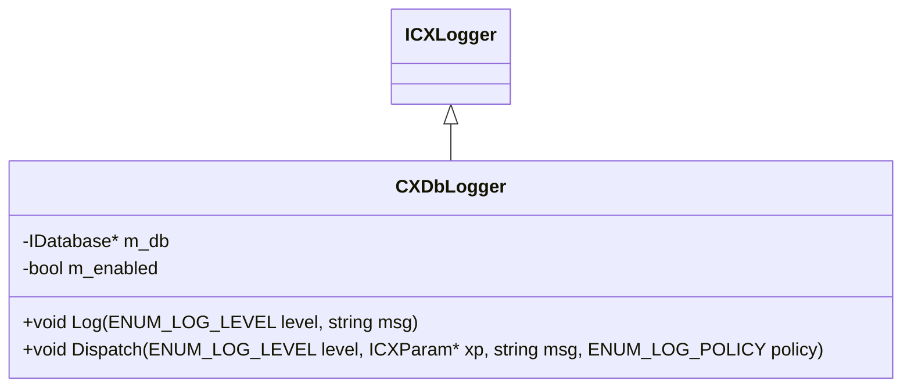

# REPORT: Logger System Improvement Strategy & Database Logging Specification (v1.1 - Consolidated Master)

This document is the consolidated master specification combining the initial concept (`v1.0`) and the refined formatting/calculation rules (`v1.1`) for recording structured trading logs dynamically in the SQLite database `atse_log` table.

---

## 1. System Architecture & Channels

ATSE utilizes `CXLogDispatcher` to route logging messages to multiple channels (File, MT5 Experts Tab, UI Dashboard, Remote). 

This improvement integrates a new **Database Logging Channel (`CXDbLogger`)** that intercepts log calls at the dispatcher level and writes structured log payloads to SQLite.

```
                  ┌──> CXFileLogger (Local text file)
                  ├──> CXTabLogger (MT5 Experts Tab console)
[CXLogDispatcher] ├──> CXUILogger (Graphical Dashboard charts)
                  ├──> CXRemoteLogger (Network socket transfer)
                  └──> CXDbLogger (NEW - SQLite atse_log table)
```

---

## 2. SQLite Database Schema (`atse_log`)

To record structured events per SID, we define the `atse_log` table:

```sql
CREATE TABLE atse_log (
    id        INTEGER PRIMARY KEY AUTOINCREMENT,
    sid       TEXT NOT NULL,
    created   DATETIME DEFAULT (datetime('now', 'localtime')),
    level     TEXT NOT NULL,
    msg       TEXT NOT NULL
);
```

---

## 3. Standardized Log Message Format Specification

To ensure auditability, the `msg` field in `atse_log` will append a standardized state payload block to the log description.

### A. Context Fields to Include:
1. **Identifiers**: `SID`, `Stage` (Current Session Stage), `Task` (Active Task Name), `SequenceState` (Current sequence state ID).
2. **Intent & Execution States**: `xa_entry`, `xa_exit`, `xe_status`, `xe_status_msg`.
3. **Trading Parameters**: `te_start`, `te_step`, `te_limit`, `ikte_start`, `ikte_step`, `tp`, `sl`, `lot`.
4. **Trailing Engine Price Conversions**: Point values must be converted to prices:
   - **Buy Trailing Entry**:
     - `ESTART_PRICE` = `entry_price` - (`te_start` * `point`)
     - `ELIMIT_PRICE` = `price_signal` - (`te_limit` * `point`)
   - **Sell Trailing Entry**:
     - `ESTART_PRICE` = `entry_price` + (`te_start` * `point`)
     - `ELIMIT_PRICE` = `price_signal` + (`te_limit` * `point`)
     - *(Where `entry_price` is the actual price of the placed pending order (`price_open` or `price`) when a ticket exists, otherwise falling back to `price_signal`)*
   - **Buy Trailing Stop (Exit)**:
     - `XSTART_PRICE` = `price_open` + (`ikte_start` * `point`)
   - **Sell Trailing Stop (Exit)**:
     - `XSTART_PRICE` = `price_open` - (`ikte_start` * `point`)

### B. Formatting Rules:
- **Double (Price & Lot)**: Formatted strictly as **`0.00`** (N2 format).
- **Points & Integers**: Formatted strictly as **`0`** (N0 format).
- **Format Structure**:
  `[Description] | SID:{sid}, Stage:{stage}, Task:{task}, SeqState:{state}, XA:({xa_entry},{xa_exit}), XE:{xe_status}, Lot:{lot:F2}, SL:{sl:F2}, TP:{tp:F2}, Parameters:[TE_Start:{te_start:F0}(P:{te_start_price:F2}), TE_Step:{te_step:F0}, TE_Limit:{te_limit:F0}(P:{te_limit_price:F2}), IK_Start:{ikte_start:F0}(P:{ikte_start_price:F2}), IK_Step:{ikte_step:F0}], Msg:\"{status_msg}\"`

---

## 4. Class Design & Mitigation Strategies



### High-Frequency Write Lockup Mitigations:
1. **Severity Filter**: Ignore `TRACE` and `DEBUG` logs. Only write `INFO`, `WARN`, `ERROR`, and `OK` logs.
2. **Deduplication**: Apply `LOG_POLICY_ON_CHANGE` to prevent spamming the database with duplicate state reports.
