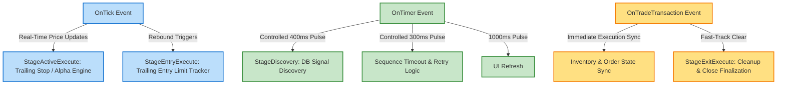

# REPORT: Event-Driven Pulse Performance Optimization Strategy (v1.0)

This report presents a design specification to optimize sequence execution and task pulsing performance by segregating workloads across MetaTrader 5 event channels (`OnTick`, `OnTimer`, `OnTradeTransaction`).

---

## 1. Analysis of Event Types & Task Suitability

To maximize execution efficiency and reduce CPU latency, engine tasks are classified by their operational characteristics:

| Event Channel | Characteristics | Target Stages & Tasks | Rationale |
| :--- | :--- | :--- | :--- |
| **`OnTick`** (High Frequency) | Triggers on price changes. Unpredictable frequency. | - `StageEntryExecute` (Limit tracking) - `StageActiveExecute` (Trailing Stop / Alpha calculations) | Real-time price tracking is critical. Delays in SL adjustment or rebound triggers lead to slippage. |
| **`OnTimer`** (Controlled Heartbeat) | Deterministic intervals (e.g., 300ms/400ms). Guarantees execution even in slow markets. | - `StageDiscovery` (Database polling) - System Health Checks (Timeout guards) - UI Dashboard refreshes | Prevents heavy DB polling on every tick. Guarantees timeout monitoring when ticks are absent. |
| **`OnTradeTransaction`** (Event-Driven State transitions) | Triggers on broker transaction changes (fill, submit, cancel). | - `StageExitExecute` (Liquidation checks) - Portfolio / Asset Inventory Syncing | Fast-tracks state updates (e.g., transitioning `xe_status` to `EXECUTED` or `CLOSED`) without polling delays. |

---

## 2. Event-to-Task Routing Architecture

---

## 3. High-Performance Optimization Designs

### A. Non-Blocking Database Polling
- **Problem**: Querying SQLite on every single tick blockades the execution thread during high-volatility events.
- **Design**: 
  - Restrict `StageDiscovery` database polling to a fixed **`OnTimer`** pulse (400ms).
  - Use memory-cached session parameters for tasks running on **`OnTick`** to bypass physical DB disk access.

### B. High-Frequency Trailing Engine on `OnTick`
- **Problem**: Running heavy validation tasks on every tick degrades execution.
- **Design**:
  - `CXTrailingEngine` calculations are isolated and bound directly to **`OnTick`**.
  - Skip execution if `SymbolInfoDouble` prices remain unchanged since the last tick (Deduplication filter).

### C. State Fast-Tracking via `OnTradeTransaction`
- **Problem**: Waiting for the next timer pulse or tick to notice an order has been filled increases entry/exit latency.
- **Design**:
  - Intercept transaction confirmations in `OnTradeTransaction` and immediately invoke `m_assetManager.Pulse(transParam)`.
  - Instantly transition the state machine (`XE_PENDING_PLACED` $\to$ `XE_EXECUTED` or `XE_CLOSED`), bypassing timer delays entirely.
