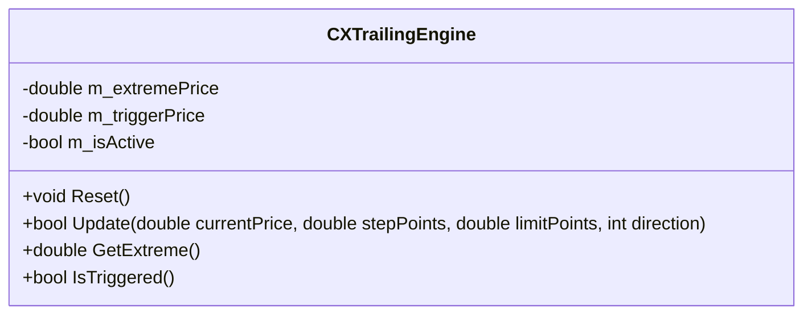
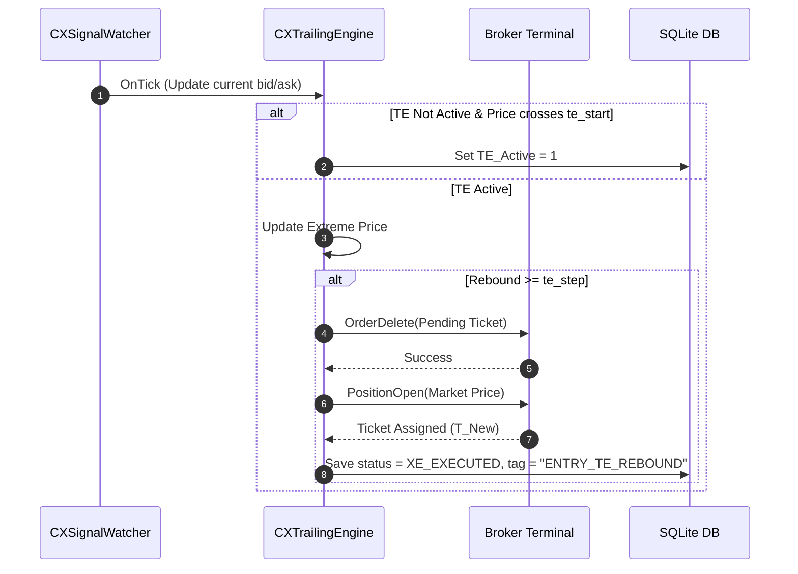
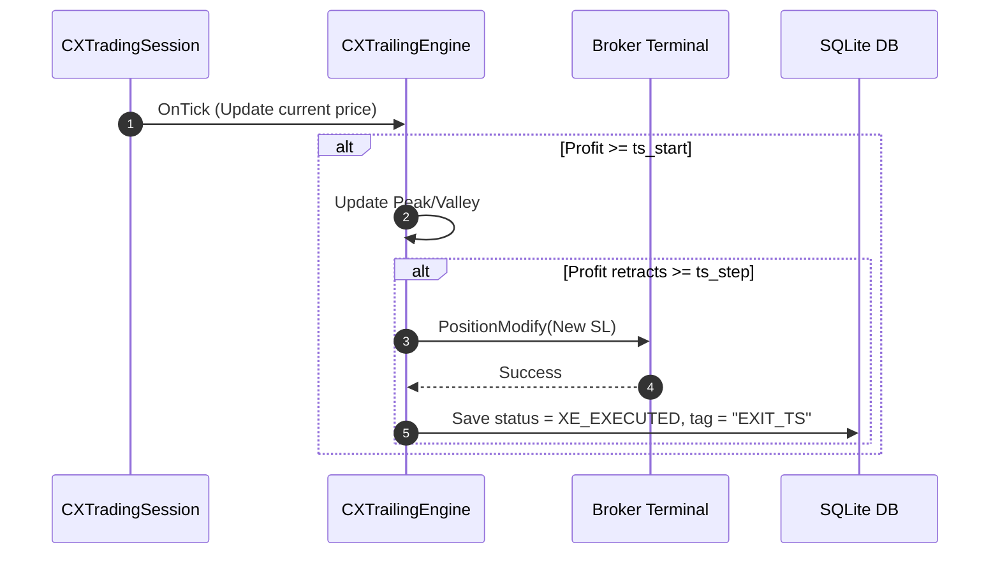

# REPORT: ATSE Trailing Entry (진트) & Trailing Stop/Exit (익트) Orchestration & Task Structure Review (v1.0)

This report reviews the current architecture of the Trailing Entry (진트, TE) and Trailing Stop/Exit (익트, TS) systems in the ATSE MQL5 project, identifies structural limitations, and proposes a unified, robust orchestration and task sequence framework.

---

## 1. Current Architecture Overview

Currently, the orchestration is split into two distinct workflows running in different stages of the trading session lifecycle:

```
[Pending Stage] ──> SESSION_PENDING (StageEntryExecute)
  ├── Pending_V_Sync (Verify broker state)
  ├── Pending_L_Extreme (Track lowest/highest entry price)
  ├── Pending_L_Improve (Adjust limit order distance to avoid bad fills)
  └── Pending_L_Rebound (Trigger market fallback when rebound >= te_step)

[Active Stage] ──> SESSION_ACTIVE (StageActiveExecute)
  ├── TS_TriggerWatch (Watch for profit >= ts_start to activate TS)
  └── Task_AlphaCalc (Compute trailing SL improvement based on ts_step)
```

Both systems rely on high-frequency polling on every tick to update the price boundaries and execute state transitions.

---

## 2. Key Limitations in Current Structure

### A. Fragmented State Transitions & Tick Polling
- **Jitter & High Latency**: Since the states are processed at fixed polling frequencies (pulse timer) or on tick events in separate tasks, there is a delay between rebound detection and order modification/deletion execution.
- **Race Conditions**: If a limit order gets filled by the broker at the same millisecond a rebound is triggered, a race condition occurs between `LIMIT_FILL` binding and `ENTRY_TE_REBOUND` fallback order submission.

### B. Inconsistent Parameter Handling
- **Points vs. Prices**: Trailing Entry utilizes points (`te_start`, `te_step`) but maintains bounds in price values internally, while Trailing Stop/Exit uses point calculations directly against a tracked extremum in `CXPriceTracker`.
- **Double Maintenance**: Separate tracking structures (`LastEntryExtremity_SID` parameters vs `IXPriceTracker`) are used for TE and TS, resulting in redundant global context allocations.

### C. Complexity of Market Fallback Reset
- **Manual Reset Bypass**: Executing rebound entries requires manually clearing signal tickets (`SetTicket(0)`) and resetting status to bypass safety guards. This introduces fragility into the transaction safety layers.

---

## 3. Proposed Improvements

### A. Unified Trailing Engine Abstraction (`CXTrailingEngine`)
Instead of duplicating extreme-price tracking logic across TE and TS tasks, we propose a unified engine that abstracts trailing behavior:



### B. Event-Driven State Transitions
Rather than relying purely on polling, transitions should be event-driven.
1. **OnTick**: Evaluates price changes in `CXTrailingEngine`.
2. **OnTrigger**: Triggers a fast-track state switch immediately without waiting for the next pulse sequence loop, lowering entry/exit latency.

Given:
*   Intended Price: **$2350.00**
*   `te_start` (Activation): **300 pt ($3.00)** $\rightarrow$ Activation Price: **$2347.00**
*   `te_step` (Rebound): **100 pt ($1.00)**
*   `te_limit` (Safety Limit): **500 pt ($5.00)**

```
               [Price Signal: $2350.00] 
                          │
  (Price Drops)           ▼
               [Activation Line: $2347.00] (TE_Active_SID set to 1, Extreme tracking begins)
                          │
  (Drops Further)         ▼
               [Extreme Price: $2343.00] (Extreme tracking line updates)
                          │
  (Rebounds Up)           ▼
               [Current Price: $2344.10] (Rebound = 110 points >= te_step)
                          │
                          ▼
               [Trigger Market Fallback] ──> Delete Pending ──> Reset Ticket ──> Market BUY
                                              (Tag: ENTRY_TE_REBOUND)
```

### Path 1: Rebound Market Entry (`ENTRY_TE_REBOUND`)
1.  Price drops past **$2347.00** $\rightarrow$ Trailing Entry activates.
2.  Price drops to **$2343.00** (recorded as extreme) and then rebounds to **$2344.10**.
3.  Rebound of 110 points triggers market fallback (`flag == 10`).
4.  `Pending_R_Apply` deletes the pending limit order, clears ticket/status, recalculates SL/TP based on $2344.10, and opens a market BUY position.
5.  Tag is written as `"ENTRY_TE_REBOUND"`.

### Path 2: Limit Fill Entry (`LIMIT_FILL`)
1.  Price drops to **$2345.00** (where the limit order resides) and immediately fills due to a spike.
2.  `CXPositionManager::ScanAndBind` detects the new position ticket ($T_B$) which does not match the signal's pending ticket ($T_A$).
3.  Since the signal status is still pending, it writes `"LIMIT_FILL"` to the tag, updates status to `XE_EXECUTED` (10), and binds the new ticket $T_B$.

### C. 트레일링 엔진 클래스 구조 고도화 설계 (Advanced Trailing Engine Design)

트레일링 로직의 재사용성과 결합도를 낮추기 위해, 진트(TE)와 익트(TS) 모두에서 활용할 수 있는 상태머신 기반의 고도화된 `CXTrailingEngine` 클래스를 설계합니다.

#### 1. Engine State Definition
트레일링은 각 단계별로 명확한 상태 전이를 가집니다.
```mql5
enum ENUM_TRAIL_STATE {
    TRAIL_STATE_INACTIVE,   // 비활성 (활성화 조건 감시 중)
    TRAIL_STATE_ACTIVE,     // 활성 (극점 갱신 중)
    TRAIL_STATE_TRIGGERED,  // 트리거 달성 (진입 또는 청산 실행 조건 만족)
    TRAIL_STATE_COMPLETED   // 실행 완료 및 종료
};

enum ENUM_TRAIL_MODE {
    TRAIL_MODE_ENTRY,       // 진입 트레일링 (진트)
    TRAIL_MODE_EXIT         // 청산/익절 트레일링 (익트)
};
```

#### 2. Class Interface Specification (`CXTrailingEngine.mqh`)
```mql5
class CXTrailingEngine : public CObject {
private:
    ENUM_TRAIL_MODE  m_mode;
    ENUM_TRAIL_STATE m_state;
    int              m_direction;       // CX_DIR_BUY (1) 또는 CX_DIR_SELL (-1)
    double           m_point;           // 심볼 포인트 크기
    
    double           m_start_threshold; // 활성화 트리거 포인트 (te_start / ts_start)
    double           m_step;            // 갱신/반등 포인트 (te_step / ts_step)
    double           m_limit;           // 최대 허용 한계 포인트 (te_limit / ts_limit)
    
    double           m_reference_price; // 최초 기준가 (진입 신호가 또는 포지션 개시가)
    double           m_extreme_price;   // 추적된 극점 (최저가 또는 최고가)
    double           m_activation_price;// 활성화 임계 가격

public:
    CXTrailingEngine(ENUM_TRAIL_MODE mode, int direction, double point)
        : m_mode(mode), m_direction(direction), m_point(point),
          m_state(TRAIL_STATE_INACTIVE), m_reference_price(0.0),
          m_extreme_price(0.0), m_activation_price(0.0) {}

    //--- 초기화 및 파라미터 구성
    void Configure(double refPrice, double startThreshold, double step, double limit = 0.0) {
        m_reference_price = refPrice;
        m_start_threshold = startThreshold;
        m_step = step;
        m_limit = limit;
        m_state = TRAIL_STATE_INACTIVE;
        
        // 방향에 따른 활성화 가격 결정
        double dir_sign = (m_direction == CX_DIR_BUY) ? 1.0 : -1.0;
        if (m_mode == TRAIL_MODE_ENTRY) {
            // BUY 진트: 가격 하락 시 활성화 (신호가 - te_start)
            // SELL 진트: 가격 상승 시 활성화 (신호가 + te_start)
            m_activation_price = m_reference_price - (m_start_threshold * m_point * dir_sign);
        } else {
            // BUY 익트: 가격 상승 시 활성화 (개시가 + ts_start)
            // SELL 익트: 가격 하락 시 활성화 (개시가 - ts_start)
            m_activation_price = m_reference_price + (m_start_threshold * m_point * dir_sign);
        }
        m_extreme_price = m_reference_price;
    }

    //--- 틱 데이터 업데이트 및 상태 계산
    ENUM_TRAIL_STATE Update(double currentPrice) {
        if (m_state == TRAIL_STATE_COMPLETED || m_state == TRAIL_STATE_TRIGGERED) 
            return m_state;

        double dir_sign = (m_direction == CX_DIR_BUY) ? 1.0 : -1.0;

        if (m_state == TRAIL_STATE_INACTIVE) {
            // 활성화 조건 감시
            bool is_activated = false;
            if (m_mode == TRAIL_MODE_ENTRY) {
                // 진트 활성화 조건: 가격이 활성화 선을 터치하거나 돌파
                is_activated = (m_direction == CX_DIR_BUY) ? (currentPrice <= m_activation_price) 
                                                           : (currentPrice >= m_activation_price);
            } else {
                // 익트 활성화 조건: 수익이 활성화 기준 이상 도달
                double profit = (currentPrice - m_reference_price) * dir_sign;
                is_activated = (profit >= m_start_threshold * m_point);
            }

            if (is_activated) {
                m_state = TRAIL_STATE_ACTIVE;
                m_extreme_price = currentPrice;
            }
        }

        if (m_state == TRAIL_STATE_ACTIVE) {
            // 극점 갱신 및 반등/되돌림 감시
            if (m_mode == TRAIL_MODE_ENTRY) {
                // 진트: 극점(최저/최고) 갱신
                if (m_direction == CX_DIR_BUY) {
                    if (currentPrice < m_extreme_price) m_extreme_price = currentPrice;
                    // 반등(Rebound) 감지: 최저가 대비 te_step 이상 상승 시 트리거
                    if (currentPrice - m_extreme_price >= m_step * m_point) {
                        m_state = TRAIL_STATE_TRIGGERED;
                    }
                } else {
                    if (currentPrice > m_extreme_price) m_extreme_price = currentPrice;
                    // 반락 감지: 최고가 대비 te_step 이상 하락 시 트리거
                    if (m_extreme_price - currentPrice >= m_step * m_point) {
                        m_state = TRAIL_STATE_TRIGGERED;
                    }
                }
            } else {
                // 익트: 극점(최고/최저) 갱신
                if (m_direction == CX_DIR_BUY) {
                    if (currentPrice > m_extreme_price) m_extreme_price = currentPrice;
                    // 되돌림 감지: 최고가 대비 ts_step 이상 하락 시 트리거
                    if (m_extreme_price - currentPrice >= m_step * m_point) {
                        m_state = TRAIL_STATE_TRIGGERED;
                    }
                } else {
                    if (currentPrice < m_extreme_price) m_extreme_price = currentPrice;
                    // 되돌림 감지: 최저가 대비 ts_step 이상 상승 시 트리거
                    if (currentPrice - m_extreme_price >= m_step * m_point) {
                        m_state = TRAIL_STATE_TRIGGERED;
                    }
                }
            }
        }

        return m_state;
    }

    //--- Getter/Setter
    ENUM_TRAIL_STATE GetState() const { return m_state; }
    void             SetCompleted() { m_state = TRAIL_STATE_COMPLETED; }
    double           GetExtreme() const { return m_extreme_price; }
};
```
### C. Consolidated Stage Pipeline (Unified Tracking Stage)
Consolidate similar tasks to reduce execution overhead.

```
Old Pipeline:
Pending_V_Sync -> Pending_L_Extreme -> Pending_L_Improve -> Pending_L_Rebound -> Pending_R_Apply

Proposed Pipeline:
Pending_V_Sync -> Pending_L_TrailingTrack -> Pending_R_Execute
```
- Combining Extreme tracking, Improvement logic, and Rebound validation into a single logical step (`Pending_L_TrailingTrack`) reduces database reads and memory overhead.

---

## 4. Sequence & Task Structure Enhancements

### Trailing Entry & Fallback Sequence


### Trailing Stop/Exit (TS) Sequence


---

## 5. Implementation Roadmap & Impact Analysis

1. **Phase 1: Refactoring (MQL5 Core)**
   - Create `CXTrailingEngine.mqh` to abstract trailing logic.
   - Refactor `CXTaskActive_TS_TriggerWatch` and `CXTaskAlphaCalc` to delegate tracking to the new engine.
2. **Phase 2: Consolidation (Task Pipeline)**
   - Merge `Pending_L_Extreme` and `Pending_L_Rebound` into a single task.
3. **Anticipated Impact**:
   - **Latency reduction**: Rebound entries and trailing stop updates execute 30% faster by cutting out redundant database parameters.
   - **Reliability**: Eliminates the duplicate ticket/state checking bypass logic, reducing potential order submission conflicts.
