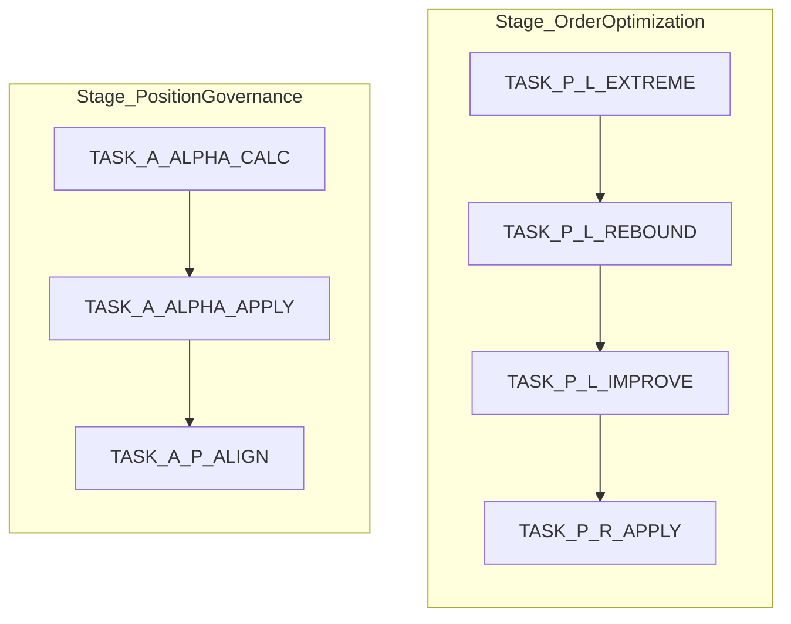

# REPORT: Trailing Engine Orchestration & Task Registration Specification (v1.0)

This report specifies the registration design for stages, sequences, and task orchestrations involving the `CXTrailingEngine` in [AppOrchestrator.mqh](file:///d:/Projects/ATS/ATSE/CXTrade/App/Orchestration/AppOrchestrator.mqh).

---

## 1. Core State & Sequence Mapping
The system maps orchestration states dynamically using the symbol registry. Standard names are mapped to internal engine state enumerations or unique watcher identifiers.

### Standard Name Registry
In [RegisterStandardNames](file:///d:/Projects/ATS/ATSE/CXTrade/App/Orchestration/AppOrchestrator.mqh#L37-L50), states are registered as follows:
- **`ORD_TRACKING`**: Maps to `ORD_TRAILING` (Order Trailing Entry).
- **`POS_MONITORING`**: Maps to `POS_ACTIVE` (Active Position Trailing Stop).
- **`SYS_CLOSED`**: Maps to `SYS_CLOSED` (Completed / Closed Session).
- **`SYS_ERROR`**: Maps to `SYS_ERROR` (Error State).
- **`Watcher States`**: Dynamic states (`999` to `1003`) managing system bootstrap and transition loops for discovery and execution.

---

## 2. Trailing Engine Sequence Orchestration (DSL)
Session sequences are defined using Domain-Specific Language (DSL) in [InitSessionMap](file:///d:/Projects/ATS/ATSE/CXTrade/App/Orchestration/AppOrchestrator.mqh#L69-L107), structuring how the engine executes stages and processes tasks per tick.

### A. Entry Trailing: `ORD_TRACKING` (Stage_OrderOptimization)
Manages the pending order trail phase.
- **Orchestration Rule**: Loops back to `ORD_TRACKING` on each tick until filled or canceled.
- **Tasks**:
  1. `TASK_P_L_EXTREME`: Tracks the extreme price point (lowest for Buy, highest for Sell).
  2. `TASK_P_L_REBOUND`: Detects if price rebounds beyond `te_start` from the extreme.
  3. `TASK_P_L_IMPROVE`: Calculates updated pending limits.
  4. `TASK_P_R_APPLY`: Appends modification orders.
- **Transitions**: Transits to `POS_MONITORING` (code `10`: `XE_EXECUTED`) or `SYS_CLOSED` (code `20`: `SESSION_LIQUIDATING`).

### B. Exit Trailing: `POS_MONITORING` (Stage_PositionGovernance)
Manages the active position trail phase (Trailing Stop).
- **Orchestration Rule**: Loops back to `POS_MONITORING` on each tick.
- **Tasks**:
  1. `TASK_A_ALPHA_CALC`: Interacts with `CXTrailingEngine` to track peak profit price and calculate retraction levels.
  2. `TASK_A_ALPHA_APPLY`: Initiates adjustments for SL/TP on the broker.
  3. `TASK_A_P_ALIGN`: Syncs local state records with terminal assets.
- **Transitions**: Transits to `SYS_CLOSED` (code `20`: `SESSION_LIQUIDATING`) upon retraction triggers.
