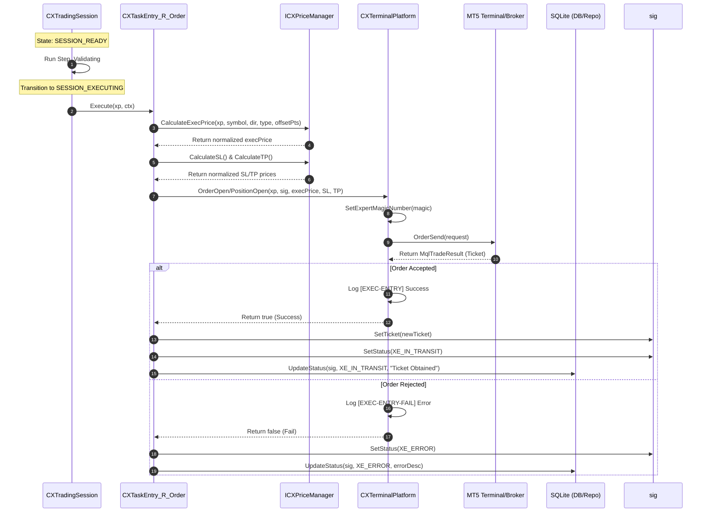
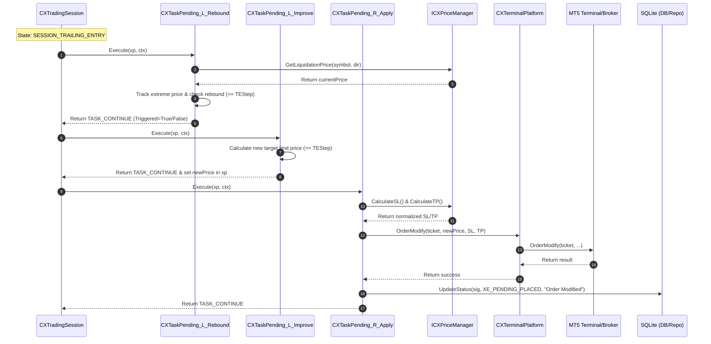
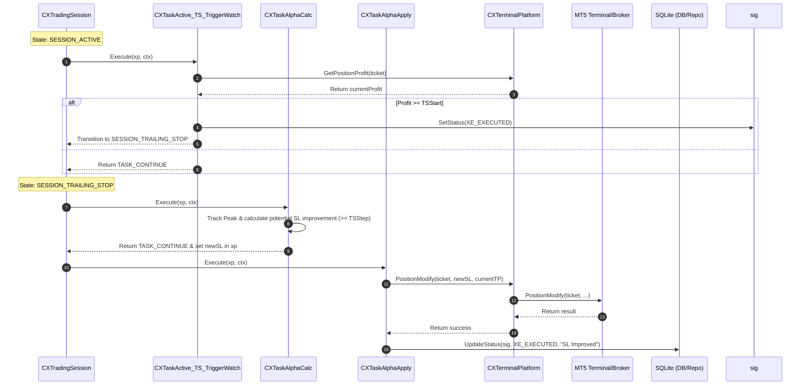
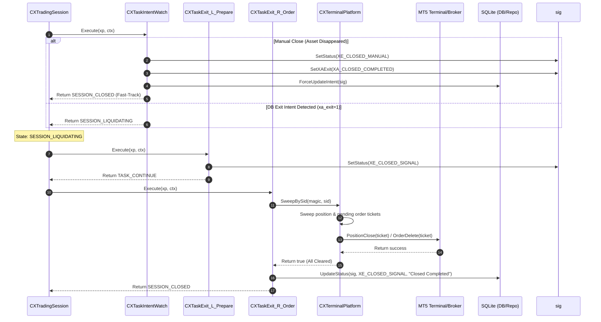

# ATSE Sequence Diagram Report (v1.0)

## 1. Executive Summary

This report presents a runtime sequence analysis of the **ATSE (Active Trading State Engine)**. It visualizes the chronological flow of messages, method invocations, and database transitions between core components:
1. **CXSignalWatcher**: Discovers and bootstraps incoming signals.
2. **CXTradingSession & Workflow Tasks**: Executes the hyper-atomic step sequences.
3. **CXTerminalPlatform**: Decouples ATSE from MT5 API and broker networks.
4. **CXSignalRepository (SQLite)**: Acts as the Single Source of Truth (SSOT).

---

## 2. Phase 1: Discovery & Session Spawn

This sequence outlines how the **Watcher** queries new entry intents from the DB, validates constraints using `CXGuard`, and registers a sandboxed `CXTradingSession`.

```mermaid
sequenceDiagram
    autonumber
    participant DB as SQLite (DB/Repo)
    participant Watcher as CXSignalWatcher
    participant Guard as CXGuard
    participant SessionMgr as CXSessionManager
    participant Session as CXTradingSession

    Watcher->>DB: GetActiveSignals()
    DB-->>Watcher: Return raw XSignal models

    loop For each signal
        Watcher->>Guard: Check(xp, ctx)
        alt Validation Fails
            Guard-->>Watcher: Return false & SetError()
            Watcher->>DB: UpdateStatus(sig, XE_ERROR, errMsg)
        else Validation Passes
            Guard-->>Watcher: Return true
            Watcher->>SessionMgr: SpawnSession(sig)
            create participant Session
            SessionMgr->>Session: New(sig, ctx)
            SessionMgr->>DB: UpdateStatus(sig, XE_PENDING_REQ, "Session Spawned")
            SessionMgr-->>Watcher: Return Session handle
        end
    end
```

---

## 3. Phase 2: Order Execution & Remapping

This sequence details the execution of `SESSION_READY` and `SESSION_EXECUTING`. The workflow tasks calculate prices using `ICXPriceManager` and dispatch orders via `IXTerminalPlatform`, remapping MT5 tickets back to the DB.



---

## 4. Phase 3: Trailing Entry (Optimization)

This sequence outlines the active trailing entry phase (`SESSION_TRAILING_ENTRY`). The engine tracking extreme prices, rebounding triggers, and dynamically shifting limit orders in the MT5 pool.



---

## 5. Phase 4: Position Trailing & Profit Protection (TS/Alpha)

When the pending order is filled, the session transitions to `SESSION_ACTIVE`. It tracks dynamic price movements, checks profit margins, and updates trailing Stop Loss levels.



---

## 6. Phase 5: Termination & Sweep

The termination sequence manages position closures (triggered by DB exit intent, broker stop-out, or manual termination). It sweeps lingering orders to guarantee absolute cleanup.


