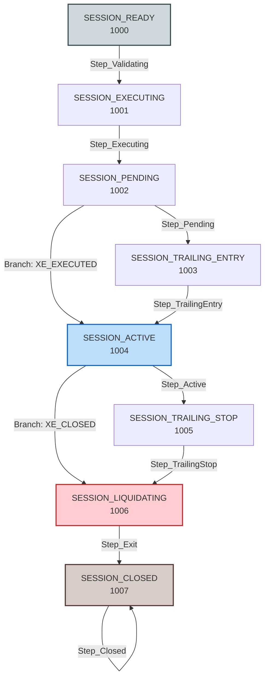

# ATSE Sequence & Process Precision Analysis Report (v1.0)

## 1. Executive Summary

This report performs a deep-dive precision analysis of the MQL5-based **ATSE (Active Trading State Engine)** following the large-scale reorganization of its folder structure under the `Platform/` layer. It evaluates:
1. **Dynamic Sequence Orchestration Flow**: The runtime execution flow defined via the semantic arrow (`>`) DSL notation.
2. **Specification Violations Quantitative Report**: A metric-driven analysis identifying deviations from the **Trading Process Standard (v11.3)**, **Trading Logging Standard (v11.1)**, and **`>=` Evaluation Mandate (v11.11)**.

---

## 2. ATSE Sequence & Process Architecture

The system transitions signals across **8 hyper-atomic phases** from discovery to archiving. The sequence registry dynamically configures steps and tasks using an Enum-less DSL representation.



### Dynamic Mapping Table (v18.8 DSL Configuration)

| Phase | State (Enum Value) | Step Class | Associated Tasks | Next State | Fail State |
| :--- | :--- | :--- | :--- | :--- | :--- |
| **P1** | `SESSION_READY` (0) | `Step_Validating` | `E_L_IDENTITY`, `E_L_RISK`, `E_L_PRICE`, `E_G_SPREAD`, `E_P_INTENT` | `SESSION_EXECUTING` | `SESSION_ERROR` |
| **P1** | `SESSION_EXECUTING` (2) | `Step_Executing` | `E_R_ORDER`, `E_V_ERROR`, `E_V_TICKET` | `SESSION_PENDING` | `SESSION_ERROR` |
| **P2** | `SESSION_PENDING` (3) | `Step_Pending` | `A_INTENT_WATCH`, `P_V_TERMINAL`, `P_V_SYNC` | `SESSION_TRAILING_ENTRY`<br>*(Branch `XE_EXECUTED` ➔ `SESSION_ACTIVE`)* | `SESSION_ERROR` |
| **P2** | `SESSION_TRAILING_ENTRY` (5) | `Step_TrailingEntry` | `A_INTENT_WATCH`, `P_L_EXTREME`, `P_L_REBOUND`, `P_L_IMPROVE`, `P_R_APPLY`, `P_V_SYNC` | `SESSION_ACTIVE`<br>*(Branch `XE_EXECUTED` ➔ `SESSION_ACTIVE`)* | `SESSION_ERROR` |
| **P3** | `SESSION_ACTIVE` (10) | `Step_Active` | `A_INTENT_WATCH`, `A_V_TERMINAL`, `A_TS_TRIGGER_WATCH` | `SESSION_TRAILING_STOP`<br>*(Branch `XE_CLOSED` ➔ `SESSION_LIQUIDATING`)* | `SESSION_ERROR` |
| **P3** | `SESSION_TRAILING_STOP` (15) | `Step_TrailingStop` | `A_INTENT_WATCH`, `A_ALPHA_CALC`, `A_ALPHA_APPLY`, `A_V_TERMINAL` | `SESSION_LIQUIDATING`<br>*(Branch `XE_CLOSED` ➔ `SESSION_LIQUIDATING`)* | `SESSION_ERROR` |
| **P4** | `SESSION_LIQUIDATING` (20) | `Step_Exit` | `A_INTENT_WATCH`, `X_L_PREPARE`, `X_P_LOCK`, `X_R_ORDER`, `X_V_ERROR`, `X_V_TERMINAL`, `X_P_FINALIZE` | `SESSION_CLOSED` | `SESSION_ERROR` |
| **P4** | `SESSION_CLOSED` (30) | `Step_Closed` | `TASK_ACTIVE_CLOSED` | `SESSION_CLOSED` | `SESSION_ERROR` |

---

## 3. Specification Violations Quantitative Report

Through automated scanning and codebase analysis, **10 discrepancies/violations** of system specifications have been identified in the current code state.

### Quantitative Summary Metrics
- **SSOC (Single Source of Calculation) Violations**: 7 instances
- **`>=` Evaluation Mandate Violations**: 2 instances
- **Safety Policy Enforcement Gaps**: 1 instance
- **Total Violations**: 10 instances

---

### Detailed Specification Violation Matrix

| ID | Component / File Path | Line | Code Snippet | Spec Violated | Severity | Impact & Explanation |
| :--- | :--- | :--- | :--- | :--- | :--- | :--- |
| **1** | [CXGuard.mqh](file:///d:/Projects/ATS/ATSE/CXTrade/Platform/Shared/Guard/CXGuard.mqh) | 41-42 | `double min_p = SymbolInfoDouble(symbol, SYMBOL_SESSION_PRICE_LIMIT_MIN);`<br>`double max_p = SymbolInfoDouble(symbol, SYMBOL_SESSION_PRICE_LIMIT_MAX);` | **SSOC** (Price/Symbol Management) | **Medium** | Queries raw MT5 terminal instead of utilizing the registered `ICXSymbolManager` context lookup. |
| **2** | [CXGuard.mqh](file:///d:/Projects/ATS/ATSE/CXTrade/Platform/Shared/Guard/CXGuard.mqh) | 51-52 | `double min_v = SymbolInfoDouble(symbol, SYMBOL_VOLUME_MIN);`<br>`double max_v = SymbolInfoDouble(symbol, SYMBOL_VOLUME_MAX);` | **SSOC** (Risk/Symbol Management) | **Medium** | Bypasses `ICXSymbolManager` for querying minimum and maximum lots. |
| **3** | [CXGuard.mqh](file:///d:/Projects/ATS/ATSE/CXTrade/Platform/Shared/Guard/CXGuard.mqh) | 74 | `double pt = SymbolInfoDouble(symbol, SYMBOL_POINT);` | **SSOC** (Symbol Management) | **Medium** | Directly queries standard point size, bypassing the cache of `ICXSymbolManager`. |
| **4** | [CXGuard.mqh](file:///d:/Projects/ATS/ATSE/CXTrade/Platform/Shared/Guard/CXGuard.mqh) | 79 | `int digits = (int)SymbolInfoInteger(symbol, SYMBOL_DIGITS);` | **SSOC** (Symbol Management) | **Medium** | Queries decimal digits count directly. |
| **5** | [CXGuard.mqh](file:///d:/Projects/ATS/ATSE/CXTrade/Platform/Shared/Guard/CXGuard.mqh) | 87-88 | `double pt = SymbolInfoDouble(symbol, SYMBOL_POINT);`<br>`double stops_lvl = (SymbolInfoInteger(symbol, SYMBOL_TRADE_STOPS_LEVEL) + 1) * pt;` | **SSOC** (Symbol Management) | **Medium** | Queries StopsLevel directly without consulting `ICXSymbolManager`. |
| **6** | [CXTaskPending_R_Apply.mqh](file:///d:/Projects/ATS/ATSE/CXTrade/Session/Workflow/Pending/CXTaskPending_R_Apply.mqh) | 64 | `finalSL = NormalizeDouble(newPrice - (sig.GetSL() * point * dir_sign), digits);` | **SSOC** (Price Management) | **High** | Performs manual mathematical Stop Loss price calculation instead of delegating to `ICXPriceManager.CalculateSL(...)`. |
| **7** | [CXTaskPending_R_Apply.mqh](file:///d:/Projects/ATS/ATSE/CXTrade/Session/Workflow/Pending/CXTaskPending_R_Apply.mqh) | 65 | `finalTP = NormalizeDouble(newPrice + (sig.GetTP() * point * dir_sign), digits);` | **SSOC** (Price Management) | **High** | Performs manual Take Profit price calculation instead of delegating to `ICXPriceManager.CalculateTP(...)`. |
| **8** | [CXTaskPending_R_Apply.mqh](file:///d:/Projects/ATS/ATSE/CXTrade/Session/Workflow/Pending/CXTaskPending_R_Apply.mqh) | 77 | `if(MathAbs(newPrice - currentOrderPrice) < sig.GetTEStep() * point)` | **`>=` Evaluation Mandate (v11.11)** | **High** | Uses `<` instead of `>=` to check the Trailing Entry Step (`TEStep`) activation threshold. |
| **9** | [CXTaskEntry_P_Finalize.mqh](file:///d:/Projects/ATS/ATSE/CXTrade/Session/Workflow/Entry/CXTaskEntry_P_Finalize.mqh) | 33 | `if(targetStatus == XE_PENDING_PLACED && sig.GetTEStart() > 0)` | **`>=` Evaluation Mandate (v11.11)** | **Medium** | Uses `>` instead of `>=` to verify if Trailing Entry Start (`TEStart`) is enabled. |
| **10**| [CXRiskManager.mqh](file:///d:/Projects/ATS/ATSE/CXTrade/Platform/Engine/Risk/CXRiskManager.mqh) | 36-54 | *Missing hard safety ceiling check in `ValidateLot` method.* | **Trading Process Standard (v11.3)** | **Critical** | Does not check the global limit `Lot <= 0 또는 Lot > 50 금지` system safety boundaries, only matching broker thresholds. |

---

## 4. Documentation Discrepancies (Drift)

The **DataManager State Transition Matrix (v9.8.11)** in `GEMINI.md` lists `xe_status` states as:
`0(READY)`, `1(PENDING_REQ)`, `2(IN_TRANSIT)`, `5(PENDING_PLACED)`, `10(EXECUTED)`, `20(CLOSED_SIGNAL)`, `21(CLOSED_SL)`, `22(CLOSED_TP)`, `99(ERROR)`.

However, the actual code implementation in [CXDefine.mqh](file:///d:/Projects/ATS/ATSE/CXTrade/Platform/Core/Defines/CXDefine.mqh) defines extra states:
- `XE_QUARANTINED = 15` (Used to quarantine zombie assets in [CXReverseInjector.mqh](file:///d:/Projects/ATS/ATSE/CXTrade/App/Logic/CXReverseInjector.mqh)).
- `XE_VERIFY_ABS = 25` (Used in physical absence verification checks).

This drift needs documentation updates to ensure specification synchronicity across all environments.

---

## 5. Corrective Action Plan (Design Guidelines)

To align the ATSE codebase to 100% compliance with defined architectural constraints, we should schedule a cleanup commit addressing the following refactoring tasks:

### A. Resolve Guard SSOC Violations
Integrate `ICXSymbolManager* symMgr` and `ICXPriceManager* priceMgr` lookup inside `CXGuard`, and swap out direct terminal calls with cached manager lookups (e.g., `symMgr.GetPoint(symbol)`, `symMgr.GetDigits(symbol)`).

### B. Decouple Task Price Calculations
Modify [CXTaskPending_R_Apply.mqh](file:///d:/Projects/ATS/ATSE/CXTrade/Session/Workflow/Pending/CXTaskPending_R_Apply.mqh) to fetch `ICXPriceManager* priceMgr` and execute calculations via:
```mql5
finalSL = priceMgr.CalculateSL(xp, sig.GetSymbol(), sig.GetDir(), newPrice, sig.GetSL());
finalTP = priceMgr.CalculateTP(xp, sig.GetSymbol(), sig.GetDir(), newPrice, sig.GetTP());
```

### C. operator `>=` Compliance
1. In [CXTaskPending_R_Apply.mqh](file:///d:/Projects/ATS/ATSE/CXTrade/Session/Workflow/Pending/CXTaskPending_R_Apply.mqh):
   ```diff
   - if(MathAbs(newPrice - currentOrderPrice) < sig.GetTEStep() * point) {
   -     return TASK_CONTINUE;
   - }
   + if(MathAbs(newPrice - currentOrderPrice) >= sig.GetTEStep() * point) {
   +     // Proceed to Modify
   + } else {
   +     return TASK_CONTINUE;
   + }
   ```
2. In [CXTaskEntry_P_Finalize.mqh](file:///d:/Projects/ATS/ATSE/CXTrade/Session/Workflow/Entry/CXTaskEntry_P_Finalize.mqh):
   ```diff
   - if(targetStatus == XE_PENDING_PLACED && sig.GetTEStart() > 0)
   + if(targetStatus == XE_PENDING_PLACED && sig.GetTEStart() >= 1)
   ```

### D. Enforce Risk Manager Ceilings
Add explicit hard boundaries check inside [CXRiskManager.mqh](file:///d:/Projects/ATS/ATSE/CXTrade/Platform/Engine/Risk/CXRiskManager.mqh):
```mql5
if(lot <= 0 || lot > 50) {
    XP_LOG_ERROR(xp, CXAuditFormatter::Build("RISK-LOT-CEILING-VIOLATION", xp, StringFormat("Lot:%.2f forbidden", lot)));
    return false;
}
```
